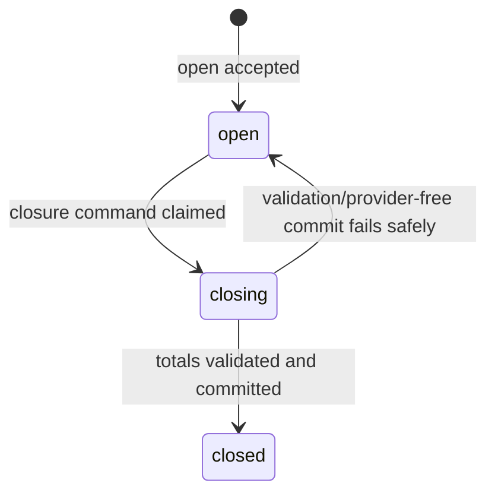
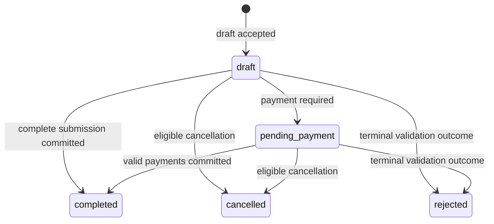
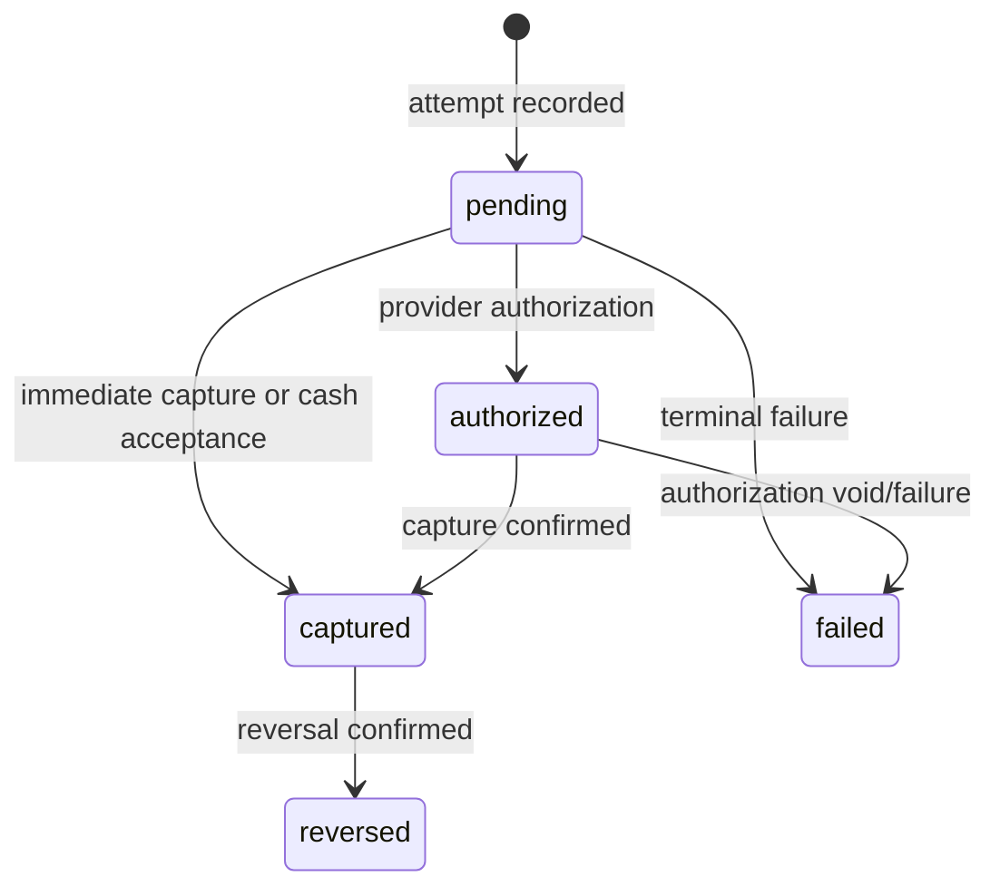
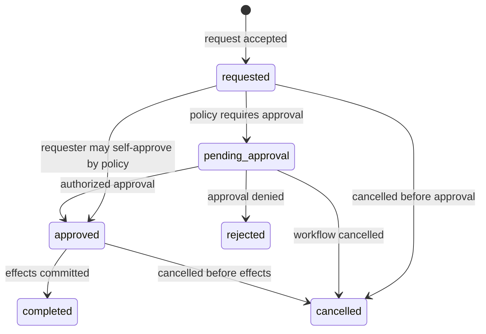
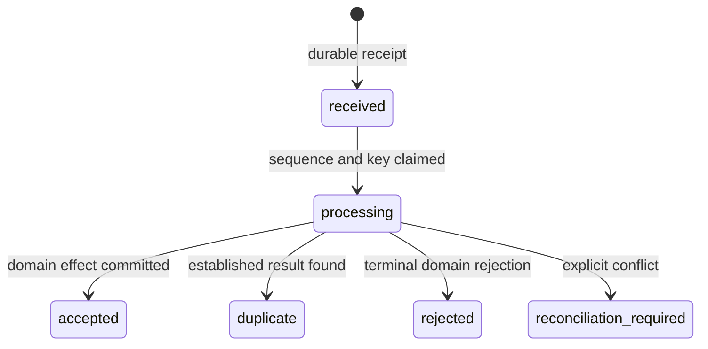
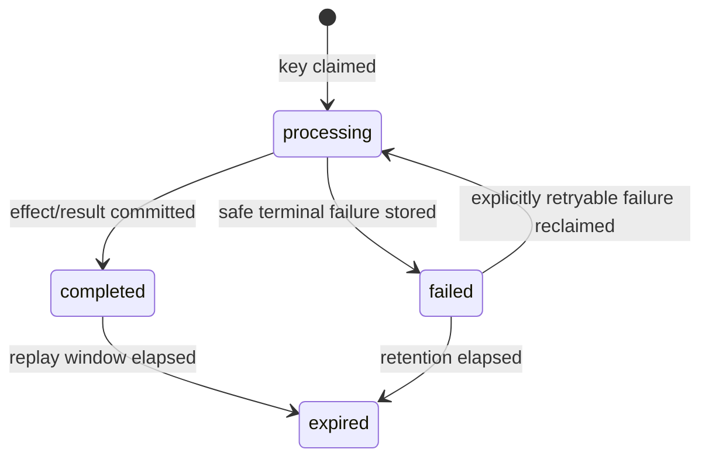

# AS ONE Core REST API Contracts

## 1. Status and purpose

This document is the authoritative REST contract for the first AS ONE transactional core. It is an implementation specification for future Fastify services and authorized AS POS, AS CEO, and administrative clients. It contains no executable API, framework code, SQL, or migration.

The contract is consistent with [CORE_DATA_MODEL.md](CORE_DATA_MODEL.md) and accepted ADRs [ADR-0001](adr/ADR-0001-money-and-rounding.md) through [ADR-0006](adr/ADR-0006-tenant-isolation.md).

## 2. Scope and non-goals

Included: authentication, company/branch context, users and authorization, devices/registers, cash operation, catalog, basic inventory, sales/payments, refunds, offline command synchronization, audit reads, checkpoints, and recovery after real-time gaps.

Excluded: customers, Rewards, events/parties, memberships, advanced promotions/tax engines, invoicing, suppliers/purchasing, recipes, payroll, accounting, AI, advanced analytics, detailed WebSocket protocol, and offline authentication.

## 3. Global conventions

| Concern | Contract |
| --- | --- |
| Base path | `/api/v1`; paths below are relative to it |
| Media type | Requests with bodies use `Content-Type: application/json`; responses use `application/json; charset=utf-8` |
| Compatibility | Additive changes only within v1. Existing meaning, required fields, and enum values are never repurposed. Breaking changes require a new version. Unknown response fields must be ignored; unknown request fields are rejected unless explicitly extensible. |
| Naming | JSON fields, query parameters, and event fields use `snake_case` |
| IDs | Public identifiers are UUID strings. UUIDv7 is preferred when approved tooling supports it; ordering never depends on UUID value. |
| Time | ISO 8601 UTC strings, normally `YYYY-MM-DDTHH:mm:ss.sssZ` |
| Money | JSON decimal strings with up to four fractional digits, plus ISO currency. Never JSON numbers/floats. Commercial MXN results use ADR-0001. |
| Quantities | JSON decimal strings with up to six fractional digits. Never floating-point assumptions. |
| Scope | `company_id` and `branch_id` in a path/body are resource references only. Authority comes exclusively from authenticated server context. Mismatch is rejected. |
| Optimistic concurrency | Mutable resources expose positive `version` and `ETag: "<version>"`. Mutations require `If-Match` where marked. |
| Idempotency | `Idempotency-Key` is required for financial, cash, inventory, and synchronization commands. Keys are tenant and operation scoped and bind to a request hash. |
| Traceability | Requests accept `X-Request-Id` and `X-Correlation-Id` UUIDs. The server generates missing values and echoes both in headers and envelopes. |
| Authentication | `Authorization: Bearer <access_token>` for protected routes; access tokens are short-lived. |
| Sensitive data | Secrets, token hashes, credentials, full payment data, internal stack traces, and unsafe audit payloads are never returned. |
| Deletion | Transactional records use cancellation, reversal, or compensating commands; ordinary DELETE is limited to revoking assignments or retiring non-transactional configuration. |

### 3.1 Header profiles

Endpoint tables reference these complete profiles:

| Profile | Required/accepted headers |
| --- | --- |
| `P` Public | `Content-Type` for body; optional request/correlation IDs; rate-limit headers returned |
| `S` Session | `Authorization`; optional request/correlation IDs |
| `Q` Versioned query | `S`; optional `If-None-Match`; returns `ETag` for single versioned resources |
| `O` Optimistic command | `S`; `Content-Type`; `If-Match`; optional request/correlation IDs |
| `C` Idempotent command | `S`; `Content-Type`; `Idempotency-Key`; optional `If-Match`; request/correlation IDs |
| `Y` Sync command | `S`; `Content-Type`; `Idempotency-Key`; `X-Device-Id`; request/correlation IDs |
| `R` Recovery query | `S`; request/correlation IDs; checkpoint query required where specified |

Missing a required header is `validation_error`; stale `If-Match` is `version_conflict`; reused idempotency content is `idempotency_conflict`.

### 3.2 Collection queries

- `limit`: positive integer; default and maximum remain configurable and are advertised in documentation/configuration.
- `cursor`: opaque stable cursor; clients must not parse it.
- `sort`: allowlisted stable ordering; every order includes a unique tie-breaker.
- `status`, `updated_after`, and domain filters are allowlisted per endpoint.
- High-volume transactional collections never use offset pagination.
- Cursor scope includes authenticated company/branch, filters, and ordering; reuse under a different scope is rejected.

## 4. Success envelopes

### 4.1 Single resource or command

```json
{
  "data": {},
  "meta": {
    "request_id": "018f0000-0000-7000-8000-000000000001",
    "correlation_id": "018f0000-0000-7000-8000-000000000002"
  }
}
```

### 4.2 Collection

```json
{
  "data": [],
  "meta": {
    "request_id": "018f0000-0000-7000-8000-000000000001",
    "correlation_id": "018f0000-0000-7000-8000-000000000002",
    "page": {
      "next_cursor": "opaque-or-null",
      "has_more": false,
      "limit": 50
    },
    "filters": {
      "status": "active"
    }
  }
}
```

Commands return `200` for an established/updated result, `201` for creation, `202` for accepted asynchronous processing, or `204` only where no resource representation is useful. A duplicate idempotent request returns the original status/body and `Idempotency-Replayed: true`.

## 5. Error contract

```json
{
  "error": {
    "code": "sale_version_conflict",
    "message": "The sale changed before this operation could be applied.",
    "details": {
      "expected_version": 3,
      "current_version": 4
    },
    "request_id": "018f0000-0000-7000-8000-000000000001",
    "correlation_id": "018f0000-0000-7000-8000-000000000002"
  }
}
```

`message` is safe and human-readable. `details` is structured, bounded, non-sensitive, and code-specific. Validation details use field paths and rule identifiers, never internal schemas or stack traces.

| Error code | HTTP | Meaning |
| --- | ---: | --- |
| `validation_error` | 400 or 422 | Malformed transport input (400) or valid shape violating declared validation (422) |
| `authentication_required` | 401 | Missing or unusable authentication |
| `invalid_credentials` | 401 | Login credentials rejected without account enumeration |
| `token_expired` | 401 | Access or refresh token expired |
| `session_expired` | 401 | Access/refresh session expired or revoked |
| `token_reuse_detected` | 401 | Rotated refresh token was reused; its token family is revoked |
| `forbidden` | 403 | Authenticated actor cannot perform the requested operation |
| `permission_denied` | 403 | Actor lacks required action permission |
| `company_scope_violation` | 403 | Resource/reference does not belong to authenticated company |
| `branch_scope_violation` | 403 | Branch is outside authorized scope |
| `not_found` | 404 | Resource absent or intentionally concealed by isolation |
| `company_scope_mismatch` | 403 | Requested resource/reference does not match the authenticated company context |
| `branch_scope_mismatch` | 403 | Requested branch does not match the actor's authorized branch scope |
| `resource_not_found` | 404 | Resource is absent or concealed to preserve isolation |
| `resource_conflict` | 409 | Current resource state prevents the operation |
| `version_conflict` | 409 | `If-Match` or `base_version` is stale |
| `idempotency_conflict` | 409 | Key reused with different request content/scope |
| `duplicate_request` | 409 | Command was already accepted under its idempotency identity |
| `device_sequence_gap` | 409 | Device sequence contains a gap that must be recovered before later commands |
| `device_sequence_replay` | 409 | Device sequence was replayed with a different command identity or payload |
| `cash_session_required` | 409 | Operation requires an open session |
| `cash_session_already_open` | 409 | Register already has an open session |
| `cash_session_not_open` | 409 | Mutation requires an open session but the session is absent or closed |
| `cash_session_closed` | 409 | Mutation attempted after cash-session closure |
| `price_conflict` | 409 | Submitted price snapshot is invalid/stale |
| `inventory_insufficient` | 409 | Movement would violate initial no-negative policy |
| `insufficient_inventory` | 409 | Inventory command would violate the no-negative policy |
| `inventory_movement_not_reversible` | 409 | Inventory movement is already reversed or cannot be reversed safely |
| `sale_not_mutable` | 409 | Sale state does not permit the requested mutation |
| `payment_not_reversible` | 409 | Payment is settled, already reversed, or otherwise ineligible for reversal |
| `sale_not_refundable` | 409 | Sale/status/payment is not refundable |
| `refund_limit_exceeded` | 409 | Quantity or value exceeds remaining refundable amount |
| `refund_approval_required` | 409 | Refund must be approved before completion |
| `device_revoked` | 403 | Device is revoked/decommissioned |
| `sync_sequence_conflict` | 409 | Device sequence is missing, repeated with different content, or otherwise invalid |
| `reconciliation_required` | 409 | Command requires explicit operator/server reconciliation |
| `rate_limited` | 429 | Rate limit exceeded; `Retry-After` returned |
| `rate_limit_exceeded` | 429 | Rate limit exceeded; `Retry-After` returned |
| `service_unavailable` | 503 | Required service is temporarily unavailable; retry policy is response-specific |
| `internal_error` | 500 | Unexpected server error with no internal disclosure |

All errors include trace IDs. New domain-safe codes may be added without changing the envelope.

## 6. Authorization model and permission registry

Permissions are action capabilities evaluated with active company membership, branch access, user role assignments, session, and device. Platform support access is outside this contract. The core uses **52 permissions**:

| Area | Permission keys |
| --- | --- |
| Company | `company.read`, `company.update`, `company_settings.read`, `company_settings.update` |
| Branch | `branch.read`, `branch.create`, `branch.update`, `branch_settings.read`, `branch_settings.update` |
| Identity | `user.read`, `user.create`, `user.update`, `role.read`, `role.create`, `role.update`, `role.assign`, `permission.read`, `branch_access.manage` |
| Devices | `device.read`, `device.register`, `device.revoke` |
| Registers/cash | `cash_register.read`, `cash_register.manage`, `cash_session.read`, `cash_session.open`, `cash_movement.create`, `cash_session.close` |
| Catalog | `catalog.read`, `category.manage`, `product.manage`, `price.manage`, `availability.manage` |
| Inventory | `inventory.read`, `inventory_location.manage`, `inventory.adjust`, `inventory.count`, `inventory.reverse` |
| Sales | `sale.read`, `sale.create`, `sale.complete`, `sale.cancel` |
| Payments | `payment.read`, `payment.create`, `payment.reverse` |
| Refunds | `refund.read`, `refund.create`, `refund.approve`, `refund.complete`, `refund.cancel` |
| Sync/operations | `sync.execute`, `audit.read`, `recovery.read` |

Authentication routes require no business permission but enforce rate limits, session policy, and account/device status.

## 7. Shared representations

All resource representations include `id`, ownership fields where applicable, lifecycle status, timestamps, and `version` when mutable. Fields below define contract minima, not permission to expose sensitive columns.

| Representation | Required public fields |
| --- | --- |
| `company` | `id`, `slug`, `display_name`, `status`, `default_currency`, `timezone`, `version`, timestamps |
| `branch` | `id`, `company_id`, `code`, `name`, `status`, `timezone`, safe address, `version`, timestamps |
| `user` | `id`, `display_name`, safe contact fields, `status`, `version`; never credential hashes |
| `role` | `id`, `company_id`, `code`, `name`, `status`, `is_system`, `version` |
| `device` | `id`, scope, `device_code`, `name`, `device_type`, `status`, `last_seen_at`, `app_version`, `version`; never private keys |
| `cash_register` | `id`, scope, `code`, `name`, `status`, `device_id`, `version` |
| `cash_session` | IDs/scope, register, operator/times, exact amounts/currency, status, discrepancy, `version` |
| `category` | IDs/scope, parent, code/name, order, status, presentation metadata, `version` |
| `product` | IDs/scope, category, SKU/barcode, name/type/unit, inventory/weight flags, tax code, status, `version` |
| `product_price` | IDs/scope, product, type, decimal-string amount/currency, validity, status, `version` |
| `inventory_balance` | IDs/scope, location/product, decimal-string on-hand/reserved/available, `version`, `updated_at` |
| `inventory_movement` | IDs/scope, location/product, type, decimal quantity, reason/reference, actor/device/time, reversal, balance version |
| `sale` | IDs/scope/session/register/device, sale number/status/currency, exact totals, times, actor, `version`, items/payments when expanded |
| `payment` | IDs/scope/sale/session, method/status, amount/currency, safe references, time, reversal |
| `refund` | IDs/scope/original sale/session, number/status/reason, exact totals, actors/times, `version` |
| `sync_outcome` | operation identity/sequence, status, aggregate, result code/data, conflict data, checkpoint |

## 8. Reusable command schemas

### 8.1 Scope and references

`company_id` and `branch_id` may appear to make resource identity explicit, but the server compares them to authenticated context. Omission is preferred when the route/context is unambiguous. Reference mismatches are never coerced.

### 8.2 Optimistic update

Administrative PATCH bodies contain only allowlisted mutable fields and no `version`; the version is supplied through `If-Match`. Successful responses return the incremented version/ETag.

### 8.3 Money and quantities

```json
{
  "amount": "125.5000",
  "currency": "MXN",
  "quantity": "2.500000"
}
```

The server validates precision, scale, sign, currency agreement, and ADR-0001 rounding. It recalculates every authoritative commercial total.

### 8.4 Command metadata

Offline-capable commands may include:

```json
{
  "client_operation_id": "018f0000-0000-7000-8000-000000000010",
  "sequence_number": 42,
  "base_version": 3,
  "occurred_at": "2026-07-22T15:00:00.000Z"
}
```

Presence does not make a command offline-approved. Each endpoint states its policy.

## 9. Endpoint contract notation

The endpoint catalogue contains **96 endpoints**. `Common` errors for protected routes are `authentication_required`, `session_expired`, `permission_denied`, scope mismatches, `resource_not_found`, `rate_limit_exceeded`, and `internal_error`. `V` adds validation errors; `OC` adds `version_conflict`/`resource_conflict`; `IC` adds idempotency conflict and stored replay semantics.

Effects use `audit / outbox`; `—` means no domain audit/event beyond security request telemetry. Query endpoints never create outbox events.

## 10. Authentication and sessions — E001–E007

| ID | Method and route; purpose | Permission / scope | Inputs | Success / errors | Idempotency, concurrency, effects |
| --- | --- | --- | --- | --- | --- |
| E001 | `POST /auth/login`; establish session | Public; requested company/branch only narrows verified membership | `P`; body `identifier*`, `password*`, optional `company_id`, `branch_id`, `device_id` | `200` access/session representation; `invalid_credentials`, scope mismatch, `device_revoked`, rate limit | Not idempotent; credential/session security audit / `auth.session.started` only for authorized security consumers |
| E002 | `POST /auth/refresh`; rotate refresh token | Valid refresh session and company context | `P`; refresh credential through the approved secure transport; optional `device_id` binding | `200` new access token and rotated refresh result; `session_expired`, reuse detection | Single-use rotation under session version lock; audit rotation/reuse / `auth.session.revoked` on reuse |
| E003 | `POST /auth/logout`; revoke current session | Current session | `S`; no body unless transport requires refresh-session selector | `204`; session errors remain safe/idempotent | Repeated revoke succeeds; audit / `auth.session.revoked` |
| E004 | `POST /auth/logout-all`; revoke actor's sessions in current company | Current user/company | `S`; body optional `except_current=false` | `200` `{revoked_count}` | Idempotent result by current state; audit / `auth.user_sessions.revoked` |
| E005 | `GET /auth/session`; current session metadata | Current session/company | `S`; no params | `200` session ID, expiry, company, permitted branches, device, security flags; Common | Query; — / — |
| E006 | `GET /auth/me`; current safe identity/memberships | Current session; results limited to actor | `S`; optional `include=memberships,branches` | `200` user and authorized memberships; Common | Query; — / — |
| E007 | `GET /auth/permissions`; effective capabilities | Current session/company/optional authorized branch | `S`; query optional `branch_id` | `200` permission keys, branch scope, policy/version marker; scope errors | Query; — / — |

Refresh tokens are never returned in URLs, logs, audit payloads, or ordinary JSON when a secure, same-site, HTTP-only cookie transport is selected. The final browser/native refresh transport remains open; rotation and reuse detection are mandatory in either case. Offline authentication is not part of v1.

## 11. Company, branch, and context — E008–E019

| ID | Method and route; purpose | Permission / scope | Inputs | Success / errors | Idempotency, concurrency, effects |
| --- | --- | --- | --- | --- | --- |
| E008 | `GET /context/companies`; companies available to actor | Authenticated memberships | `S`; cursor, limit, status | `200` company summaries; Common | Query; — / — |
| E009 | `GET /context/branches`; authorized branches in active company | Active company membership | `S`; cursor, limit, status | `200` branch summaries and default marker; Common | Query; — / — |
| E010 | `GET /companies/{company_id}`; company detail | `company.read`; company | `Q`; path company UUID | `200 company`; Common | ETag; — / — |
| E011 | `PATCH /companies/{company_id}`; update safe company fields | `company.update`; company | `O`; path; body allowlisted `display_name`, `timezone`, `status` transition | `200 company`; Common+V+OC | Optimistic; `company.updated` / `company.updated` |
| E012 | `GET /companies/{company_id}/branches`; list branches | `branch.read`; company, filtered by actor branch access unless company-wide | `S`; cursor, limit, status, updated_after | `200` branches; Common | Query; — / — |
| E013 | `POST /companies/{company_id}/branches`; create branch | `branch.create`; company | `S` + JSON; body client UUID optional, `code*`, `name*`, `timezone*`, safe address | `201 branch`; Common+V+resource conflict | Server/client UUID unique; `branch.created` / `branch.created` |
| E014 | `GET /branches/{branch_id}`; branch detail | `branch.read`; authorized branch | `Q`; path branch UUID | `200 branch`; Common | ETag; — / — |
| E015 | `PATCH /branches/{branch_id}`; update/deactivate branch | `branch.update`; branch | `O`; body allowlisted branch fields/status | `200 branch`; Common+V+OC | Optimistic; `branch.updated` / `branch.updated` |
| E016 | `GET /companies/{company_id}/settings/effective`; effective company settings | `company_settings.read`; company | `Q`; query optional `keys` allowlist | `200` safe typed effective settings and version checkpoint; Common | Secrets omitted; — / — |
| E017 | `PUT /companies/{company_id}/settings/{key}`; set/retire company value | `company_settings.update`; company | `O`; path key; body `value*`, `value_type*`, optional `status` | `200 setting`; Common+V+OC | Optimistic; secret values handled by…5771 tokens truncated…branch | `C`; body `base_version*`, refund payment instructions, occurred_at | `200 completed refund`; limit, inventory disposition, provider, session, version, IC | One transaction for local records/ledger/outbox; external provider resumable; `refund.completed` / refund/payment/inventory events |
| E087 | `POST /refunds/{refund_id}/cancellations`; cancel eligible refund workflow | `refund.cancel`; branch | `C`; body `base_version*`, reason_code*, note | `200 cancelled refund`; completed conflict, version, IC | Completed refund cannot cancel; correction needs new compensating process; `refund.cancelled` / same |

## 18. Offline synchronization — E088–E092

### 18.1 Operation schema

```json
{
  "client_operation_id": "018f0000-0000-7000-8000-000000000201",
  "sequence_number": 45,
  "operation_type": "sale.submit",
  "aggregate_type": "sale",
  "aggregate_id": "018f0000-0000-7000-8000-000000000100",
  "base_version": null,
  "payload": {},
  "payload_hash": "sha256:base64url-value",
  "idempotency_key": "device-generated-opaque-key",
  "occurred_at": "2026-07-22T15:00:00.000Z"
}
```

The authenticated device ID and branch determine scope. The envelope cannot override company, branch, actor, or device authority.

| ID | Method and route; purpose | Permission / scope | Inputs | Success / errors | Idempotency, concurrency, effects |
| --- | --- | --- | --- | --- | --- |
| E088 | `POST /sync/operations`; submit one command | `sync.execute` plus permission for underlying operation; device branch | `Y`; operation schema*; header key must equal body key representation policy | `200 sync_outcome`; device revoked, sequence conflict, IC, underlying domain errors mapped to outcome | Ordered per device; accepted effect/audit/outbox atomic; `sync.operation_processed` audit, domain outbox only |
| E089 | `POST /sync/operations/batch`; submit ordered batch | Same as every contained operation | `Y`; body `operations*` ordered array, optional `stop_on_gap=true`; batch limits configurable | `200` ordered per-item outcomes and checkpoint; top-level 400 only if batch unusable | Partial success is allowed per independent operation; sequence gap stops dependent later operations, prior commits remain; duplicates return stored results |
| E090 | `GET /sync/operations/{client_operation_id}`; retrieve outcome | `sync.execute`; submitting device or privileged same-branch actor | `S` + `X-Device-Id`; path | `200 sync_outcome`; Common/device revoked policy | Query by stable client operation ID; — / — |
| E091 | `GET /sync/checkpoints`; current device/domain checkpoints | `sync.execute`; device branch | `S` + `X-Device-Id`; optional domains | `200` device accepted sequence, catalog/inventory/recovery checkpoints, server time | Query; — / — |
| E092 | `GET /sync/changes`; recover authorized changes | `sync.execute`; device branch | `R` + `X-Device-Id`; `since_checkpoint*`, limit, domains allowlist | `200` ordered changes/tombstones, next checkpoint, has_more; invalid checkpoint/scope | Read recovery, not table upload; — / — |

### 18.2 Ordering, retries, and gaps

1. A device sequence is monotonic and unique within company/device.
2. Exact duplicate operation ID, sequence, key, and payload hash returns `duplicate` with the established outcome.
3. Same identity with different content is `idempotency_conflict` or `sync_sequence_conflict`.
4. A forward gap returns the last accepted sequence and missing expected sequence; it does not guess or apply later dependent commands.
5. Batch responses contain one outcome per processed item. Transport failure is safe to retry unchanged.
6. Domain conflicts return `reconciliation_required`; money, inventory, and cash never use last-write-wins.
7. Limits, maximum offline age, replay retention, and sequence-reset recovery remain configurable/open.

## 19. Audit and recovery — E093–E096

| ID | Method and route; purpose | Permission / scope | Inputs | Success / errors | Idempotency, concurrency, effects |
| --- | --- | --- | --- | --- | --- |
| E093 | `GET /audit-logs`; privileged audit search | `audit.read`; company and authorized branch scope | `S`; cursor, limit, branch_id, actor_user_id, actor_device_id, resource_type/id, action, result, occurred_from/to, correlation_id | `200` redacted immutable audit entries; Common | No create/update/delete audit endpoints; access itself audited as `audit.read`; no outbox |
| E094 | `GET /recovery/checkpoints`; obtain domain recovery heads | `recovery.read`; company/branches | `S`; domains allowlist, optional branch | `200` opaque checkpoints and server generated_at; Common | Query; — / — |
| E095 | `GET /recovery/changes`; recover state/event gaps | `recovery.read`; company/branches | `R`; `since_checkpoint*`, limit, domains, branch | `200` authorized ordered change envelopes, tombstones, next checkpoint; invalid/expired checkpoint | Gap recovery after WebSocket loss; — / — |
| E096 | `GET /recovery/events`; inspect pending/recent deliverable events | `recovery.read`; company/branches | `R`; cursor/checkpoint, limit, aggregate/event types, branch, occurred range | `200` safe authorized event envelopes and next checkpoint; Common | Not raw outbox administration and no mutation; audit privileged read when sensitive / — |

Audit records cannot be created, edited, or deleted through ordinary REST routes. Event/recovery responses exclude secrets and re-evaluate current authorization rather than trusting the permission that existed when the event was created.

## 20. Endpoint and permission summary matrix

| Range | Domain | Endpoint count | Principal permissions |
| --- | --- | ---: | --- |
| E001–E007 | Authentication/session | 7 | Authenticated-session policy; no business permission |
| E008–E019 | Context/company/branch/settings | 12 | `company.*`, `branch.*`, scoped settings permissions |
| E020–E033 | Users/roles/permissions/access | 14 | `user.*`, `role.*`, `permission.read`, `branch_access.manage` |
| E034–E048 | Devices/registers/cash | 15 | `device.*`, `cash_register.*`, cash session/movement permissions |
| E049–E063 | Catalog | 15 | `catalog.read`, category/product/price/availability management |
| E064–E072 | Inventory | 9 | inventory read/location/adjust/count/reverse |
| E073–E080 | Sales/payments | 8 | sale and payment read/command permissions |
| E081–E087 | Refunds | 7 | refund read/create/approve/complete/cancel |
| E088–E092 | Synchronization | 5 | `sync.execute` plus underlying command permission |
| E093–E096 | Audit/recovery | 4 | `audit.read`, `recovery.read` |
| **Total** |  | **96** | **52 unique permission keys** |

## 21. State machines

The contract defines **29 states and 34 allowed transitions** across six machines. Any transition not shown is rejected with `resource_conflict` or a more specific domain error. Database transactions, not UI state, establish transitions.

### 21.1 `cash_sessions` — 3 states, 3 transitions



`closed` is terminal. A closure retry uses the same idempotency key; a new key against closed state is rejected.

### 21.2 `sales` — 5 states, 7 transitions



`completed`, `cancelled`, and `rejected` are terminal for direct edits. Completed-sale corrections use refund/cancellation policy and compensating records.

### 21.3 `payments` — 5 states, 6 transitions



`failed` and `reversed` are terminal. Provider retry uses the established attempt/idempotency identity.

### 21.4 `refunds` — 6 states, 8 transitions



`completed`, `cancelled`, and `rejected` are terminal. The approval-separation policy remains configurable/open.

### 21.5 `sync_operations` — 6 states, 5 transitions



Every outcome state is terminal for the exact payload hash. A reconciled attempt is a new command and idempotency key.

### 21.6 `idempotency_keys` — 4 states, 5 transitions



Expired key behavior must still respect resource UUID uniqueness and financial retention. Exact retryability classifications remain implementation policy documented per command.

## 22. Normative request/response examples

The following **12 examples** demonstrate envelope, decimal, concurrency, idempotency, and recovery behavior. UUIDs and values are illustrative.

### EX01 — Login

Request:

```json
{"identifier":"operator@example.test","password":"redacted","company_id":"018f0000-0000-7000-8000-000000000001"}
```

Response:

```json
{"data":{"access_token":"redacted","token_type":"Bearer","expires_at":"2026-07-22T15:15:00.000Z","session":{"id":"018f0000-0000-7000-8000-000000000002","company_id":"018f0000-0000-7000-8000-000000000001","permitted_branch_ids":["018f0000-0000-7000-8000-000000000003"]}},"meta":{"request_id":"018f0000-0000-7000-8000-000000000004","correlation_id":"018f0000-0000-7000-8000-000000000005"}}
```

The placeholder demonstrates shape only; production examples and logs never contain real credentials/tokens.

### EX02 — Cursor collection

```json
{"data":[{"id":"018f0000-0000-7000-8000-000000000010","code":"MAIN","name":"Main branch","status":"active","version":2}],"meta":{"request_id":"018f0000-0000-7000-8000-000000000011","correlation_id":"018f0000-0000-7000-8000-000000000012","page":{"next_cursor":"opaque-v1-value","has_more":true,"limit":50},"filters":{"status":"active"}}}
```

### EX03 — Version conflict

```json
{"error":{"code":"version_conflict","message":"The resource changed before this operation could be applied.","details":{"expected_version":4,"current_version":5},"request_id":"018f0000-0000-7000-8000-000000000013","correlation_id":"018f0000-0000-7000-8000-000000000014"}}
```

### EX04 — Open cash session

Request (`Idempotency-Key: open-018f...`):

```json
{"id":"018f0000-0000-7000-8000-000000000020","cash_register_id":"018f0000-0000-7000-8000-000000000021","device_id":"018f0000-0000-7000-8000-000000000022","opening_amount":"1000.0000","currency":"MXN","occurred_at":"2026-07-22T14:00:00.000Z"}
```

Response:

```json
{"data":{"id":"018f0000-0000-7000-8000-000000000020","status":"open","opening_amount":"1000.0000","currency":"MXN","version":1},"meta":{"request_id":"018f0000-0000-7000-8000-000000000023","correlation_id":"018f0000-0000-7000-8000-000000000024"}}
```

### EX05 — Cash withdrawal

```json
{"movement_type":"cash_out","amount":"250.0000","currency":"MXN","reason_code":"safe_drop","note":"Shift safe drop","occurred_at":"2026-07-22T16:00:00.000Z"}
```

```json
{"data":{"id":"018f0000-0000-7000-8000-000000000030","movement_type":"cash_out","amount":"250.0000","currency":"MXN","reversal_of_id":null},"meta":{"request_id":"018f0000-0000-7000-8000-000000000031","correlation_id":"018f0000-0000-7000-8000-000000000032"}}
```

### EX06 — Inventory adjustment rejected

Request:

```json
{"id":"018f0000-0000-7000-8000-000000000040","inventory_location_id":"018f0000-0000-7000-8000-000000000041","product_id":"018f0000-0000-7000-8000-000000000042","quantity":"-5.000000","reason_code":"damage","expected_version":8,"occurred_at":"2026-07-22T16:10:00.000Z"}
```

Response:

```json
{"error":{"code":"insufficient_inventory","message":"The movement would produce a negative inventory balance.","details":{"available_quantity":"3.000000","requested_delta":"-5.000000","current_version":8},"request_id":"018f0000-0000-7000-8000-000000000043","correlation_id":"018f0000-0000-7000-8000-000000000044"}}
```

### EX07 — Complete sale accepted

```json
{"data":{"outcome":"accepted","sale":{"id":"018f0000-0000-7000-8000-000000000100","status":"completed","currency":"MXN","total":"300.0000","paid_total":"300.0000","change_total":"0.0000","version":2},"checkpoint":"opaque-sale-checkpoint"},"meta":{"request_id":"018f0000-0000-7000-8000-000000000110","correlation_id":"018f0000-0000-7000-8000-000000000111"}}
```

### EX08 — Duplicate sale replay

With the same key and request hash, the server returns the original EX07 status/body and header:

```text
Idempotency-Replayed: true
```

No new sale, payment, movement, audit fact, or outbox event is created.

### EX09 — Refund request

```json
{"id":"018f0000-0000-7000-8000-000000000120","sale_id":"018f0000-0000-7000-8000-000000000100","reason_code":"customer_request","currency":"MXN","items":[{"sale_item_id":"018f0000-0000-7000-8000-000000000104","quantity":"1.000000","submitted_line_total":"150.0000","restock_disposition":"not_applicable"}],"submitted_totals":{"total":"150.0000"},"occurred_at":"2026-07-22T17:00:00.000Z"}
```

```json
{"data":{"id":"018f0000-0000-7000-8000-000000000120","sale_id":"018f0000-0000-7000-8000-000000000100","status":"pending_approval","total":"150.0000","currency":"MXN","version":1},"meta":{"request_id":"018f0000-0000-7000-8000-000000000121","correlation_id":"018f0000-0000-7000-8000-000000000122"}}
```

### EX10 — Single sync operation accepted

```json
{"client_operation_id":"018f0000-0000-7000-8000-000000000201","sequence_number":45,"operation_type":"sale.submit","aggregate_type":"sale","aggregate_id":"018f0000-0000-7000-8000-000000000100","base_version":null,"payload":{},"payload_hash":"sha256:base64url-value","idempotency_key":"device-key-45","occurred_at":"2026-07-22T15:00:00.000Z"}
```

```json
{"data":{"client_operation_id":"018f0000-0000-7000-8000-000000000201","sequence_number":45,"status":"accepted","aggregate_id":"018f0000-0000-7000-8000-000000000100","result_code":"sale_completed","checkpoint":"opaque-device-checkpoint-45"},"meta":{"request_id":"018f0000-0000-7000-8000-000000000202","correlation_id":"018f0000-0000-7000-8000-000000000203"}}
```

### EX11 — Batch with sequence gap

```json
{"data":{"outcomes":[{"sequence_number":46,"status":"accepted"},{"sequence_number":48,"status":"rejected","result_code":"sync_sequence_conflict","result_data":{"expected_sequence_number":47}}],"last_accepted_sequence_number":46,"checkpoint":"opaque-device-checkpoint-46"},"meta":{"request_id":"018f0000-0000-7000-8000-000000000210","correlation_id":"018f0000-0000-7000-8000-000000000211"}}
```

### EX12 — Recovery after WebSocket gap

```json
{"data":[{"change_id":"018f0000-0000-7000-8000-000000000220","domain":"catalog","change_type":"upsert","resource_type":"product","resource_id":"018f0000-0000-7000-8000-000000000042","resource_version":9,"occurred_at":"2026-07-22T17:05:00.000Z"}],"meta":{"request_id":"018f0000-0000-7000-8000-000000000221","correlation_id":"018f0000-0000-7000-8000-000000000222","page":{"next_cursor":"opaque-recovery-checkpoint","has_more":false,"limit":100}}}
```

## 23. Security, audit, and event requirements

- Validate headers, paths, queries, and bodies before invoking a use case; reject unknown command fields.
- Reauthorize on every request and event delivery. Cached permissions never expand current server authority.
- Apply tenant/branch scope in service and repository boundaries and enforce composite ownership relationships.
- Rate-limit login, refresh, enrollment, device registration/revocation, refunds, exports, audit, and expensive searches.
- Redact credentials, tokens, hashes, provider secrets, private keys, sensitive audit values, and unnecessary personal data.
- Commands record safe actor, device, scope, reason, request, correlation, outcome, and changed resource evidence.
- Domain state, idempotency result, audit entry, and outbox events commit in the same PostgreSQL transaction.
- Redis and WebSockets are coordination/delivery mechanisms, not sources of truth.
- Outbox payloads contain event/schema IDs, aggregate/version, scope, occurrence, correlation/causation, and minimal safe data.
- Public errors conceal existence where required to preserve tenant isolation.

## 24. Open decisions

The contract intentionally leaves **12 decisions open**:

1. Browser versus native refresh-token transport (HTTP-only cookie, protected native storage, or both).
2. Default/maximum collection page sizes and domain-specific search limits.
3. Maximum sync batch size, payload size, offline age, replay retention, and sequence-reset recovery.
4. User enrollment/invitation and initial credential-verification flow.
5. Operations, if any, allowed without an open cash session.
6. Effective price precedence among company, branch, channel, and future rule sources.
7. Tax calculation and fiscal rounding rules beyond the accepted MXN commercial baseline.
8. Electronic payment provider state mapping, authorization/capture policy, and webhook contracts.
9. Exact boundary between eligible sale cancellation and required refund.
10. Refund approval thresholds, separation of duties, and original-branch requirements.
11. Whether physical inventory counts need their own durable aggregate/table before implementation; the current core records only resulting movements.
12. Checkpoint retention/expiry, audit/event payload retention, and recovery behavior after a checkpoint is no longer available.

These decisions must be resolved through product policy, provider evidence, operational measurement, or a new ADR. Implementers must not choose silently.

## 25. Implementation readiness checklist

Before implementing an endpoint:

1. Confirm its owning backend module and exact permission.
2. Resolve any open decision affecting behavior.
3. Define runtime schema from this contract without widening scope.
4. Confirm tenant/branch derivation and negative isolation tests.
5. Define transaction boundary, idempotency retention, audit, and outbox payload.
6. Define optimistic/offline conflict and retry semantics.
7. Add contract, authorization, idempotency, concurrency, and failure tests.
8. Update this document and create an ADR for material changes.

## 26. Contract inventory

- Endpoints: **96**.
- Permission keys: **52**.
- State machines: **6**.
- States: **29**.
- Allowed transitions: **34**.
- Normative examples: **12**.
- Open decisions: **12**.
