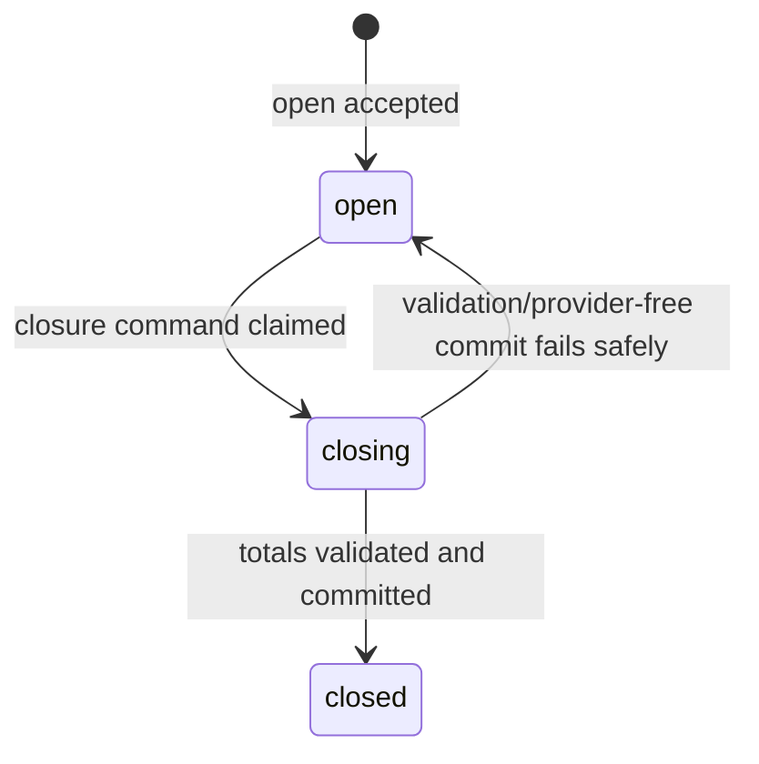
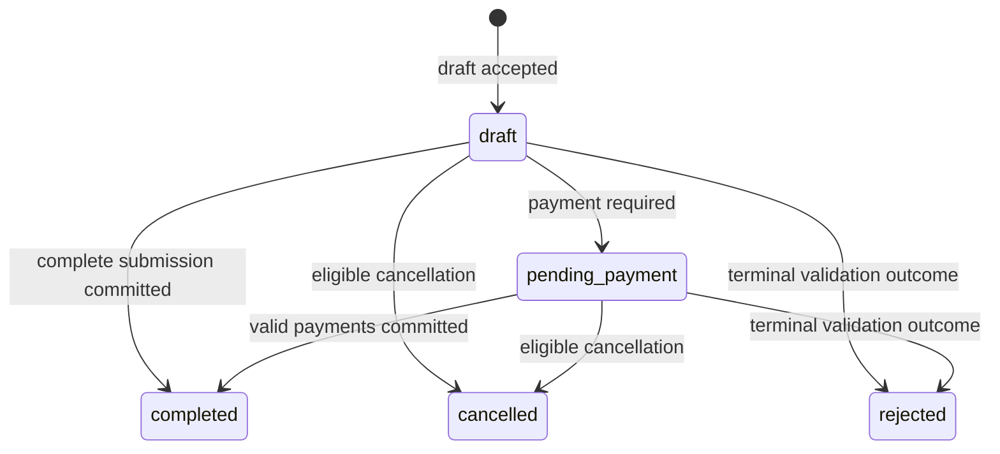
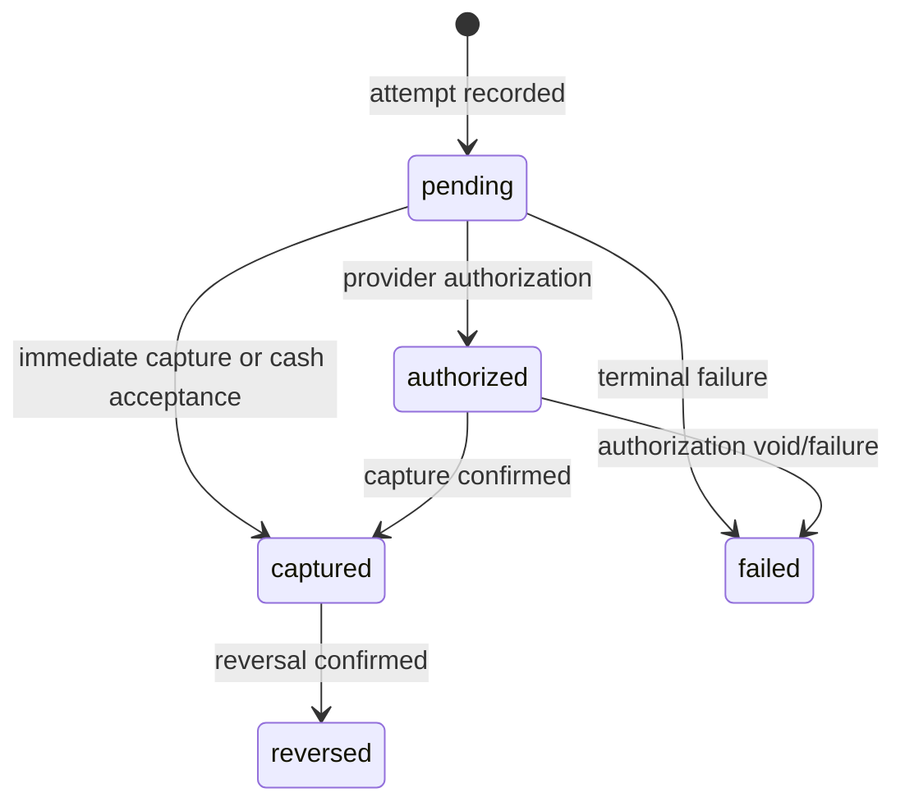
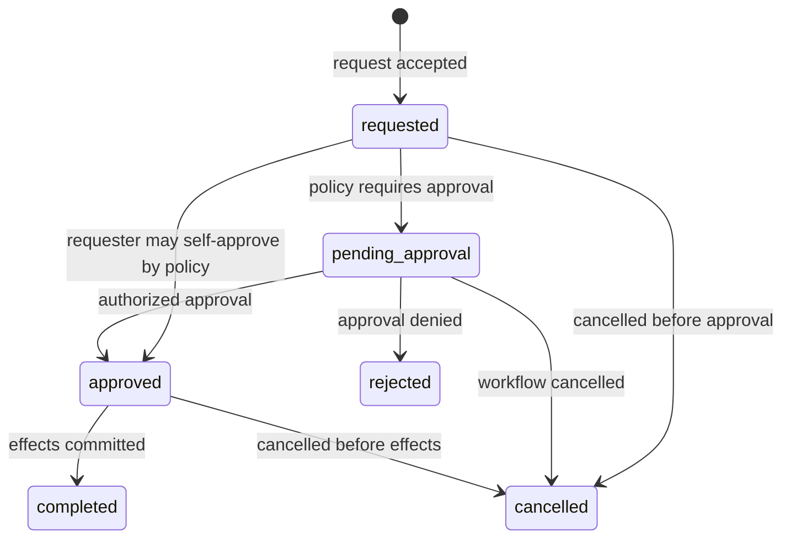
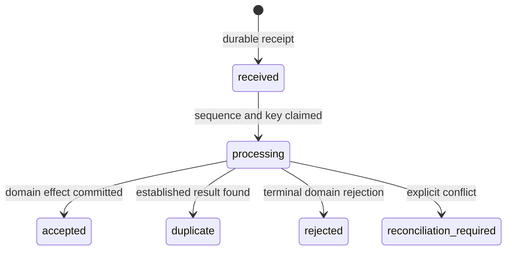
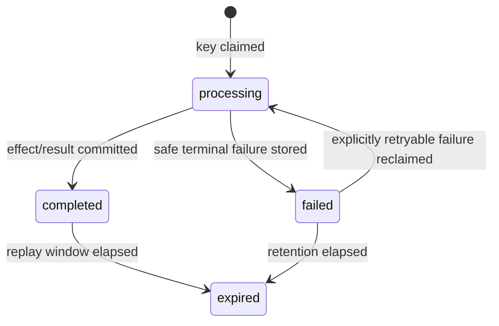

# AS ONE Core REST API Contracts

## 1. Status and purpose

This document is the authoritative REST contract for the first AS ONE transactional core. It is an implementation specification for future Fastify services and authorized AS POS, AS CEO, and administrative clients. It contains no executable API, framework code, SQL, or migration.

The contract is consistent with [CORE_DATA_MODEL.md](CORE_DATA_MODEL.md) and accepted ADRs [ADR-0001](adr/ADR-0001-money-and-rounding.md) through [ADR-0006](adr/ADR-0006-tenant-isolation.md).

## 2. Scope and non-goals

Included: authentication, company/branch context, users and authorization, devices/registers, cash operation, catalog, basic inventory, sales/payments, refunds, offline command synchronization, audit reads, checkpoints, and recovery after real-time gaps.

Excluded: customers, Rewards, events/parties, memberships, advanced promotions/tax engines, invoicing, suppliers/purchasing, recipes, payroll, accounting, AI, advanced analytics, detailed WebSocket protocol, and offline authentication.

## 3. Global conventions

| Concern | Contract |
| --- | --- |
| Base path | `/api/v1`; paths below are relative to it |
| Media type | Requests with bodies use `Content-Type: application/json`; responses use `application/json; charset=utf-8` |
| Compatibility | Additive changes only within v1. Existing meaning, required fields, and enum values are never repurposed. Breaking changes require a new version. Unknown response fields must be ignored; unknown request fields are rejected unless explicitly extensible. |
| Naming | JSON fields, query parameters, and event fields use `snake_case` |
| IDs | Public identifiers are UUID strings. UUIDv7 is preferred when approved tooling supports it; ordering never depends on UUID value. |
| Time | ISO 8601 UTC strings, normally `YYYY-MM-DDTHH:mm:ss.sssZ` |
| Money | JSON decimal strings with up to four fractional digits, plus ISO currency. Never JSON numbers/floats. Commercial MXN results use ADR-0001. |
| Quantities | JSON decimal strings with up to six fractional digits. Never floating-point assumptions. |
| Scope | `company_id` and `branch_id` in a path/body are resource references only. Authority comes exclusively from authenticated server context. Mismatch is rejected. |
| Optimistic concurrency | Mutable resources expose positive `version` and `ETag: "<version>"`. Mutations require `If-Match` where marked. |
| Idempotency | `Idempotency-Key` is required for financial, cash, inventory, and synchronization commands. Keys are tenant and operation scoped and bind to a request hash. |
| Traceability | Requests accept `X-Request-Id` and `X-Correlation-Id` UUIDs. The server generates missing values and echoes both in headers and envelopes. |
| Authentication | `Authorization: Bearer <access_token>` for protected routes; access tokens are short-lived. |
| Sensitive data | Secrets, token hashes, credentials, full payment data, internal stack traces, and unsafe audit payloads are never returned. |
| Deletion | Transactional records use cancellation, reversal, or compensating commands; ordinary DELETE is limited to revoking assignments or retiring non-transactional configuration. |

### 3.1 Header profiles

Endpoint tables reference these complete profiles:

| Profile | Required/accepted headers |
| --- | --- |
| `P` Public | `Content-Type` for body; optional request/correlation IDs; rate-limit headers returned |
| `S` Session | `Authorization`; optional request/correlation IDs |
| `Q` Versioned query | `S`; optional `If-None-Match`; returns `ETag` for single versioned resources |
| `O` Optimistic command | `S`; `Content-Type`; `If-Match`; optional request/correlation IDs |
| `C` Idempotent command | `S`; `Content-Type`; `Idempotency-Key`; optional `If-Match`; request/correlation IDs |
| `Y` Sync command | `S`; `Content-Type`; `Idempotency-Key`; `X-Device-Id`; request/correlation IDs |
| `R` Recovery query | `S`; request/correlation IDs; checkpoint query required where specified |

Missing a required header is `validation_error`; stale `If-Match` is `version_conflict`; reused idempotency content is `idempotency_conflict`.

### 3.2 Collection queries

- `limit`: positive integer; default and maximum remain configurable and are advertised in documentation/configuration.
- `cursor`: opaque stable cursor; clients must not parse it.
- `sort`: allowlisted stable ordering; every order includes a unique tie-breaker.
- `status`, `updated_after`, and domain filters are allowlisted per endpoint.
- High-volume transactional collections never use offset pagination.
- Cursor scope includes authenticated company/branch, filters, and ordering; reuse under a different scope is rejected.

## 4. Success envelopes

### 4.1 Single resource or command

```json
{
  "data": {},
  "meta": {
    "request_id": "018f0000-0000-7000-8000-000000000001",
    "correlation_id": "018f0000-0000-7000-8000-000000000002"
  }
}
```

### 4.2 Collection

```json
{
  "data": [],
  "meta": {
    "request_id": "018f0000-0000-7000-8000-000000000001",
    "correlation_id": "018f0000-0000-7000-8000-000000000002",
    "page": {
      "next_cursor": "opaque-or-null",
      "has_more": false,
      "limit": 50
    },
    "filters": {
      "status": "active"
    }
  }
}
```

Commands return `200` for an established/updated result, `201` for creation, `202` for accepted asynchronous processing, or `204` only where no resource representation is useful. A duplicate idempotent request returns the original status/body and `Idempotency-Replayed: true`.

## 5. Error contract

```json
{
  "error": {
    "code": "sale_version_conflict",
    "message": "The sale changed before this operation could be applied.",
    "details": {
      "expected_version": 3,
      "current_version": 4
    },
    "request_id": "018f0000-0000-7000-8000-000000000001",
    "correlation_id": "018f0000-0000-7000-8000-000000000002"
  }
}
```

`message` is safe and human-readable. `details` is structured, bounded, non-sensitive, and code-specific. Validation details use field paths and rule identifiers, never internal schemas or stack traces.

| Error code | HTTP | Meaning |
| --- | ---: | --- |
| `validation_error` | 400 or 422 | Malformed transport input (400) or valid shape violating declared validation (422) |
| `authentication_required` | 401 | Missing or unusable authentication |
| `invalid_credentials` | 401 | Login credentials rejected without account enumeration |
| `token_expired` | 401 | Access or refresh token expired |
| `session_expired` | 401 | Access/refresh session expired or revoked |
| `token_reuse_detected` | 401 | Rotated refresh token was reused; its token family is revoked |
| `forbidden` | 403 | Authenticated actor cannot perform the requested operation |
| `permission_denied` | 403 | Actor lacks required action permission |
| `company_scope_violation` | 403 | Resource/reference does not belong to authenticated company |
| `branch_scope_violation` | 403 | Branch is outside authorized scope |
| `not_found` | 404 | Resource absent or intentionally concealed by isolation |
| `company_scope_mismatch` | 403 | Requested resource/reference does not match the authenticated company context |
| `branch_scope_mismatch` | 403 | Requested branch does not match the actor's authorized branch scope |
| `resource_not_found` | 404 | Resource is absent or concealed to preserve isolation |
| `resource_conflict` | 409 | Current resource state prevents the operation |
| `version_conflict` | 409 | `If-Match` or `base_version` is stale |
| `idempotency_conflict` | 409 | Key reused with different request content/scope |
| `duplicate_request` | 409 | Command was already accepted under its idempotency identity |
| `device_sequence_gap` | 409 | Device sequence contains a gap that must be recovered before later commands |
| `device_sequence_replay` | 409 | Device sequence was replayed with a different command identity or payload |
| `cash_session_required` | 409 | Operation requires an open session |
| `cash_session_already_open` | 409 | Register already has an open session |
| `cash_session_not_open` | 409 | Mutation requires an open session but the session is absent or closed |
| `cash_session_closed` | 409 | Mutation attempted after cash-session closure |
| `price_conflict` | 409 | Submitted price snapshot is invalid/stale |
| `inventory_insufficient` | 409 | Movement would violate initial no-negative policy |
| `insufficient_inventory` | 409 | Inventory command would violate the no-negative policy |
| `inventory_movement_not_reversible` | 409 | Inventory movement is already reversed or cannot be reversed safely |
| `sale_not_mutable` | 409 | Sale state does not permit the requested mutation |
| `payment_not_reversible` | 409 | Payment is settled, already reversed, or otherwise ineligible for reversal |
| `sale_not_refundable` | 409 | Sale/status/payment is not refundable |
| `refund_limit_exceeded` | 409 | Quantity or value exceeds remaining refundable amount |
| `refund_approval_required` | 409 | Refund must be approved before completion |
| `device_revoked` | 403 | Device is revoked/decommissioned |
| `sync_sequence_conflict` | 409 | Device sequence is missing, repeated with different content, or otherwise invalid |
| `reconciliation_required` | 409 | Command requires explicit operator/server reconciliation |
| `rate_limited` | 429 | Rate limit exceeded; `Retry-After` returned |
| `rate_limit_exceeded` | 429 | Rate limit exceeded; `Retry-After` returned |
| `service_unavailable` | 503 | Required service is temporarily unavailable; retry policy is response-specific |
| `internal_error` | 500 | Unexpected server error with no internal disclosure |

All errors include trace IDs. New domain-safe codes may be added without changing the envelope.

## 6. Authorization model and permission registry

Permissions are action capabilities evaluated with active company membership, branch access, user role assignments, session, and device. Platform support access is outside this contract. The core uses **53 permissions**:

| Area | Permission keys |
| --- | --- |
| Company | `company.read`, `company.update`, `company_settings.read`, `company_settings.update` |
| Branch | `branch.read`, `branch.create`, `branch.update`, `branch_settings.read`, `branch_settings.update` |
| Identity | `user.read`, `user.create`, `user.update`, `role.read`, `role.create`, `role.update`, `role.assign`, `permission.read`, `branch_access.manage` |
| Devices | `device.read`, `device.register`, `device.revoke` |
| Registers/cash | `cash_register.read`, `cash_register.manage`, `cash_session.read`, `cash_session.open`, `cash_movement.create`, `cash_session.close` |
| Catalog | `catalog.read`, `category.manage`, `product.manage`, `price.manage`, `availability.manage` |
| Inventory | `inventory.read`, `inventory.cost.read`, `inventory_location.manage`, `inventory.adjust`, `inventory.count`, `inventory.reverse` |
| Sales | `sale.read`, `sale.create`, `sale.complete`, `sale.cancel` |
| Payments | `payment.read`, `payment.create`, `payment.reverse` |
| Refunds | `refund.read`, `refund.create`, `refund.approve`, `refund.complete`, `refund.cancel` |
| Sync/operations | `sync.execute`, `audit.read`, `recovery.read` |

Authentication routes require no business permission but enforce rate limits, session policy, and account/device status.

## 7. Shared representations

All resource representations include `id`, ownership fields where applicable, lifecycle status, timestamps, and `version` when mutable. Fields below define contract minima, not permission to expose sensitive columns.

| Representation | Required public fields |
| --- | --- |
| `company` | `id`, `slug`, `display_name`, `status`, `default_currency`, `timezone`, `version`, timestamps |
| `branch` | `id`, `company_id`, `code`, `name`, `status`, `timezone`, safe address, `version`, timestamps |
| `user` | `id`, `display_name`, safe contact fields, `status`, `version`; never credential hashes |
| `role` | `id`, `company_id`, `code`, `name`, `status`, `is_system`, `version` |
| `device` | `id`, scope, `device_code`, `name`, `device_type`, `status`, `last_seen_at`, `app_version`, `version`; never private keys |
| `cash_register` | `id`, scope, `code`, `name`, `status`, `device_id`, `version` |
| `cash_session` | IDs/scope, register, operator/times, exact amounts/currency, status, discrepancy, `version` |
| `category` | IDs/scope, parent, code/name, order, status, presentation metadata, `version` |
| `product` | IDs/scope, category, SKU/barcode, name/type/unit, inventory/weight flags, tax code, status, `version` |
| `product_price` | IDs/scope, product, type, decimal-string amount/currency, validity, status, `version` |
| `inventory_balance` | IDs/scope, location/product, decimal-string on-hand/reserved/available, `version`, `updated_at` |
| `inventory_movement` | IDs/scope, location/product, type, decimal quantity, reason/reference, actor/device/time, reversal, balance version |
| `sale` | IDs/scope/session/register/device, sale number/status/currency, exact totals, times, actor, `version`, items/payments when expanded |
| `payment` | IDs/scope/sale/session, method/status, amount/currency, safe references, time, reversal |
| `refund` | IDs/scope/original sale/session, number/status/reason, exact totals, actors/times, `version` |
| `sync_outcome` | operation identity/sequence, status, aggregate, result code/data, conflict data, checkpoint |

## 8. Reusable command schemas

### 8.1 Scope and references

`company_id` and `branch_id` may appear to make resource identity explicit, but the server compares them to authenticated context. Omission is preferred when the route/context is unambiguous. Reference mismatches are never coerced.

### 8.2 Optimistic update

Administrative PATCH bodies contain only allowlisted mutable fields and no `version`; the version is supplied through `If-Match`. Successful responses return the incremented version/ETag.

### 8.3 Money and quantities

```json
{
  "amount": "125.5000",
  "currency": "MXN",
  "quantity": "2.500000"
}
```

The server validates precision, scale, sign, currency agreement, and ADR-0001 rounding. It recalculates every authoritative commercial total.

### 8.4 Command metadata

Offline-capable commands may include:

```json
{
  "client_operation_id": "018f0000-0000-7000-8000-000000000010",
  "sequence_number": 42,
  "base_version": 3,
  "occurred_at": "2026-07-22T15:00:00.000Z"
}
```

Presence does not make a command offline-approved. Each endpoint states its policy.

## 9. Endpoint contract notation

The endpoint catalogue contains **96 endpoints**. `Common` errors for protected routes are `authentication_required`, `session_expired`, `permission_denied`, scope mismatches, `resource_not_found`, `rate_limit_exceeded`, and `internal_error`. `V` adds validation errors; `OC` adds `version_conflict`/`resource_conflict`; `IC` adds idempotency conflict and stored replay semantics.

Effects use `audit / outbox`; `—` means no domain audit/event beyond security request telemetry. Query endpoints never create outbox events.

## 10. Authentication and sessions — E001–E007

| ID | Method and route; purpose | Permission / scope | Inputs | Success / errors | Idempotency, concurrency, effects |
| --- | --- | --- | --- | --- | --- |
| E001 | `POST /auth/login`; establish session | Public; requested company/branch only narrows verified membership | `P`; body `identifier*`, `password*`, optional `company_id`, `branch_id`, `device_id` | `200` access/session representation; `invalid_credentials`, scope mismatch, `device_revoked`, rate limit | Not idempotent; credential/session security audit / `auth.session.started` only for authorized security consumers |
| E002 | `POST /auth/refresh`; rotate refresh token | Valid refresh session and company context | `P`; refresh credential through the approved secure transport; optional `device_id` binding | `200` new access token and rotated refresh result; `session_expired`, reuse detection | Single-use rotation under session version lock; audit rotation/reuse / `auth.session.revoked` on reuse |
| E003 | `POST /auth/logout`; revoke current session | Current session | `S`; no body unless transport requires refresh-session selector | `204`; session errors remain safe/idempotent | Repeated revoke succeeds; audit / `auth.session.revoked` |
| E004 | `POST /auth/logout-all`; revoke actor's sessions in current company | Current user/company | `S`; body optional `except_current=false` | `200` `{revoked_count}` | Idempotent result by current state; audit / `auth.user_sessions.revoked` |
| E005 | `GET /auth/session`; current session metadata | Current session/company | `S`; no params | `200` session ID, expiry, company, permitted branches, device, security flags; Common | Query; — / — |
| E006 | `GET /auth/me`; current safe identity/memberships | Current session; results limited to actor | `S`; optional `include=memberships,branches` | `200` user and authorized memberships; Common | Query; — / — |
| E007 | `GET /auth/permissions`; effective capabilities | Current session/company/optional authorized branch | `S`; query optional `branch_id` | `200` permission keys, branch scope, policy/version marker; scope errors | Query; — / — |

Refresh tokens are never returned in URLs, logs, audit payloads, or ordinary JSON when a secure, same-site, HTTP-only cookie transport is selected. The final browser/native refresh transport remains open; rotation and reuse detection are mandatory in either case. Offline authentication is not part of v1.

## 11. Company, branch, and context — E008–E019

| ID | Method and route; purpose | Permission / scope | Inputs | Success / errors | Idempotency, concurrency, effects |
| --- | --- | --- | --- | --- | --- |
| E008 | `GET /context/companies`; companies available to actor | Authenticated memberships | `S`; cursor, limit, status | `200` company summaries; Common | Query; — / — |
| E009 | `GET /context/branches`; authorized branches in active company | Active company membership | `S`; cursor, limit, status | `200` branch summaries and default marker; Common | Query; — / — |
| E010 | `GET /companies/{company_id}`; company detail | `company.read`; company | `Q`; path company UUID | `200 company`; Common | ETag; — / — |
| E011 | `PATCH /companies/{company_id}`; update safe company fields | `company.update`; company | `O`; path; body allowlisted `display_name`, `timezone`, `status` transition | `200 company`; Common+V+OC | Optimistic; `company.updated` / `company.updated` |
| E012 | `GET /companies/{company_id}/branches`; list branches | `branch.read`; company, filtered by actor branch access unless company-wide | `S`; cursor, limit, status, updated_after | `200` branches; Common | Query; — / — |
| E013 | `POST /companies/{company_id}/branches`; create branch | `branch.create`; company | `S` + JSON; body client UUID optional, `code*`, `name*`, `timezone*`, safe address | `201 branch`; Common+V+resource conflict | Server/client UUID unique; `branch.created` / `branch.created` |
| E014 | `GET /branches/{branch_id}`; branch detail | `branch.read`; authorized branch | `Q`; path branch UUID | `200 branch`; Common | ETag; — / — |
| E015 | `PATCH /branches/{branch_id}`; update/deactivate branch | `branch.update`; branch | `O`; body allowlisted branch fields/status | `200 branch`; Common+V+OC | Optimistic; `branch.updated` / `branch.updated` |
| E016 | `GET /companies/{company_id}/settings/effective`; effective company settings | `company_settings.read`; company | `Q`; query optional `keys` allowlist | `200` safe typed effective settings and version checkpoint; Common | Secrets omitted; — / — |
| E017 | `PUT /companies/{company_id}/settings/{key}`; set/retire company value | `company_settings.update`; company | `O`; path key; body `value*`, `value_type*`, optional `status` | `200 setting`; Common+V+OC | Optimistic; secret values handled by separate future secret facility; `company_setting.changed` / same |
| E018 | `GET /branches/{branch_id}/settings/effective`; resolve company+branch settings | `branch_settings.read`; branch | `Q`; optional keys | `200` values with source scope and checkpoint; Common | Query; — / — |
| E019 | `PUT /branches/{branch_id}/settings/{key}`; set/retire branch override | `branch_settings.update`; branch | `O`; body typed value/status | `200 setting`; Common+V+OC | Optimistic and only overridable keys; `branch_setting.changed` / same |

Administrative company/branch routes are separate from `/context/*`, which only discovers authority already granted to the current actor.

## 12. Users, roles, permissions, and branch access — E020–E033

| ID | Method and route; purpose | Permission / scope | Inputs | Success / errors | Idempotency, concurrency, effects |
| --- | --- | --- | --- | --- | --- |
| E020 | `GET /users`; list company members | `user.read`; company and authorized branches | `S`; cursor, limit, status, branch_id, role_id, search | `200` safe users/membership summary; Common | Query; — / — |
| E021 | `POST /users`; create/invite company user | `user.create`; company | `S` + JSON; body optional client UUID, `display_name*`, safe contact, enrollment method; no plaintext credential echo | `201` user/membership enrollment state; Common+V+conflict | Invitation/enrollment policy open; `user.created` / `user.created` |
| E022 | `GET /users/{user_id}`; member detail | `user.read`; company/branch visibility | `Q`; path; optional include roles/branches | `200` safe user; Common | ETag for profile; — / — |
| E023 | `PATCH /users/{user_id}`; update profile/status | `user.update`; company | `O`; allowlisted profile/status fields | `200 user`; Common+V+OC | Optimistic; status change may revoke sessions; `user.updated` / `user.updated` or `auth.user_sessions.revoked` |
| E024 | `GET /roles`; list company roles | `role.read`; company | `S`; cursor, limit, status | `200 roles`; Common | Query; — / — |
| E025 | `POST /roles`; create role | `role.create`; company | `S` + JSON; body optional ID, `code*`, `name*`, description | `201 role`; Common+V+conflict | `role.created` / `role.created` |
| E026 | `GET /roles/{role_id}`; role and grants | `role.read`; company | `Q`; optional include permissions | `200 role`; Common | ETag; — / — |
| E027 | `PATCH /roles/{role_id}`; update/retire role | `role.update`; company | `O`; allowlisted name/description/status | `200 role`; Common+V+OC | System restrictions; `role.updated` / `role.updated` |
| E028 | `PUT /roles/{role_id}/permissions`; replace effective grant set intentionally | `role.update`; company | `O`; body `permissions*` array `{permission_key,effect}` | `200 role` with grants and new version; Common+V+OC | Atomic diff; `role.permissions_changed` / same |
| E029 | `POST /users/{user_id}/roles`; assign role | `role.assign`; company/optional branch | `S` + JSON; body `role_id*`, optional `branch_id`, `valid_from`, `valid_until` | `201 assignment`; Common+V+conflict | Duplicate active equivalence returns existing or conflict by exact body; `user.role_assigned` / same |
| E030 | `DELETE /users/{user_id}/roles/{assignment_id}`; revoke assignment | `role.assign`; assignment scope | `S`; optional body is prohibited; query optional safe reason code | `204`; Common+resource conflict | Revocation is idempotent; `user.role_revoked` / same |
| E031 | `PUT /users/{user_id}/branch-access/{branch_id}`; grant/update branch access | `branch_access.manage`; branch | `O` for existing or `S` for creation; body `status*`, `is_default*` | `200` or `201` access grant; Common+V+OC | One default per company/user; `user.branch_access_changed` / same |
| E032 | `DELETE /users/{user_id}/branch-access/{branch_id}`; revoke access | `branch_access.manage`; branch | `S`; optional reason query | `204`; Common+resource conflict | Idempotent revoke; invalidates affected sessions/caches; `user.branch_access_revoked` / same |
| E033 | `GET /permissions`; discover global permission catalog | `permission.read`; company context | `S`; cursor, limit, resource, action, status | `200` permission definitions; Common | Query; — / — |

## 13. Devices, registers, and cash operation — E034–E048

| ID | Method and route; purpose | Permission / scope | Inputs | Success / errors | Idempotency, concurrency, effects |
| --- | --- | --- | --- | --- | --- |
| E034 | `POST /devices`; register device identity | `device.register`; authorized branch | `S` + JSON; body optional client UUID, `branch_id*`, `device_code*`, `name*`, `device_type*`, public key/attestation when approved | `201 device` plus one-time enrollment result through secure channel; Common+V+conflict | Enrollment request must be replay-safe through client ID; `device.registered` / same |
| E035 | `GET /devices`; list devices | `device.read`; company/authorized branches | `S`; cursor, limit, branch_id, type, status, last_seen_before | `200 devices`; Common | Query; — / — |
| E036 | `GET /devices/{device_id}`; device detail | `device.read`; device branch | `Q`; path | `200 device`; Common | ETag; no secret/private key; — / — |
| E037 | `POST /devices/{device_id}/revocations`; revoke device | `device.revoke`; device branch | `C`; body `reason_code*`, optional note | `201` revocation/device state; Common+IC+resource conflict | Revokes sessions and new sync commands; `device.revoked` / `device.revoked` |
| E038 | `GET /cash-registers`; list registers | `cash_register.read`; authorized branches | `S`; cursor, limit, branch_id, status, device_id | `200 registers`; Common | Query; — / — |
| E039 | `POST /cash-registers`; create register | `cash_register.manage`; branch | `S` + JSON; body optional ID, `branch_id*`, `code*`, `name*`, optional device | `201 register`; Common+V+conflict/scope | Device branch must match; `cash_register.created` / same |
| E040 | `GET /cash-registers/{register_id}`; register detail | `cash_register.read`; branch | `Q`; path | `200 register`; Common | ETag; — / — |
| E041 | `PUT /cash-registers/{register_id}/device-assignment`; assign/unassign device | `cash_register.manage`; branch | `O`; body nullable `device_id`, `reason_code*` | `200 register`; Common+V+OC+scope | Device/register same branch; one active assignment; `cash_register.device_assigned` / same |
| E042 | `POST /cash-sessions`; open session | `cash_session.open`; register branch | `C`; body client UUID*, `cash_register_id*`, `device_id*`, `opening_amount*`, `currency*`, `occurred_at*`, optional offline metadata | `201 cash_session`; cash already open, device revoked, scope, IC | Atomic one-open check; approved offline subject to sync policy; `cash_session.opened` / same |
| E043 | `GET /cash-sessions/current`; find open session | `cash_session.read`; branch | `S`; query exactly one of `cash_register_id` or `device_id` | `200 session` or `data:null`; Common+V | Query; — / — |
| E044 | `GET /cash-sessions/{session_id}`; session detail | `cash_session.read`; branch | `Q`; optional include summary | `200 session`; Common | ETag; — / — |
| E045 | `POST /cash-sessions/{session_id}/movements`; cash in/out | `cash_movement.create`; session branch | `C`; body client UUID*, `movement_type*`, positive `amount*`, `currency*`, `reason_code*`, note, device, occurred_at, offline metadata | `201 movement` and session summary; session closed, IC, insufficient policy, scope | Immutable command; offline allowed only for registered session/device; `cash_movement.created` / same |
| E046 | `GET /cash-sessions/{session_id}/movements`; movement history | `cash_session.read`; branch | `S`; cursor, limit, type, occurred_from/to | `200 movements`; Common | Stable `(occurred_at,id)` cursor; — / — |
| E047 | `POST /cash-sessions/{session_id}/closures`; close session | `cash_session.close`; branch | `C`; body `declared_closing_amount*`, currency*, denomination summary optional, reason/note, occurred_at*, expected `base_version*` | `201` closure result and closed session; session closed, version, IC | Server calculates expected/discrepancy; no reopen in v1; `cash_session.closed` / same |
| E048 | `GET /cash-sessions/{session_id}/summary`; totals/discrepancy | `cash_session.read`; branch | `S`; no query except optional `as_of` for open session | `200` exact totals by payment/movement, expected, declared, discrepancy, freshness; Common | Query from authoritative facts; — / — |

### 13.1 Cash transition rules

- Opening validates register/device/branch, currency, authorization, and the partial unique “one open session” invariant.
- Cash movements are positive amounts with an explicit direction/type; correction creates a reversal/compensating movement.
- Closure recalculates all totals and rejects stale `base_version`. Closed sessions are immutable.

## 14. Catalog — E049–E063

| ID | Method and route; purpose | Permission / scope | Inputs | Success / errors | Idempotency, concurrency, effects |
| --- | --- | --- | --- | --- | --- |
| E049 | `GET /categories`; list categories | `catalog.read`; company | `S`; cursor, limit, parent_id, status, updated_after, sort allowlist | `200 categories`; Common | Query; — / — |
| E050 | `POST /categories`; create category | `category.manage`; company | `S` + JSON; body optional ID, parent, `code*`, `name*`, description, sort_order, presentation | `201 category`; Common+V+conflict | Parent same company/no cycle; `category.created` / same |
| E051 | `GET /categories/{category_id}`; category detail | `catalog.read`; company | `Q`; path | `200 category`; Common | ETag; — / — |
| E052 | `PATCH /categories/{category_id}`; update/reorder/retire | `category.manage`; company | `O`; allowlisted fields | `200 category`; Common+V+OC | Cycle/dependency checks; `category.updated` / same |
| E053 | `GET /products`; list/search products | `catalog.read`; company and optional branch availability | `S`; cursor, limit, category_id, branch_id, status, sku/barcode exact, search, updated_after | `200 products`; Common/scope | Stable cursor; optional effective availability expansion; — / — |
| E054 | `POST /products`; create product and, when supplied or required, its default variant | `product.manage`; company | `S` + JSON; body optional product ID, `code*`, `name*`, `product_type*`, status, tracking flag, category, brand, tax code, and nested `default_variant`; no SKU, barcode, UOM, quantity scale, cost, or currency exists directly on product | `201 product` with authorized default-variant representation; Common+V+conflict, `invalid_product_state`, duplicate SKU/barcode | Product and default variant commit atomically; `product.created` and `product_variant.updated` / same |
| E055 | `GET /products/{product_id}`; detail | `catalog.read`; company | `Q`; optional include current prices/availability | `200 product`; Common | ETag; — / — |
| E056 | `PATCH /products/{product_id}`; update/retire | `product.manage`; company | `O`; allowlisted mutable fields/status | `200 product`; Common+V+OC | Completed sale snapshots unaffected; `product.updated` / same |
| E057 | `GET /products/{product_id}/prices`; list price records/effective result | `catalog.read`; company/authorized branch | `S`; cursor, limit, branch_id, price_type, currency, valid_at, status | `200` records plus `effective_price` when valid_at supplied; Common | Precedence remains an open decision; — / — |
| E058 | `POST /products/{product_id}/prices`; create effective-dated price | `price.manage`; company/optional branch | `S` + JSON; body optional ID, branch, `price_type*`, decimal `amount*`, currency*, valid interval* | `201 price`; price conflict, scope, V | Overlap rejected; `product_price.created` / `product.price_changed` |
| E059 | `PATCH /product-prices/{price_id}`; expire/correct future price | `price.manage`; scope of price | `O`; allowed status/valid_until and future unpublished amount only | `200 price`; price conflict, Common+OC | Referenced/effective historical price not rewritten; `product_price.updated` / `product.price_changed` |
| E060 | `GET /product-availability`; list branch availability | `catalog.read`; authorized branch | `S`; cursor, limit, branch_id*, product_id, channel, available, updated_after | `200 availability`; Common | Query; — / — |
| E061 | `PUT /branches/{branch_id}/products/{product_id}/availability`; upsert availability | `availability.manage`; branch | `O` if existing, `S` if absent; body `is_available*`, `sales_channel*`, display_order | `200/201 availability`; Common+V+OC | Same-company product; `product.availability_changed` / same |
| E062 | `GET /catalog/checkpoints`; current catalog checkpoint | `catalog.read`; company/authorized branch | `S`; optional branch_id, channel | `200` opaque checkpoint and generated_at | Query; — / — |
| E063 | `GET /catalog/changes`; incremental catalog read | `catalog.read`; company/branch | `R`; `since_checkpoint*`, limit, optional branch/channel | `200` ordered upserts/tombstones plus next checkpoint/has_more; invalid checkpoint, scope | Never LWW submission; read recovery only; — / — |

### 14.1 E054 product and default-variant creation

SKU, barcode, unit of measure, quantity scale, standard cost, and currency are attributes of a concrete variant, never direct product-owned fields. A representative request is:

```json
{
  "code": "ACCESS-GENERAL",
  "name": "Acceso general",
  "product_type": "simple",
  "status": "active",
  "tracks_inventory": true,
  "category_id": "018f0000-0000-7000-8000-000000000010",
  "brand_id": null,
  "default_variant": {
    "sku": "ACCESS-GENERAL-DEFAULT",
    "unit_of_measure_code": "unit",
    "quantity_scale": 0,
    "standard_cost": "0.0000",
    "currency_code": "MXN",
    "barcode": {
      "type": "internal",
      "value": "ACCESS001",
      "is_primary": true
    }
  }
}
```

- `simple`: `default_variant` is required; product and variant are created atomically.
- `service`: `default_variant` is required; both product and variant have `tracks_inventory=false`.
- `kit`: `default_variant` is required in this block and has `tracks_inventory=false`; E054 does not explode components and does not implement `product_components`.
- `variable`: `default_variant` may be omitted only while the product remains `draft`. Activation requires at least one active variant and exactly one default variant.
- Product and nested references are resolved only inside the authenticated company. The server rejects unknown fields and cross-company category, brand, unit, or barcode references.
- `standard_cost` is an exact decimal string. It is accepted under `product.manage`, but is omitted from responses unless the actor also has effective `inventory.cost.read`; omission is used instead of a placeholder zero.
- Future sale lines, inventory facts, and commercial item references use `product_variant_id`, not `product_id`.

## 15. Inventory — E064–E072

| ID | Method and route; purpose | Permission / scope | Inputs | Success / errors | Idempotency, concurrency, effects |
| --- | --- | --- | --- | --- | --- |
| E064 | `GET /inventory/locations`; list locations | `inventory.read`; authorized branches | `S`; cursor, limit, branch_id, type, status | `200 locations`; Common | Query; — / — |
| E065 | `POST /inventory/locations`; create location | `inventory_location.manage`; branch | `S` + JSON; body optional ID, `branch_id*`, `code*`, `name*`, `location_type*` | `201 location`; Common+V+conflict | `inventory_location.created` / same |
| E066 | `PATCH /inventory/locations/{location_id}`; update/deactivate | `inventory_location.manage`; branch | `O`; allowlisted fields/status | `200 location`; Common+V+OC | Cannot deactivate with unresolved operations by policy; `inventory_location.updated` / same |
| E067 | `GET /inventory/balances`; current projections | `inventory.read`; branch | `S`; cursor, limit, branch_id*, location_id, `product_variant_id`, changed_after | `200 balances` with variant identity, exact quantities, version, checkpoint/freshness; Common | Balance is read-only projection; — / — |
| E068 | `GET /inventory/movements`; posted ledger history | `inventory.read`; branch | `S`; cursor, limit, branch/location/`product_variant_id`/type/status/reference, occurred_from/to | `200 movements`; Common | Status vocabulary is `draft,pending,posted,cancelled,reversed`; stable `(occurred_at,id)`; — / — |
| E069 | `POST /inventory/adjustments`; create and post adjustment | `inventory.adjust`; branch/location | `C`; body client movement UUID*, location*, `product_variant_id*`, `direction*`=`adjustment_in|adjustment_out`, positive `quantity*`, reason_code*, note, `expected_version*`, occurred_at, offline metadata | `201` posted movement plus balance; `insufficient_inventory`, `negative_inventory_not_allowed`, `inventory_balance_conflict`, IC | Atomic ledger+balance+audit+outbox; `inventory.adjusted` / `inventory.stock.changed` |
| E070 | `POST /inventory/counts`; apply authorized immediate physical count | `inventory.count`; branch/location | `C`; body client command ID*, location*, `product_variant_id*`, nonnegative `counted_quantity*`, `expected_version*`, reason/note, occurred_at | `201` posted adjustment movement and balance; `insufficient_inventory`, `inventory_balance_conflict`, IC | Response records calculated direction and positive delta; persistent count workflow remains E115-E123; `inventory.count_applied` / `inventory.stock.changed` |
| E071 | `POST /inventory/movements/{movement_id}/reversals`; fully compensate eligible posted manual movement | `inventory.reverse`; original branch | `C+O`; body `reason_code*`, note | `201` linked posted reversal result; `movement_already_reversed`, `inventory_movement_not_reversible`, `insufficient_inventory`, IC | `Idempotency-Key` plus original strong `If-Match`; creates inverse movement and atomically marks original reversed; movement-created/reversed and stock-changed events |
| E072 | `GET /inventory/changes`; incremental balances/movements | `inventory.read`; branch | `R`; `since_checkpoint*`, limit, branch/location filters | `200` ordered changes/tombstones and next checkpoint; invalid checkpoint/scope | Recovery/read model only; — / — |

Inventory balances have no POST/PATCH endpoint. Every accepted mutation creates an immutable movement, and the initial policy rejects a resulting negative on-hand balance.

## 16. Sales and payments — E073–E080

### 16.1 Complete sale submission body

`POST /sales` accepts one aggregate command:

```json
{
  "id": "018f0000-0000-7000-8000-000000000100",
  "cash_register_id": "018f0000-0000-7000-8000-000000000101",
  "cash_session_id": "018f0000-0000-7000-8000-000000000102",
  "device_id": "018f0000-0000-7000-8000-000000000103",
  "submission_mode": "complete",
  "currency": "MXN",
  "items": [
    {
      "id": "018f0000-0000-7000-8000-000000000104",
      "line_number": 1,
      "product_id": "018f0000-0000-7000-8000-000000000105",
      "product_version": 7,
      "price_id": "018f0000-0000-7000-8000-000000000106",
      "price_version": 3,
      "sku_snapshot": "ENT-001",
      "name_snapshot": "General admission",
      "quantity": "2.000000",
      "unit_price": "150.0000",
      "submitted_subtotal": "300.0000",
      "submitted_discount_total": "0.0000",
      "submitted_tax_total": "0.0000",
      "submitted_line_total": "300.0000"
    }
  ],
  "submitted_totals": {
    "subtotal": "300.0000",
    "discount_total": "0.0000",
    "tax_total": "0.0000",
    "total": "300.0000"
  },
  "payments": [
    {
      "id": "018f0000-0000-7000-8000-000000000107",
      "payment_method": "cash",
      "amount": "300.0000",
      "currency": "MXN"
    }
  ],
  "offline": {
    "client_operation_id": "018f0000-0000-7000-8000-000000000108",
    "sequence_number": 44,
    "base_version": null,
    "payload_hash": "sha256:base64url-value",
    "occurred_at": "2026-07-22T15:00:00.000Z"
  }
}
```

The server independently resolves authorization, effective products/prices, rounding, inventory, session status, totals, payment policy, and duplicate state. Submitted snapshots are evidence and display history, not authority. A mismatch returns `price_conflict`, `validation_error`, `insufficient_inventory`, or `reconciliation_required` without partially committing effects.

| ID | Method and route; purpose | Permission / scope | Inputs | Success / errors | Idempotency, concurrency, effects |
| --- | --- | --- | --- | --- | --- |
| E073 | `POST /sales`; create draft or atomically complete sale | `sale.create` plus `sale.complete` when mode complete; branch/register | `C`; aggregate body above; client-generated sale/items/payment IDs; optional offline metadata | `201` sale + outcome `accepted`; replay returns same with `duplicate`; `409` structured `reconciliation_required`; rejected commands use safe error/result | Server transaction covers sale, lines, allowed payments, inventory/cash effects, audit, idempotency, sync outcome, outbox; `sale.created` and optionally `sale.completed` |
| E074 | `GET /sales/{sale_id}`; sale detail | `sale.read`; sale branch | `S`; path; include allowlist `items,payments,refund_summary` | `200 sale`; Common | Completed snapshot immutable; — / — |
| E075 | `GET /sales`; stable sale history | `sale.read`; authorized branches | `S`; cursor, limit, branch/register/session/device/status, occurred_from/to, sale_number | `200 sales`; Common | Stable `(occurred_at,id)` cursor; — / — |
| E076 | `POST /sales/{sale_id}/completion`; complete existing draft | `sale.complete`; sale branch | `C`; body `base_version*`, optional submitted totals, payment IDs to include, occurred_at | `200 completed sale`; cash session/price/inventory/version/IC errors | Recalculate and commit effects atomically; `sale.completed` / same plus inventory/payment events |
| E077 | `POST /sales/{sale_id}/cancellations`; cancel eligible non-completed or policy-eligible sale | `sale.cancel`; branch | `C`; body `reason_code*`, note, `base_version*`, occurred_at | `201 cancellation result/sale`; resource conflict, version, IC; completed settled sale normally requires refund | Compensating effects only where valid; `sale.cancelled` / same |
| E078 | `POST /sales/{sale_id}/payments`; register payment attempt/result | `payment.create`; branch/session | `C`; body client UUID*, method*, amount*, currency*, safe provider fields, occurred_at, optional offline metadata | `201 payment`; session, currency, provider, IC errors | Cash may be approved offline; electronic provider authorization online; `payment.recorded` / `payment.status_changed` |
| E079 | `GET /sales/{sale_id}/payments`; payment history | `payment.read`; branch | `S`; cursor, limit, status, method | `200 payments`; Common | Query; sensitive provider data omitted; — / — |
| E080 | `POST /payments/{payment_id}/reversals`; reverse eligible captured payment | `payment.reverse`; branch | `C`; body client UUID*, reason_code*, note, occurred_at | `201 reversal payment`; resource conflict, IC, provider failure | Original immutable; external side effect uses resumable state; `payment.reversed` / same |

### 16.2 Sale outcomes

| Outcome | HTTP behavior | Meaning |
| --- | --- | --- |
| `accepted` | `201`/`200` | Command committed and returned authoritative aggregate |
| `duplicate` | Original status/body + `Idempotency-Replayed: true` | Exact command was already established |
| `rejected` | Appropriate 4xx error envelope | No business effect committed; result is terminal for that payload |
| `reconciliation_required` | `409` error plus safe current/submitted comparison | No silent overwrite; operator/client must refresh and choose an allowed new command |

## 17. Refunds — E081–E087

Refund commands are **online-only** in this initial contract. They always reference the original sale and enforce remaining quantity/value, payment state, actor approval, branch policy, and exact currency.

| ID | Method and route; purpose | Permission / scope | Inputs | Success / errors | Idempotency, concurrency, effects |
| --- | --- | --- | --- | --- | --- |
| E081 | `GET /sales/{sale_id}/refundable-balance`; calculate remaining eligibility | `refund.read`; sale branch | `S`; optional as_of | `200` sale-level and line-level refundable quantities/values, reasons blocking refund, version marker; sale not refundable | Query; — / — |
| E082 | `POST /refunds`; request refund | `refund.create`; original sale branch | `C`; body client UUID*, `sale_id*`, session optional, reason*, currency*, items `{sale_item_id,quantity,submitted amounts,restock_disposition}`, submitted totals, occurred_at | `201 refund` in requested/approved state by policy; limit, not refundable, IC | Server recalculates; `refund.requested` / same |
| E083 | `GET /refunds/{refund_id}`; refund detail | `refund.read`; branch | `Q`; include items/payment effects | `200 refund`; Common | ETag; — / — |
| E084 | `GET /refunds`; list refunds | `refund.read`; authorized branches | `S`; cursor, limit, branch, sale, status, occurred range | `200 refunds`; Common | Stable cursor; — / — |
| E085 | `POST /refunds/{refund_id}/approval`; approve pending refund | `refund.approve`; branch | `C`; body `base_version*`, decision reason/note | `200 approved refund`; version, limit recheck, conflict, IC | Approver may not equal requester when policy requires separation; `refund.approved` / same |
| E086 | `POST /refunds/{refund_id}/completion`; commit refund/payment/inventory effects | `refund.complete`; branch | `C`; body `base_version*`, refund payment instructions, occurred_at | `200 completed refund`; limit, inventory disposition, provider, session, version, IC | One transaction for local records/ledger/outbox; external provider resumable; `refund.completed` / refund/payment/inventory events |
| E087 | `POST /refunds/{refund_id}/cancellations`; cancel eligible refund workflow | `refund.cancel`; branch | `C`; body `base_version*`, reason_code*, note | `200 cancelled refund`; completed conflict, version, IC | Completed refund cannot cancel; correction needs new compensating process; `refund.cancelled` / same |

## 18. Offline synchronization — E088–E092

### 18.1 Operation schema

```json
{
  "client_operation_id": "018f0000-0000-7000-8000-000000000201",
  "sequence_number": 45,
  "operation_type": "sale.submit",
  "aggregate_type": "sale",
  "aggregate_id": "018f0000-0000-7000-8000-000000000100",
  "base_version": null,
  "payload": {},
  "payload_hash": "sha256:base64url-value",
  "idempotency_key": "device-generated-opaque-key",
  "occurred_at": "2026-07-22T15:00:00.000Z"
}
```

The authenticated device ID and branch determine scope. The envelope cannot override company, branch, actor, or device authority.

| ID | Method and route; purpose | Permission / scope | Inputs | Success / errors | Idempotency, concurrency, effects |
| --- | --- | --- | --- | --- | --- |
| E088 | `POST /sync/operations`; submit one command | `sync.execute` plus permission for underlying operation; device branch | `Y`; operation schema*; header key must equal body key representation policy | `200 sync_outcome`; device revoked, sequence conflict, IC, underlying domain errors mapped to outcome | Ordered per device; accepted effect/audit/outbox atomic; `sync.operation_processed` audit, domain outbox only |
| E089 | `POST /sync/operations/batch`; submit ordered batch | Same as every contained operation | `Y`; body `operations*` ordered array, optional `stop_on_gap=true`; batch limits configurable | `200` ordered per-item outcomes and checkpoint; top-level 400 only if batch unusable | Partial success is allowed per independent operation; sequence gap stops dependent later operations, prior commits remain; duplicates return stored results |
| E090 | `GET /sync/operations/{client_operation_id}`; retrieve outcome | `sync.execute`; submitting device or privileged same-branch actor | `S` + `X-Device-Id`; path | `200 sync_outcome`; Common/device revoked policy | Query by stable client operation ID; — / — |
| E091 | `GET /sync/checkpoints`; current device/domain checkpoints | `sync.execute`; device branch | `S` + `X-Device-Id`; optional domains | `200` device accepted sequence, catalog/inventory/recovery checkpoints, server time | Query; — / — |
| E092 | `GET /sync/changes`; recover authorized changes | `sync.execute`; device branch | `R` + `X-Device-Id`; `since_checkpoint*`, limit, domains allowlist | `200` ordered changes/tombstones, next checkpoint, has_more; invalid checkpoint/scope | Read recovery, not table upload; — / — |

### 18.2 Ordering, retries, and gaps

1. A device sequence is monotonic and unique within company/device.
2. Exact duplicate operation ID, sequence, key, and payload hash returns `duplicate` with the established outcome.
3. Same identity with different content is `idempotency_conflict` or `sync_sequence_conflict`.
4. A forward gap returns the last accepted sequence and missing expected sequence; it does not guess or apply later dependent commands.
5. Batch responses contain one outcome per processed item. Transport failure is safe to retry unchanged.
6. Domain conflicts return `reconciliation_required`; money, inventory, and cash never use last-write-wins.
7. Limits, maximum offline age, replay retention, and sequence-reset recovery remain configurable/open.

## 19. Audit and recovery — E093–E096

| ID | Method and route; purpose | Permission / scope | Inputs | Success / errors | Idempotency, concurrency, effects |
| --- | --- | --- | --- | --- | --- |
| E093 | `GET /audit-logs`; privileged audit search | `audit.read`; company and authorized branch scope | `S`; cursor, limit, branch_id, actor_user_id, actor_device_id, resource_type/id, action, result, occurred_from/to, correlation_id | `200` redacted immutable audit entries; Common | No create/update/delete audit endpoints; access itself audited as `audit.read`; no outbox |
| E094 | `GET /recovery/checkpoints`; obtain domain recovery heads | `recovery.read`; company/branches | `S`; domains allowlist, optional branch | `200` opaque checkpoints and server generated_at; Common | Query; — / — |
| E095 | `GET /recovery/changes`; recover state/event gaps | `recovery.read`; company/branches | `R`; `since_checkpoint*`, limit, domains, branch | `200` authorized ordered change envelopes, tombstones, next checkpoint; invalid/expired checkpoint | Gap recovery after WebSocket loss; — / — |
| E096 | `GET /recovery/events`; inspect pending/recent deliverable events | `recovery.read`; company/branches | `R`; cursor/checkpoint, limit, aggregate/event types, branch, occurred range | `200` safe authorized event envelopes and next checkpoint; Common | Not raw outbox administration and no mutation; audit privileged read when sensitive / — |

Audit records cannot be created, edited, or deleted through ordinary REST routes. Event/recovery responses exclude secrets and re-evaluate current authorization rather than trusting the permission that existed when the event was created.

### 19.1 Proposed inventory extension — E097–E138

E040–E096 are already allocated and must never be reassigned. TASK 09.4 reserves E097–E138 for the inventory architecture described in [INVENTORY_ENGINE.md](INVENTORY_ENGINE.md).

All endpoints in this subsection are **Proposed, not Implemented**. E097–E107 establish the contract foundation required by the inventory-catalog block. E108–E138 reserve later workflow routes and require final request/response examples in their owning implementation block before they become implementation-ready.

Common rules:

- Company scope comes only from authenticated server context.
- A requested branch or location narrows existing authorization and never expands it.
- V1 branch access plus the relevant inventory permission grants access to active locations in that branch.
- Mutations use the existing safe envelope, idempotency rules, request/correlation propagation, audit, and transactional outbox.
- Mutable aggregates use strong row ETags and mandatory `If-Match` where noted.
- Quantities and costs are decimal strings, never JSON floating-point numbers.
- Collection reads use stable opaque cursors, bounded limits, allowlisted filters, and checkpoints where defined.
- Cross-tenant resources remain hidden.
- No balance has a POST, PUT, PATCH, or DELETE contract.

| ID | Proposed method and route | Permission / scope | Concurrency and effects |
| --- | --- | --- | --- |
| E097 | `GET /brands` | `catalog.read`; company | Stable cursor; read only |
| E098 | `POST /brands` | `product.manage`; company | Idempotent optional client UUID; audit and catalog event |
| E099 | `PATCH /brands/{brand_id}` | `product.manage`; company | `If-Match`; logical retirement |
| E100 | `GET /products/{product_id}/variants` | `catalog.read`; company | Cursor, status, SKU/barcode filters |
| E101 | `POST /products/{product_id}/variants` | `product.manage`; company | Idempotent; duplicate SKU/barcode conflicts |
| E102 | `GET /product-variants/{variant_id}` | `catalog.read`; company | Row ETag; safe option/barcode expansion |
| E103 | `PATCH /product-variants/{variant_id}` | `product.manage`; company | `If-Match`; unit lock after first movement |
| E104 | `POST /product-variants/{variant_id}/barcodes` | `product.manage`; company | Idempotent; tenant-unique normalized barcode |
| E105 | `DELETE /product-barcodes/{barcode_id}` | `product.manage`; company | `If-Match`; logical retirement |
| E106 | `GET /products/{product_id}/components` | `catalog.read`; company | Returns BOM version and exact quantity strings |
| E107 | `PUT /products/{product_id}/components` | `product.manage`; company | `If-Match`; atomic replacement; cycle validation |
| E108 | `GET /inventory/transfers` | `inventory.read`; authorized branches | Cursor and allowlisted filters |
| E109 | `POST /inventory/transfers` | `inventory.transfer`; source/destination scope | Idempotent requested aggregate; no stock effect |
| E110 | `GET /inventory/transfers/{transfer_id}` | `inventory.read`; transfer scope | Row ETag; lines and history |
| E111 | `POST /inventory/transfers/{transfer_id}/approvals` | `inventory.approve`; transfer scope | Idempotent transition with base version |
| E112 | `POST /inventory/transfers/{transfer_id}/shipments` | `inventory.transfer`; source scope | Idempotent source-to-transit movement |
| E113 | `POST /inventory/transfers/{transfer_id}/receipts` | `inventory.receive`; destination scope | Idempotent partial receipt |
| E114 | `POST /inventory/transfers/{transfer_id}/cancellations` | `inventory.transfer`; transfer scope | Base version; documented remainder disposition |
| E115 | `GET /inventory/counts` | `inventory.read`; authorized branches | Cursor and count filters |
| E116 | `POST /inventory/counts` | `inventory.count`; active location | Idempotent draft with bounded scope |
| E117 | `GET /inventory/counts/{count_id}` | `inventory.read`; count scope | Row ETag |
| E118 | `POST /inventory/counts/{count_id}/starts` | `inventory.count`; count scope | Idempotent snapshot and expiring locks |
| E119 | `PUT /inventory/counts/{count_id}/lines/{variant_id}` | `inventory.count`; count scope | `If-Match`; no balance mutation |
| E120 | `POST /inventory/counts/{count_id}/submissions` | `inventory.count`; count scope | Base version; freezes submitted result |
| E121 | `POST /inventory/counts/{count_id}/approvals` | `inventory.approve`; count scope | Idempotent approve/reject |
| E122 | `POST /inventory/counts/{count_id}/applications` | `inventory.approve`; count scope | Apply once; adjustment and controls atomically |
| E123 | `POST /inventory/counts/{count_id}/cancellations` | `inventory.count`; count scope | Idempotent cancellation and lock release |
| E124 | `GET /inventory/reservations` | `inventory.read`; authorized branches | Cursor and reservation filters |
| E125 | `POST /inventory/reservations` | `inventory.reservation.manage` or internal sale capability | Idempotent; increases reserved |
| E126 | `GET /inventory/reservations/{reservation_id}` | `inventory.read`; reservation scope | Row ETag |
| E127 | `POST /inventory/reservations/{reservation_id}/confirmations` | Owning command capability | Idempotent; decreases reserved and on hand |
| E128 | `POST /inventory/reservations/{reservation_id}/releases` | Managing or owning capability | Idempotent release/cancel/expire |
| E129 | `GET /inventory/kardex` | `inventory.read`; authorized locations | Stable line cursor; cost redaction |
| E130 | `GET /inventory/costs` | `inventory.cost.read`; authorized locations | Current exact costs |
| E131 | `GET /inventory/cost-history` | `inventory.cost.read`; authorized locations | Stable cursor and source movement |
| E132 | `GET /inventory/stock-policies` | `inventory.read`; authorized locations | Cursor and low-stock filters |
| E133 | `PUT /inventory/stock-policies/{location_id}/{variant_id}` | `inventory.update`; active location | `If-Match`; metadata only |
| E134 | `POST /inventory/receipts` | `inventory.adjust`; active location | Idempotent manual entry; reason required |
| E135 | `POST /inventory/consumptions` | `inventory.adjust`; active location | Idempotent; negative stock prohibited |
| E136 | `GET /users/{user_id}/inventory-location-access` | Reserved future administration extension | Not V1 |
| E137 | `PUT /users/{user_id}/inventory-location-access/{location_id}` | Reserved future administration extension | Not V1; no behavior frozen |
| E138 | `DELETE /users/{user_id}/inventory-location-access/{location_id}` | Reserved future administration extension | Not V1; logical revocation later |

#### 19.1.1 Canonical inventory contract overlay

The following rules are normative for E064-E072 and E108-E135:

- Inventory identity in request fields, response fields, filters, lines, balance
  keys, transfer lines, reservation lines, count lines, and kardex is
  `product_variant_id`. `product_id` may appear only as derived catalog metadata.
- Persisted movement status is one of `draft`, `pending`, `posted`, `cancelled`,
  or `reversed`. Legal transitions are `draft -> pending -> posted`,
  `draft|pending -> cancelled`, and `posted -> reversed` only when the full
  compensating movement posts atomically.
- Persisted movement-line quantities are positive and nonzero. Direction is
  explicit. Adjustment input uses `adjustment_in` or `adjustment_out`; transfer
  input uses source/destination locations; count input is a nonnegative absolute
  quantity from which the server derives direction and positive delta.
- E065, E069-E071, E109, E111-E114, E116, E118, E120-E123, E125, E127-E128,
  E134, and E135 require `Idempotency-Key`. Reusing a key with different
  canonical content returns `idempotency_conflict`.
- E066 and E133 require `If-Match`. E111-E114, E118-E123, and E127-E128 require
  the published aggregate base version and may additionally expose a strong
  ETag. Read-only E064, E067-E068, E072, E108, E110, E115, E117, E124, E126,
  and E129-E132 require neither header.
- Collection endpoints use stable opaque cursor pagination and only their
  allowlisted company/branch/location/variant/status/time/reference filters.
- Mutations return the affected aggregate and version. Stock-affecting commands
  also return posted movement ID and resulting balance versions.
- Canonical stock errors are those listed below. General errors remain
  `validation_error`, `resource_not_found`, `permission_denied`,
  `version_conflict`, and `idempotency_conflict`.
- E065-E066 use `inventory_location.manage`. No
  `inventory.location.manage` permission exists.
- Stock effects emit `inventory.stock.changed` once per changed balance.
  `inventory.balance_changed` is replaced and must not be emitted.
- Every material mutation records audit and transactional outbox facts. General
  realtime payloads omit cost.

Reserved inventory and catalog errors are `insufficient_inventory`, `negative_inventory_not_allowed`, `inventory_location_not_found`, `inventory_location_inactive`, `invalid_movement_state`, `movement_already_posted`, `movement_already_reversed`, `inventory_balance_conflict`, `inventory_reconciliation_required`, `inventory_count_in_progress`, `product_variant_inactive`, `duplicate_sku`, `duplicate_barcode`, `duplicate_option_code`, `duplicate_option_value_code`, `option_combination_conflict`, `invalid_product_state`, `reservation_expired`, `reservation_already_completed`, `transfer_invalid_transition`, `transfer_quantity_exceeded`, `idempotency_conflict`, and `inventory_unit_locked`.

`insufficient_stock`, `inventory_version_conflict`, `reconciliation_required`, and `idempotency_payload_mismatch` are replaced inventory aliases and are not active canonical errors for E064-E072 or E108-E135. `insufficient_inventory` returns HTTP `409`, is not automatically retryable without a changed command or authoritative refresh, and may expose only safe exact quantities and current versions. It never exposes SQL, constraint, or internal lock details.

| Canonical error | HTTP | Retry policy | Safe optional details |
| --- | --- | --- | --- |
| `insufficient_inventory` | 409 | Change command or refresh authority first | requested and available exact quantities, current version |
| `negative_inventory_not_allowed` | 409 | Not unchanged | resulting exact quantity, policy scope |
| `inventory_location_not_found` | 404 | Not unchanged | none |
| `inventory_location_inactive` | 409 | Only after authorized lifecycle change | location ID and safe status/blocked direction |
| `invalid_movement_state` | 409 | Only after aggregate refresh | current status and version |
| `movement_already_posted` | 409 | Use reversal contract when applicable | movement ID, current status/version |
| `movement_already_reversed` | 409 | No | original and reversal IDs |
| `inventory_balance_conflict` | 409 | Refresh, reconcile, and submit a new command | expected/current balance versions |
| `inventory_reconciliation_required` | 409 | Recover authoritative state first | safe checkpoint and affected aggregate IDs |
| `inventory_unit_locked` | 409 | No direct retry | variant ID and safe lock reason |
| `version_conflict` | 409 | Refresh aggregate and submit a new command | expected/current versions |
| `idempotency_conflict` | 409 | New key only for a genuinely new command | operation scope; never hashes or stored payload |

Messages remain stable, user-safe summaries of these conditions. Detail fields
are allowlisted, cost-redacted, tenant-scoped, and omit SQL text, constraints,
lock diagnostics, stack traces, request hashes, and unrestricted payloads.

`validation_error`, `resource_not_found`, `permission_denied`, and `version_conflict` reuse the global error contract. `option_in_use` is not reserved because no physical-delete endpoint exists: E141 and E144 retire records logically, preserve relational mappings, and use `invalid_product_state` only when the requested lifecycle transition violates product invariants.

E070 remains the compatible immediate count adjustment. E115–E123 do not replace it. E136–E138 reserve IDs only and do not approve explicit location-access storage in V1.

### 19.2 Proposed product-option extension — E139–E144

These six endpoints are **Proposed, not Implemented**. Options and values are company-owned through their product. They are authoritative relational definitions used by `product_variant_option_values`; a JSON option combination is never an authoritative substitute. Used definitions and values cannot be physically deleted, and no DELETE route is reserved.

| ID | Proposed method and route; purpose | Permission / scope | Inputs | Success / stable errors | Idempotency, concurrency, effects |
| --- | --- | --- | --- | --- | --- |
| E139 | `GET /products/{product_id}/options`; list option definitions | `catalog.read`; company | `S`; cursor, limit, status, sort allowlist | `200 options`; Common | Stable cursor; read only |
| E140 | `POST /products/{product_id}/options`; create option definition | `product.manage`; company | `C`; optional client UUID, `code*`, `name*`, sort_order, status | `201 option`; Common+V, `duplicate_option_code`, `invalid_product_state`, IC | Idempotency key required; product aggregate update, audit, outbox; `product.updated` / same |
| E141 | `PATCH /product-options/{option_id}`; update or retire definition | `product.manage`; company | `O`; allowlisted name, sort_order, status | `200 option`; Common+V+OC, `duplicate_option_code`, `invalid_product_state` | `If-Match` required; logical retirement preserves mappings; audit/outbox; `product.updated` / same |
| E142 | `GET /product-options/{option_id}/values`; list values | `catalog.read`; company | `S`; cursor, limit, status, sort allowlist | `200 option values`; Common | Stable cursor; read only |
| E143 | `POST /product-options/{option_id}/values`; create value | `product.manage`; company | `C`; optional client UUID, `code*`, `name*`, sort_order, status | `201 option value`; Common+V, `duplicate_option_value_code`, `invalid_product_state`, IC | Idempotency key required; product aggregate update, audit, outbox; `product.updated` / same |
| E144 | `PATCH /product-option-values/{value_id}`; update or retire value | `product.manage`; company | `O`; allowlisted name, sort_order, status | `200 option value`; Common+V+OC, `duplicate_option_value_code`, `option_combination_conflict`, `invalid_product_state` | `If-Match` required; logical retirement preserves mappings; audit/outbox; `product.updated` / same |

All six routes derive `company_id` from the authenticated session, conceal cross-company resources as not found, validate normalized codes and lifecycle transitions, and reject unknown fields. Retiring an option or value does not rewrite historical variant mappings. Activation or later variant mutation must still satisfy the active-option combination and exactly-one-default-variant rules.

### 19.3 Proposed editable inventory movement drafts — E145–E152

These eight endpoints are **Proposed, not Implemented**. They manage an
`inventory_movement` draft aggregate without posting, reversing, changing a
balance, or emitting a stock event. E068 remains the canonical collection read;
E146 adds aggregate detail without changing E068.

| ID | Proposed method and route; purpose | Permission / scope | Inputs | Success / stable errors | Idempotency, concurrency, effects |
| --- | --- | --- | --- | --- | --- |
| E145 | `POST /inventory/movements`; create draft header | `inventory.adjust`; authorized branch | `C`; `branch_id*`, `movement_type*`, occurred_at, reason_code, reference pair, source_document_number, notes | `201 movement detail`; Common+V, `invalid_movement_type`, IC | `Idempotency-Key`; UUIDv7 ID and deterministic `IMV-<uuid-without-hyphens>` number are server-owned; audit only |
| E146 | `GET /inventory/movements/{movement_id}`; read movement detail | `inventory.read`; movement branch | No query parameters | `200 movement detail`; `inventory_movement_not_found` | Strong ETag; no embedded lines; no mutation |
| E147 | `PATCH /inventory/movements/{movement_id}`; edit draft header | `inventory.adjust`; movement branch | `O`; allowlisted header fields | `200 movement detail`; Common+V+OC, `invalid_movement_state` | Strong `If-Match`; one aggregate-version increment; audit only |
| E148 | `POST /inventory/movements/{movement_id}/cancel`; cancel draft | `inventory.adjust`; movement branch | `C+O`; `reason_code*`, note | `200 movement detail`; Common+V+IC, state errors | `Idempotency-Key` and strong `If-Match`; exact terminal replay; audit only |
| E149 | `GET /inventory/movements/{movement_id}/lines`; list lines | `inventory.read`; movement branch | `S`; cursor, limit | `200 lines`; `inventory_movement_not_found` | Stable `(line_number,id)` cursor; cost redaction; no mutation |
| E150 | `POST /inventory/movements/{movement_id}/lines`; add line | `inventory.adjust`; movement branch | `C+O`; line input | `201 line mutation result`; Common+V+IC, line/direction/UOM errors | `Idempotency-Key` and strong `If-Match`; increments movement version; audit only |
| E151 | `PATCH /inventory/movements/{movement_id}/lines/{line_id}`; edit line | `inventory.adjust`; movement branch | `O`; allowlisted line fields | `200 line mutation result`; Common+V+OC, line/direction/UOM errors | Strong `If-Match`; increments movement version; audit only |
| E152 | `DELETE /inventory/movements/{movement_id}/lines/{line_id}`; remove line | `inventory.adjust`; movement branch | `O`; no body | `200 deletion result`; Common+V+OC, line/state errors | Strong `If-Match`; draft-line deletion; increments movement version; audit only |

#### Lifecycle and authoring

| State | Editable | Cancellable | Postable | Immutable | Terminal |
| --- | --- | --- | --- | --- | --- |
| `draft` | Yes | Yes | No; a future command may submit it | No | No |
| `pending` | No | Yes | Yes, outside this block | Yes except approved transition | No |
| `posted` | No | No | Already posted | Yes | No; reversible outside this block |
| `cancelled` | No | No | No | Yes | Yes |
| `reversed` | No | No | No | Yes | Yes |

New manually authored aggregates start in `draft`. This block approves only
`opening_balance` and `adjustment` for the generic draft API. `receipt` and
operational consumption remain typed commands E134 and E135. `issue`, `return`,
`transfer_shipment`, `transfer_receipt`, and `reversal` are system/workflow
owned. Sale, sale return, waste, consumption, event use, and correction are
reason/reference classifications, not new persisted movement types.

E145 creates the header only. The client may supply `branch_id`,
`movement_type`, `occurred_at`, `reason_code`, the nullable
`reference_type`/`reference_id` pair, `source_document_number`, and `notes`.
Unknown fields, embedded lines, IDs, movement number, status, version, actors,
lifecycle timestamps, and header metadata are rejected. `occurred_at` defaults
to server time. E147 may edit those same descriptive fields while the movement
is `draft`; changing branch or movement type is allowed only while it has zero
lines. The reference fields are both null/omitted or both present.

#### Movement number

`movement_number` is an opaque, immutable, server-generated identifier with
canonical format `IMV-<UUIDv7 without hyphens>` and regex
`^IMV-[0-9a-f]{32}$`. Given movement ID
`019c12e4-7a91-7e52-b84a-b41592784f31`, its movement number is
`IMV-019c12e47a917e52b84ab41592784f31`.

E145 generates `movement_id` with the approved UUIDv7 application utility,
serializes it in lowercase canonical form, removes its hyphens, prefixes
`IMV-`, and inserts both values in the same transaction. The value is
non-sequential, non-reusable, deterministic for that generated ID, globally
unique in practice, and additionally protected by
`UNIQUE(company_id,movement_number)`.

Clients cannot provide or modify the number, calculate a successor, depend on
contiguous order, or infer company, branch, year, movement type, or sequence
from it. APIs may display and filter by it only as an opaque value. It is not a
fiscal folio, ticket number, accounting sequence, purchase-receipt number,
transfer number, or legally sequential document number; those identifiers
belong to their owning workflows.

Allocation uses neither `MAX(number)+1`, a PostgreSQL sequence, a folio table,
nor number-allocation locks, so it is safe across API instances, companies, and
branches. An exact E145 idempotency replay returns the originally stored
`movement_id` and `movement_number`; after commit, no retry generates or exposes
a second number.

E146 returns a strict movement detail with ID, branch, movement number, exact
type/status, reason/reference fields, source document number, notes, version,
`occurred_at`, lifecycle timestamps, creation/update timestamps, and
`line_count`. Actor summaries, capabilities, derived totals, metadata, and
embedded lines are not approved. Unauthorized company/branch resources use the
non-leaking `404 inventory_movement_not_found` response.

Cancellation requires an allowlisted `reason_code` and optional sanitized note.
The reason is retained in audit command evidence; the physical header retains
its existing purpose fields and adds only its canonical cancellation actor/time.
The movement and its lines remain queryable. An exact replay with the original
idempotency key returns the stored successful response without another version,
audit record, or effect. A new key against `cancelled` returns
`movement_already_cancelled`.

#### Line contract, direction, quantities, and costs

Line responses contain `id`, `movement_id`, stable `line_number`,
`product_variant_id`, nullable source/destination location IDs, `quantity`,
`base_quantity`, `unit_of_measure_code`, nullable `unit_cost`,
`extended_cost`, and `currency_code`, allowlisted `reason_code`, sanitized
metadata, and `created_at`. Exact decimals are JSON strings. Cost fields are
omitted without `inventory.cost.read`; they are nullable when visible.

Line creation and update accept only `product_variant_id`,
`source_inventory_location_id`, `destination_inventory_location_id`,
`quantity`, `unit_of_measure_code`, `reason_code`, and sanitized metadata.
`id`, `line_number`, `base_quantity`, costs, currency, timestamps, company,
branch, and movement identity are server-owned. The current catalog has no
approved arbitrary conversion graph, so submitted UOM must equal the variant
base UOM and the server sets `base_quantity = quantity`. Both values use
positive, nonzero, non-scientific decimal strings compatible with
`numeric(19,6)` and the variant quantity scale.

- `opening_balance`: source forbidden; active destination required.
- `adjustment`: exactly one active endpoint is required; destination means
  adjustment-in and source means adjustment-out.
- Source and destination may never be equal.
- Every location and variant belongs to the authenticated company; locations
  belong to the movement branch and respect receive/issue flags.
- Line numbers never change after deletion. A new line receives
  `max(existing line_number) + 1`.
- Duplicate active `(movement,variant,source,destination)` direction tuples
  return `duplicate_movement_line`.

Client-provided costs are not approved for drafts. `unit_cost`,
`extended_cost`, and `currency_code` are posting-owned valuation evidence;
`extended_cost` is never client input. A later posting contract defines
valuation under lock. No `inventory.cost.manage` permission is added.

#### Aggregate concurrency, idempotency, audit, and events

E147, E148, and E150–E152 use the parent's strong quoted ETag:
`If-Match: "<positive movement version>"`. Every successful header or line
mutation increments `movement.version` exactly once and returns the new version
and ETag. Lines do not have independent versions. Stale versions return
`409 version_conflict`.

E145, E148, and E150 require `Idempotency-Key`. Keys are scoped by authenticated
company, actor, and operation; canonical request hashes include client fields,
path identity, and expected parent version where applicable, but exclude
server-generated values. Exact replay returns the stored status, body, and
relevant headers. Mismatched reuse returns `409 idempotency_conflict`.
Retention follows ADR-0005 and the configured offline retry window.

Successful mutations write one of these audit actions in the same transaction:
`inventory_movement.created`, `inventory_movement.updated`,
`inventory_movement.cancelled`, `inventory_movement_line.created`,
`inventory_movement_line.updated`, or `inventory_movement_line.deleted`.
Evidence includes company, branch, actor, movement/line IDs, safe before/after
summary, request ID, correlation ID, and sanitized metadata. It excludes
secrets, unrestricted notes, idempotency hashes, and raw payloads.

Draft edits emit no public/domain outbox event. The existing
`inventory.movement.created` event remains a posted-movement fact and is not
emitted by E145 or line edits. Posting later owns that event and
`inventory.stock.changed`; this block emits neither.

#### Strict response and error contracts

All request and response objects set `additionalProperties: false`. UUIDs use
the UUID format, timestamps use UTC `date-time`, enums are exact, and nullable
fields are explicit JSON nulls in detail/line resources. Permission-redacted
cost fields are omitted. Collection responses use the common envelope and
opaque cursor metadata. Mutation responses always include the new aggregate
version. E152 returns `{movement_id, deleted_line_id, version}` in the common
success envelope.

| Error | HTTP | Meaning |
| --- | ---: | --- |
| `inventory_movement_not_found` | 404 | Movement is absent or outside authorized company/branch scope |
| `inventory_movement_line_not_found` | 404 | Line is absent or hidden with its aggregate |
| `invalid_movement_state` | 409 | Requested edit/transition is not legal in the current state |
| `movement_already_posted` | 409 | Posted movement requires a future reversal contract |
| `movement_already_reversed` | 409 | Reversed movement is terminal for direct edits |
| `movement_already_cancelled` | 409 | New cancellation command targets an already-cancelled movement |
| `invalid_movement_direction` | 422 | Source/destination violates the movement type |
| `invalid_movement_type` | 422 | Type is not in the generic manual-draft allowlist |
| `invalid_inventory_location` | 422 | Location is inactive, incompatible, or outside the movement branch |
| `duplicate_movement_line` | 409 | Equivalent draft line already exists |
| `product_variant_not_found` | 404 | Variant is absent or outside company scope |
| `unit_of_measure_not_found` | 404 | UOM is absent/inactive or not the variant base UOM |

`validation_error` is `400`; `permission_denied` is `403`;
`version_conflict` and `idempotency_conflict` are `409`. Errors use the common
safe envelope and never disclose SQL, constraints, hashes, hidden-company
existence, or internal lock details.

E064–E072, E108–E144, and E129 retain their existing contracts and IDs. No
posting route, generic movement DELETE, balance mutation, schema change, or
migration is approved by E145–E152.

### 19.4 Proposed inventory movement submission and posting — E153–E154

These two endpoints are **Proposed, not Implemented**. They extend, but do not
alter, E145–E152. No preview route, generic status PATCH, reversal route, or
direct balance endpoint is approved.

| ID | Proposed method and route; purpose | Permission / scope | Inputs | Success / stable errors | Idempotency, concurrency, effects |
| --- | --- | --- | --- | --- | --- |
| E153 | `POST /inventory/movements/{movement_id}/submit`; freeze a complete draft | `inventory.adjust`; movement branch | No body | `200 submission result`; Common+V+IC and movement/line errors | Strong `If-Match` and `Idempotency-Key`; `draft -> pending`; version +1; audit only |
| E154 | `POST /inventory/movements/{movement_id}/post`; atomically post a pending movement | `inventory.approve`; movement branch | No body | `200 posting result`; Common+V+IC, `insufficient_inventory`, balance/movement errors | Strong `If-Match` and `Idempotency-Key`; quantity-only ledger/projection, audit, outbox |

#### Lifecycle and approval

E153 accepts only a `draft` movement with at least one line. It repeats final
structural validation, changes status to `pending`, and increments the movement
version exactly once. It performs no balance mutation, valuation, line edit, or
public event. The body is absent: submission reason, approval note,
`requested_by`, and `requested_at` are not added. The authenticated actor and
audit timestamp are the authoritative submission evidence.

E154 accepts only `pending`. A draft never posts directly. Successful posting
sets `status=posted`, server-owned `posted_at` and `posted_by`, and increments
the movement version exactly once. `draft` is editable; `pending` is immutable
except E148 cancellation; `posted` is immutable and correctable only through a
future reversal movement; `cancelled` and `reversed` are terminal for direct
commands.

The public generic flow accepts only `opening_balance` and `adjustment`.
Receipt, issue/consumption, return, transfer shipment/receipt, sale, sale
return, reservation consumption, and reversal remain owned by typed workflows.
Those workflows may later reuse the same internal posting engine within their
own transaction, but they cannot call E154 with a workflow-owned type.

The current approval boundary is permission based. The same actor may author,
submit, and post only when that actor independently holds both
`inventory.adjust` and `inventory.approve`. Four-eyes and value-based approval
are deferred until a company policy and valuation basis are approved.
`inventory.approve` is already documented for controlled inventory approvals
but is not yet in the technical permission seed; seeding and intentional role
assignment are prerequisites to implementing E154. It is not automatically
granted to ordinary cashiers. No `inventory.post` permission is added.

#### Submit and posting responses

Both strict response data objects set `additionalProperties: false`.
E153 requires exactly string UUID `movement_id`, canonical string
`movement_number`, enum `status=pending`, and positive integer `version`. E154
requires those same fields with `status=posted`, plus UTC `posted_at` and
nonnegative integer `affected_balance_count`. All fields are required and no
nullable or additional field is accepted.

E153 returns:

```json
{"movement_id":"019c12e4-7a91-7e52-b84a-b41592784f31","movement_number":"IMV-019c12e47a917e52b84ab41592784f31","status":"pending","version":4}
```

E154 returns:

```json
{"movement_id":"019c12e4-7a91-7e52-b84a-b41592784f31","movement_number":"IMV-019c12e47a917e52b84ab41592784f31","status":"posted","version":5,"posted_at":"2026-07-29T18:00:00.000Z","affected_balance_count":2}
```

Outbox IDs, internal correlation storage, created balance IDs, balance
snapshots, costs, and event IDs are not exposed. Detailed authoritative state
remains available through E067, E068, E072, E129 when implemented, and E146.

#### Quantity-only posting semantics

Posting uses persisted positive `base_quantity` as the authoritative stock
quantity. It revalidates positive `quantity`/`base_quantity`, base UOM
consistency, active tenant-owned variants, active branch-owned locations,
direction flags, movement type, and `numeric(19,6)` range. HTTP decimals remain
non-scientific strings; calculations use exact decimal arithmetic and never
binary floating point or implicit rounding.

- `opening_balance`: destination required, source forbidden; add base quantity
  to destination `quantity_on_hand`.
- `adjustment` in: destination required, source forbidden; add base quantity to
  destination `quantity_on_hand`.
- `adjustment` out: source required, destination forbidden; subtract base
  quantity from source `quantity_on_hand`.

Generic posting never changes `quantity_reserved` or `quantity_in_transit`.
Available quantity is derived as
`quantity_on_hand - quantity_reserved`; it is not stored. Multiple lines are
defensively aggregated by
`(company_id,branch_id,inventory_location_id,product_variant_id)` before
availability validation and updates, even though the draft layer rejects
equivalent duplicate direction tuples.

Inbound posting atomically creates a missing balance through the existing
tenant-scoped unique key and applies the aggregate delta. A concurrent creator
converges on that single row; unsafe select-then-insert allocation is
prohibited. Outbound posting requires an existing balance. V1 forbids negative
stock and exposes no override: total outbound demand is validated against
`quantity_on_hand` after locking, failure returns `409
insufficient_inventory`, and no line, balance, movement, audit, outbox, or
idempotency result partially commits.

This contract deliberately posts **quantities only**. Draft costs are not
captured by E145–E152, and the physical schema has no approved opening-balance
valuation source. E154 therefore leaves an existing `average_unit_cost`
unchanged; a new inbound balance starts at the schema-safe zero cost with null
currency; movement-line `unit_cost`, `extended_cost`, and `currency_code`
remain null. Zero-cost opening balances are allowed and explicitly mean
“valuation not established,” not a fiscal valuation. Weighted-average,
last-purchase, transfer-cost preservation, and later cost correction require a
dedicated valuation reconciliation contract before implementation.

#### Transaction and locking

Every E154 writer uses this deadlock-resistant order:

1. Begin a PostgreSQL transaction and acquire tenant/actor/operation
   idempotency ownership.
2. Lock the tenant- and branch-authorized movement row.
3. Validate status and strong `If-Match` before any balance effect.
4. Load lines in `(line_number,id)` order, validate them, and aggregate deltas.
5. Sort complete balance keys by
   `(company_id,branch_id,inventory_location_id,product_variant_id)`.
6. Lock existing rows in that order; safely create missing inbound rows through
   the unique key, then obtain their locks in the same canonical order.
7. Validate all aggregate outbound availability and numeric results.
8. Update each balance once, increment its version once, and set
   `last_movement_id`.
9. Mark the movement posted and increment its version once.
10. Insert audit and outbox rows, persist the idempotent response, and commit.

No network call occurs in the transaction. Expected serialization/deadlock
failures may receive only a bounded whole-command retry under the same
idempotency key. Business conflicts are never automatically retried.

#### Idempotency, ETags, audit, and events

E153 and E154 keys are scoped by authenticated company, actor, and operation.
The canonical request hash includes path movement identity and expected
version. Exact replay returns the original status, body, and strong quoted
ETag, with no new version, balance mutation, audit, or outbox row. Reuse with a
different hash returns `409 idempotency_conflict`. A stale ETag returns `409
version_conflict` before any effect.

E153 writes one `inventory_movement.submitted` audit action atomically with the
state transition and completed idempotency outcome. E154 writes one
`inventory_movement.posted` action in the posting transaction. Evidence
includes company, branch, actor, movement ID and number, previous/new status,
sorted affected balance keys and exact quantity deltas, request/correlation
IDs, and bounded sanitized metadata. It excludes raw payloads, unrestricted
notes, idempotency hashes, secrets, and costs.

E153 emits no public event. E154 inserts schema-version-1
`inventory.movement.created` with aggregate type/ID
`inventory_movement/{movement_id}` and one schema-version-1
`inventory.stock.changed` per affected balance with aggregate type/ID
`inventory_balance/{balance_id}`. Events share company, branch, movement,
correlation, and posting time. Event IDs are generated once inside the posting
transaction, persisted in the outbox, never exposed by E154, and consumers
deduplicate by `event_id`.

The logical publisher ordering/partition key is
`company_id:aggregate_type:aggregate_id`, derived from existing outbox fields;
it is not a new database column. Movement and balance events therefore order
independently by their own aggregate version without claiming global order.

`inventory.movement.created` contains company/branch, movement ID/number/type,
posted status/time, actor, reason/reference, line count, and correlation ID.
Each `inventory.stock.changed` contains company/branch, balance/location/variant
IDs, previous/delta/new on-hand, reserved and derived available quantities,
balance version, movement ID/number, occurred time, and correlation ID. Exact
decimals are strings and general stock events contain no cost fields.

#### Stable errors and reversal boundary

| Error | HTTP | Meaning |
| --- | ---: | --- |
| `inventory_movement_not_found` | 404 | Movement absent or hidden by company/branch scope |
| `movement_has_no_lines` | 409 | Submit/post target has no lines |
| `inventory_balance_not_found` | 409 | Required outbound balance does not exist |
| `insufficient_inventory` | 409 | Aggregate outbound quantity exceeds on hand |
| `invalid_movement_state` | 409 | Transition is not legal from current status |
| `movement_already_posted` | 409 | New post command targets a posted movement |
| `movement_already_cancelled` | 409 | Command targets a cancelled movement |
| `movement_already_reversed` | 409 | Command targets a reversed movement |
| `invalid_movement_line` | 422 | Persisted line fails final structural validation |
| `invalid_inventory_location` | 422 | Location is inactive, incompatible, or outside scope |
| `invalid_movement_direction` | 422 | Aggregated line direction is invalid |
| `invalid_movement_type` | 422 | Type is not public-postable |
| `numeric_overflow` | 422 | Exact result exceeds approved numeric precision |

`validation_error` is `400`; `permission_denied` is `403`; `version_conflict`,
`idempotency_conflict`, and the existing `inventory_balance_conflict` are
`409`. Safe envelopes never disclose SQL, constraint names, lock details,
cross-company keys, or stack traces.

Posted movements cannot be edited, cancelled, or deleted. BLOCK 3.3C.3 will
define a distinct linked reversal movement that applies inverse deltas,
preserves the original ledger, and emits its own audit/events. No reversal ID
is reserved here.

E064–E072, E108–E144, E145–E152, and E129 retain their existing contracts and
IDs. E129 remains Proposed / Not Implemented. E153–E154 approve no schema
change, migration, posting implementation, balance mutation, or event producer.

### 19.5 Canonical inventory movement reversal — E071

E071 remains the single public reversal command:
`POST /inventory/movements/{movement_id}/reversals`. No E155, singular
`/reverse` alias, generic status endpoint, editable reversal draft, or partial
reversal endpoint is reserved. This section reconciles E071 without
renumbering or altering E064–E072 or E145–E154.

#### Eligibility and lifecycle

The generic command reverses only a `posted` `opening_balance` or `adjustment`
created through the manual movement flow. Receipt, issue/consumption, return,
sale, sale return, transfer shipment/receipt, reservation consumption, count
application, and prior reversal movements remain owned by their typed
workflows. A reversal cannot itself be reversed through E071.

E071 is an immediate atomic command. It creates and posts a distinct
`movement_type=reversal` movement with immutable inverse lines, applies their
quantity effects, and transitions the original `posted -> reversed`. Original
lines and posting evidence remain unchanged. Exactly one full reversal is
permitted; partial reversal is outside V1.

The reversal sets `reversal_of_movement_id` to the original. The original sets
`reversed_by_movement_id`, `reversed_at`, and `reversed_by`, and increments its
version once. The reversal is created directly in `posted` with a server-owned
UUIDv7 ID, canonical `IMV-<uuid-without-hyphens>` number, `posted_at`,
`posted_by`, and version `1`. Existing tenant-scoped foreign keys and the
partial unique index enforce the relationship and one-reversal rule.

#### Request and response

E071 requires `inventory.reverse`, `Idempotency-Key`, and the strong
`If-Match` ETag of the original. Neither `inventory.adjust` nor
`inventory.approve` substitutes for the dedicated permission. Its strict body
has `additionalProperties: false`:

```json
{"reason_code":"ENTRY_ERROR","note":"Optional bounded operator explanation."}
```

`reason_code` is trimmed, non-empty, and at most 64 characters. `note` is
optional, nullable, and at most 1000 characters. IDs, numbers, branch, type,
state, lines, quantities, costs, actor, timestamps, links, and versions are
server-owned.

Success is `201`; the standard `ETag` header contains the new original version:

```json
{
  "original_movement_id": "019c12e4-7a91-7e52-b84a-b41592784f31",
  "original_status": "reversed",
  "original_version": 6,
  "reversal_movement_id": "019c12f0-427c-78a1-8173-eeb6db45f411",
  "reversal_movement_number": "IMV-019c12f0427c78a18173eeb6db45f411",
  "reversal_status": "posted",
  "reversal_version": 1,
  "reversed_at": "2026-07-29T20:00:00.000Z",
  "affected_balance_count": 2
}
```

All fields are required, the data object has `additionalProperties: false`,
and no cost or internal event field is exposed.

#### Inverse quantities and valuation

Generated lines preserve original `(line_number,id)` order by assigning
contiguous reversal line numbers in that order. Variant, positive `quantity`,
positive authoritative `base_quantity`, UOM, and branch remain identical.
Source and destination are exchanged: destination-only becomes source-only,
and source-only becomes destination-only. The schema has no original-line FK;
movement-level linkage and stable generated order are canonical, and metadata
is not a substitute relationship.

Inverse deltas are aggregated by company, branch, location, and variant before
validation. Reversing an outbound effect is inbound and may safely create a
missing balance. Reversing an inbound effect is outbound and requires an
existing balance with sufficient unreserved availability:
`quantity_on_hand - quantity_reserved >= inverse outbound quantity`. Failure
returns `409 insufficient_inventory` with no partial effect.

Reversal remains quantity-only. Line costs remain null, average cost and
currency remain unchanged, new inbound balances use schema defaults, and
events contain no costs. It is not a financial or valuation reversal.

#### Transaction, concurrency, and idempotency

The transaction acquires idempotency ownership; locks and validates the
tenant/branch original, ETag, eligibility, and absence of a prior reversal;
loads lines in stable order; derives and aggregates inverse deltas; sorts
balance keys by company, branch, location, and variant; locks existing
balances; safely creates missing inbound balances; validates outbound
availability; updates each balance once; creates the posted reversal and
lines; marks the original reversed; writes audits and outbox; persists the
response; and commits.

Two different keys racing for one original produce at most one reversal; the
loser receives `movement_already_reversed`. Exact replay returns the original
`201`, body, and original ETag without new effects. The request hash includes
movement ID, original ETag, and normalized body. Conflicting key reuse returns
`idempotency_conflict`; a stale ETag returns `version_conflict` before effects.

#### Audit, events, and errors

The transaction writes `inventory_movement.reversal_created` for the
compensation and `inventory_movement.reversed` for the original. Bounded
evidence includes tenant, branch, actor, both movement IDs/numbers, reason,
note, status transition, sorted balance keys, exact inverse deltas, request ID,
and correlation ID; it excludes idempotency values and costs.

It inserts one `inventory.movement.created` for the posted reversal, one
already-approved `inventory.movement_reversed` for the original, and one
`inventory.stock.changed` per affected balance, all schema version 1. The
created event identifies `movement_type=reversal` and
`original_movement_id`. Replay creates no additional rows.

E071 reuses `inventory_movement_not_found`, `invalid_movement_state`,
`inventory_movement_not_reversible`, `movement_already_reversed`,
`movement_has_no_lines`, `insufficient_inventory`,
`inventory_balance_not_found`, `invalid_movement_line`, `version_conflict`,
`idempotency_conflict`, `numeric_overflow`, `permission_denied`, and
`validation_error`. A known relationship uniqueness race maps to
`movement_already_reversed`; SQL, constraint names, hidden-company keys, and
lock details are never exposed.

The **58 proposed E097–E154 routes** are not included in the implementation-ready total below.

## 20. Endpoint and permission summary matrix

| Range | Domain | Endpoint count | Principal permissions |
| --- | --- | ---: | --- |
| E001–E007 | Authentication/session | 7 | Authenticated-session policy; no business permission |
| E008–E019 | Context/company/branch/settings | 12 | `company.*`, `branch.*`, scoped settings permissions |
| E020–E033 | Users/roles/permissions/access | 14 | `user.*`, `role.*`, `permission.read`, `branch_access.manage` |
| E034–E048 | Devices/registers/cash | 15 | `device.*`, `cash_register.*`, cash session/movement permissions |
| E049–E063 | Catalog | 15 | `catalog.read`, category/product/price/availability management |
| E064–E072 | Inventory | 9 | inventory read/location/adjust/count/reverse |
| E073–E080 | Sales/payments | 8 | sale and payment read/command permissions |
| E081–E087 | Refunds | 7 | refund read/create/approve/complete/cancel |
| E088–E092 | Synchronization | 5 | `sync.execute` plus underlying command permission |
| E093–E096 | Audit/recovery | 4 | `audit.read`, `recovery.read` |
| **Total** |  | **96** | **53 unique permission keys** |

## 21. State machines

The contract defines **29 states and 34 allowed transitions** across six machines. Any transition not shown is rejected with `resource_conflict` or a more specific domain error. Database transactions, not UI state, establish transitions.

### 21.1 `cash_sessions` — 3 states, 3 transitions


```mermaid
stateDiagram-v2
    [*] --> open: open accepted
    open --> closing: closure command claimed
    closing --> closed: totals validated and committed
    closing --> open: validation/provider-free commit fails safely
```

`closed` is terminal. A closure retry uses the same idempotency key; a new key against closed state is rejected.

### 21.2 `sales` — 5 states, 7 transitions


```mermaid
stateDiagram-v2
    [*] --> draft: draft accepted
    draft --> pending_payment: payment required
    draft --> completed: complete submission committed
    pending_payment --> completed: valid payments committed
    draft --> cancelled: eligible cancellation
    pending_payment --> cancelled: eligible cancellation
    draft --> rejected: terminal validation outcome
    pending_payment --> rejected: terminal validation outcome
```

`completed`, `cancelled`, and `rejected` are terminal for direct edits. Completed-sale corrections use refund/cancellation policy and compensating records.

### 21.3 `payments` — 5 states, 6 transitions


```mermaid
stateDiagram-v2
    [*] --> pending: attempt recorded
    pending --> authorized: provider authorization
    pending --> captured: immediate capture or cash acceptance
    pending --> failed: terminal failure
    authorized --> captured: capture confirmed
    authorized --> failed: authorization void/failure
    captured --> reversed: reversal confirmed
```

`failed` and `reversed` are terminal. Provider retry uses the established attempt/idempotency identity.

### 21.4 `refunds` — 6 states, 8 transitions


```mermaid
stateDiagram-v2
    [*] --> requested: request accepted
    requested --> pending_approval: policy requires approval
    requested --> approved: requester may self-approve by policy
    pending_approval --> approved: authorized approval
    pending_approval --> rejected: approval denied
    approved --> completed: effects committed
    requested --> cancelled: cancelled before approval
    pending_approval --> cancelled: workflow cancelled
    approved --> cancelled: cancelled before effects
```

`completed`, `cancelled`, and `rejected` are terminal. The approval-separation policy remains configurable/open.

### 21.5 `sync_operations` — 6 states, 5 transitions


```mermaid
stateDiagram-v2
    [*] --> received: durable receipt
    received --> processing: sequence and key claimed
    processing --> accepted: domain effect committed
    processing --> duplicate: established result found
    processing --> rejected: terminal domain rejection
    processing --> reconciliation_required: explicit conflict
```

Every outcome state is terminal for the exact payload hash. A reconciled attempt is a new command and idempotency key.

### 21.6 `idempotency_keys` — 4 states, 5 transitions


```mermaid
stateDiagram-v2
    [*] --> processing: key claimed
    processing --> completed: effect/result committed
    processing --> failed: safe terminal failure stored
    failed --> processing: explicitly retryable failure reclaimed
    completed --> expired: replay window elapsed
    failed --> expired: retention elapsed
```

Expired key behavior must still respect resource UUID uniqueness and financial retention. Exact retryability classifications remain implementation policy documented per command.

## 22. Normative request/response examples

The following **12 examples** demonstrate envelope, decimal, concurrency, idempotency, and recovery behavior. UUIDs and values are illustrative.

### EX01 — Login

Request:

```json
{"identifier":"operator@example.test","password":"redacted","company_id":"018f0000-0000-7000-8000-000000000001"}
```

Response:

```json
{"data":{"access_token":"redacted","token_type":"Bearer","expires_at":"2026-07-22T15:15:00.000Z","session":{"id":"018f0000-0000-7000-8000-000000000002","company_id":"018f0000-0000-7000-8000-000000000001","permitted_branch_ids":["018f0000-0000-7000-8000-000000000003"]}},"meta":{"request_id":"018f0000-0000-7000-8000-000000000004","correlation_id":"018f0000-0000-7000-8000-000000000005"}}
```

The placeholder demonstrates shape only; production examples and logs never contain real credentials/tokens.

### EX02 — Cursor collection

```json
{"data":[{"id":"018f0000-0000-7000-8000-000000000010","code":"MAIN","name":"Main branch","status":"active","version":2}],"meta":{"request_id":"018f0000-0000-7000-8000-000000000011","correlation_id":"018f0000-0000-7000-8000-000000000012","page":{"next_cursor":"opaque-v1-value","has_more":true,"limit":50},"filters":{"status":"active"}}}
```

### EX03 — Version conflict

```json
{"error":{"code":"version_conflict","message":"The resource changed before this operation could be applied.","details":{"expected_version":4,"current_version":5},"request_id":"018f0000-0000-7000-8000-000000000013","correlation_id":"018f0000-0000-7000-8000-000000000014"}}
```

### EX04 — Open cash session

Request (`Idempotency-Key: open-018f...`):

```json
{"id":"018f0000-0000-7000-8000-000000000020","cash_register_id":"018f0000-0000-7000-8000-000000000021","device_id":"018f0000-0000-7000-8000-000000000022","opening_amount":"1000.0000","currency":"MXN","occurred_at":"2026-07-22T14:00:00.000Z"}
```

Response:

```json
{"data":{"id":"018f0000-0000-7000-8000-000000000020","status":"open","opening_amount":"1000.0000","currency":"MXN","version":1},"meta":{"request_id":"018f0000-0000-7000-8000-000000000023","correlation_id":"018f0000-0000-7000-8000-000000000024"}}
```

### EX05 — Cash withdrawal

```json
{"movement_type":"cash_out","amount":"250.0000","currency":"MXN","reason_code":"safe_drop","note":"Shift safe drop","occurred_at":"2026-07-22T16:00:00.000Z"}
```

```json
{"data":{"id":"018f0000-0000-7000-8000-000000000030","movement_type":"cash_out","amount":"250.0000","currency":"MXN","reversal_of_id":null},"meta":{"request_id":"018f0000-0000-7000-8000-000000000031","correlation_id":"018f0000-0000-7000-8000-000000000032"}}
```

### EX06 — Inventory adjustment rejected

Request:

```json
{"id":"018f0000-0000-7000-8000-000000000040","inventory_location_id":"018f0000-0000-7000-8000-000000000041","product_variant_id":"018f0000-0000-7000-8000-000000000042","direction":"adjustment_out","quantity":"5.000000","reason_code":"damage","expected_version":8,"occurred_at":"2026-07-22T16:10:00.000Z"}
```

Response:

```json
{"error":{"code":"insufficient_inventory","message":"The requested inventory quantity is not available.","details":{"available_quantity":"3.000000","requested_quantity":"5.000000","current_version":8},"request_id":"018f0000-0000-7000-8000-000000000043","correlation_id":"018f0000-0000-7000-8000-000000000044"}}
```

### EX07 — Complete sale accepted

```json
{"data":{"outcome":"accepted","sale":{"id":"018f0000-0000-7000-8000-000000000100","status":"completed","currency":"MXN","total":"300.0000","paid_total":"300.0000","change_total":"0.0000","version":2},"checkpoint":"opaque-sale-checkpoint"},"meta":{"request_id":"018f0000-0000-7000-8000-000000000110","correlation_id":"018f0000-0000-7000-8000-000000000111"}}
```

### EX08 — Duplicate sale replay

With the same key and request hash, the server returns the original EX07 status/body and header:

```text
Idempotency-Replayed: true
```

No new sale, payment, movement, audit fact, or outbox event is created.

### EX09 — Refund request

```json
{"id":"018f0000-0000-7000-8000-000000000120","sale_id":"018f0000-0000-7000-8000-000000000100","reason_code":"customer_request","currency":"MXN","items":[{"sale_item_id":"018f0000-0000-7000-8000-000000000104","quantity":"1.000000","submitted_line_total":"150.0000","restock_disposition":"not_applicable"}],"submitted_totals":{"total":"150.0000"},"occurred_at":"2026-07-22T17:00:00.000Z"}
```

```json
{"data":{"id":"018f0000-0000-7000-8000-000000000120","sale_id":"018f0000-0000-7000-8000-000000000100","status":"pending_approval","total":"150.0000","currency":"MXN","version":1},"meta":{"request_id":"018f0000-0000-7000-8000-000000000121","correlation_id":"018f0000-0000-7000-8000-000000000122"}}
```

### EX10 — Single sync operation accepted

```json
{"client_operation_id":"018f0000-0000-7000-8000-000000000201","sequence_number":45,"operation_type":"sale.submit","aggregate_type":"sale","aggregate_id":"018f0000-0000-7000-8000-000000000100","base_version":null,"payload":{},"payload_hash":"sha256:base64url-value","idempotency_key":"device-key-45","occurred_at":"2026-07-22T15:00:00.000Z"}
```

```json
{"data":{"client_operation_id":"018f0000-0000-7000-8000-000000000201","sequence_number":45,"status":"accepted","aggregate_id":"018f0000-0000-7000-8000-000000000100","result_code":"sale_completed","checkpoint":"opaque-device-checkpoint-45"},"meta":{"request_id":"018f0000-0000-7000-8000-000000000202","correlation_id":"018f0000-0000-7000-8000-000000000203"}}
```

### EX11 — Batch with sequence gap

```json
{"data":{"outcomes":[{"sequence_number":46,"status":"accepted"},{"sequence_number":48,"status":"rejected","result_code":"sync_sequence_conflict","result_data":{"expected_sequence_number":47}}],"last_accepted_sequence_number":46,"checkpoint":"opaque-device-checkpoint-46"},"meta":{"request_id":"018f0000-0000-7000-8000-000000000210","correlation_id":"018f0000-0000-7000-8000-000000000211"}}
```

### EX12 — Recovery after WebSocket gap

```json
{"data":[{"change_id":"018f0000-0000-7000-8000-000000000220","domain":"catalog","change_type":"upsert","resource_type":"product","resource_id":"018f0000-0000-7000-8000-000000000042","resource_version":9,"occurred_at":"2026-07-22T17:05:00.000Z"}],"meta":{"request_id":"018f0000-0000-7000-8000-000000000221","correlation_id":"018f0000-0000-7000-8000-000000000222","page":{"next_cursor":"opaque-recovery-checkpoint","has_more":false,"limit":100}}}
```

## 23. Security, audit, and event requirements

- Validate headers, paths, queries, and bodies before invoking a use case; reject unknown command fields.
- Reauthorize on every request and event delivery. Cached permissions never expand current server authority.
- Apply tenant/branch scope in service and repository boundaries and enforce composite ownership relationships.
- Rate-limit login, refresh, enrollment, device registration/revocation, refunds, exports, audit, and expensive searches.
- Redact credentials, tokens, hashes, provider secrets, private keys, sensitive audit values, and unnecessary personal data.
- Commands record safe actor, device, scope, reason, request, correlation, outcome, and changed resource evidence.
- Domain state, idempotency result, audit entry, and outbox events commit in the same PostgreSQL transaction.
- Redis and WebSockets are coordination/delivery mechanisms, not sources of truth.
- Outbox payloads contain event/schema IDs, aggregate/version, scope, occurrence, correlation/causation, and minimal safe data.
- Public errors conceal existence where required to preserve tenant isolation.

## 24. Open decisions

The contract intentionally leaves **12 decisions open**:

1. Browser versus native refresh-token transport (HTTP-only cookie, protected native storage, or both).
2. Default/maximum collection page sizes and domain-specific search limits.
3. Maximum sync batch size, payload size, offline age, replay retention, and sequence-reset recovery.
4. User enrollment/invitation and initial credential-verification flow.
5. Operations, if any, allowed without an open cash session.
6. Effective price precedence among company, branch, channel, and future rule sources.
7. Tax calculation and fiscal rounding rules beyond the accepted MXN commercial baseline.
8. Electronic payment provider state mapping, authorization/capture policy, and webhook contracts.
9. Exact boundary between eligible sale cancellation and required refund.
10. Refund approval thresholds, separation of duties, and original-branch requirements.
11. Whether physical inventory counts need their own durable aggregate/table before implementation; the current core records only resulting movements.
12. Checkpoint retention/expiry, audit/event payload retention, and recovery behavior after a checkpoint is no longer available.

These decisions must be resolved through product policy, provider evidence, operational measurement, or a new ADR. Implementers must not choose silently.

## 25. Implementation readiness checklist

Before implementing an endpoint:

1. Confirm its owning backend module and exact permission.
2. Resolve any open decision affecting behavior.
3. Define runtime schema from this contract without widening scope.
4. Confirm tenant/branch derivation and negative isolation tests.
5. Define transaction boundary, idempotency retention, audit, and outbox payload.
6. Define optimistic/offline conflict and retry semantics.
7. Add contract, authorization, idempotency, concurrency, and failure tests.
8. Update this document and create an ADR for material changes.

## 26. Contract inventory

- Endpoints: **96**.
- Permission keys: **53**.
- State machines: **6**.
- States: **29**.
- Allowed transitions: **34**.
- Normative examples: **12**.
- Open decisions: **12**.
