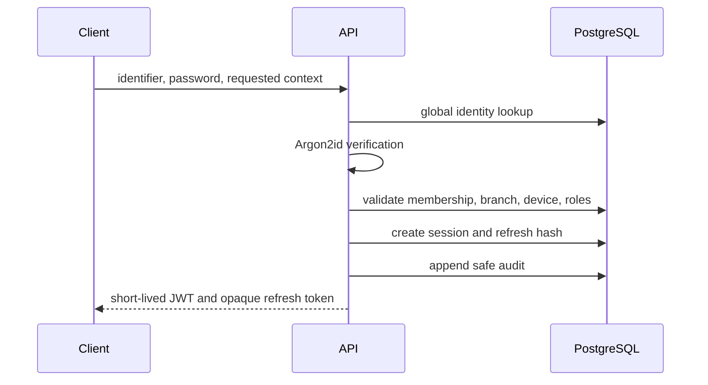

# Authentication and Identity Foundation

## Scope

TASK 09.1 implements authentication contracts E001–E007: login, refresh, logout, logout-all, current session, current identity, and effective permissions. It excludes registration, recovery, MFA, SSO, OAuth, business endpoints, offline authentication, and frontend behavior.

## Identity and context

`users` remains the global identity. Authentication selects an active `company_memberships` record and may narrow authority to an authorized branch and active device. Client-provided identifiers request a context; they never grant authority. A user with multiple active memberships must select a company. Branch authority comes from active company-wide or branch-scoped roles.

## Login flow

Unknown identifiers and incorrect passwords both return `invalid_credentials`. Unknown users still execute a dummy Argon2id verification to reduce timing-based enumeration. Passwords and hashes are never logged or returned.

## Tokens and sessions

- Access tokens are JWTs signed with explicit `HS256`, issuer, audience, subject, session ID, and minimal context identifiers.
- Access tokens are short-lived and contain no permission list.
- Refresh tokens are opaque 384-bit random values. The initial cross-client contract transports them in the request body over mandatory production TLS.
- PostgreSQL stores only SHA-256 refresh-token hashes.
- Tokens are prohibited in URLs, logs, and audit metadata.
- Asymmetric signing and key rotation remain a production hardening decision behind the isolated token component.

## Rotation and reuse detection

`sessions` stores the family and current generation. `session_refresh_tokens` retains hashed generations with `active`, `rotated`, `revoked`, or `reused` status. Rotation locks the presented row, marks it rotated, inserts the next hash, and advances the session atomically. Reuse of a rotated hash revokes the session family, marks the reused generation, revokes remaining active hashes, and records safe audit evidence.

## RBAC, revocation, and audit

Permissions are loaded from active membership, role, role-permission, branch, and device state on the server. Utilities enforce authentication, permission keys, and branch access. Logout revokes the current session; logout-all revokes the actor's sessions in the active company. Login, refresh, reuse, logout, and logout-all append allowlisted audit records without credentials or tokens.

## Configuration

| Variable | Purpose |
| --- | --- |
| `AUTH_JWT_ISSUER` | Exact accepted JWT issuer |
| `AUTH_JWT_AUDIENCE` | Exact accepted JWT audience |
| `AUTH_ACCESS_TOKEN_SECRET` | High-entropy signing secret, minimum 32 characters |
| `AUTH_ACCESS_TOKEN_TTL_SECONDS` | Access lifetime, 60–3600 seconds |
| `AUTH_REFRESH_TOKEN_TTL_SECONDS` | Refresh-session lifetime |
| `AUTH_LOGIN_RATE_LIMIT_MAX` | Login/refresh attempts per window |
| `AUTH_LOGIN_RATE_LIMIT_WINDOW_MS` | Authentication rate-limit window |

Secrets come from environment or a future external secret manager. `.env.example` contains fictitious local placeholders only.

## Remaining risks and decisions

- Select production secret management and asymmetric key rotation before external launch.
- Approve cookie and CSRF policy if browser refresh moves to HTTP-only cookies.
- Define credential enrollment, password changes, lockout escalation, recovery, and breach response.
- Define session and audit retention periods.
- Add MFA and stronger device attestation only through later approved tasks.
- Validate migrations and repositories against disposable PostgreSQL whenever `DATABASE_TEST_URL` is available.
