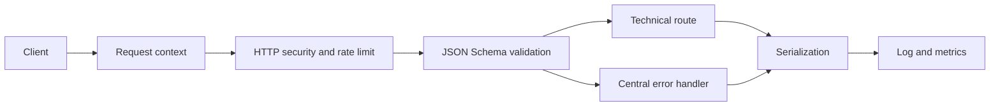

# Backend Foundation

## Scope

The AS ONE API foundation is the technical HTTP shell for the future modular monolith. It establishes shared transport behavior without implementing companies, branches, identity, catalog, inventory, sales, payments, offline synchronization, or other business capabilities.

## Structure

```text
apps/api/src/
├── bootstrap/       Application construction, plugin order, and shutdown
├── http/            Common response and HTTP status helpers
├── infrastructure/  PostgreSQL and Redis lifecycle/readiness adapters
├── plugins/         Context, errors, security, OpenAPI, and observability
├── routes/          Technical health and versioned API routes
├── schemas/         Reusable JSON Schema contracts
└── types/           Fastify type augmentation
```

Business modules will be introduced separately behind `/api/v1`. They must follow the approved domain model and contracts; this foundation does not pre-empt their boundaries.

## Request lifecycle



Fastify is created with explicit body, request, keep-alive, route-parameter, prototype-poisoning, and proxy-trust controls. Plugins are registered in a deterministic order before the server accepts traffic.

## Request context

Every request receives cryptographically random UUID `request_id` and `correlation_id` values unless valid incoming `x-request-id` or `x-correlation-id` headers are supplied. Accepted values are limited to 128 characters and the characters `A-Z`, `a-z`, `0-9`, `.`, `_`, and `-`. The request ID is returned as `x-request-id` and both IDs are attached to safe request logs.

The context reserves optional `company_id`, `branch_id`, `user_id`, `session_id`, and `device_id` fields. They remain empty until authenticated scope is implemented; the client is not trusted to populate them.

## Responses and errors

Normal API responses use `data` and `meta`; errors use a stable public `error` object and the same request metadata. Health probes remain intentionally compact for infrastructure consumers.

The centralized handler maps `AppError`, Fastify validation failures, malformed JSON, oversized payloads, unsupported media types, rate limits, missing routes, unsupported methods, and unknown failures. Unknown causes and stack traces are logged with redaction but never serialized. `POST`, `PUT`, and `PATCH` bodies accept JSON only.

## HTTP security

- Helmet supplies maintained security headers.
- CORS uses an explicit origin allowlist; credentials are disabled.
- Global rate limiting uses in-process storage during this foundation phase and returns `Retry-After`.
- Request size and timeouts have validated bounds.
- Constructor and prototype poisoning are rejected.
- Request logging omits bodies, authorization, cookies, tokens, sensitive queries, and infrastructure URLs.
- CSRF protection is deferred until a cookie-based session design exists.

The in-process rate-limit store is not suitable for consistent enforcement across multiple API replicas. A distributed store must be selected before horizontal production deployment.

## OpenAPI

`@fastify/swagger` generates OpenAPI 3.x from registered routes and reusable schemas. `GET /documentation` exposes `@fastify/swagger-ui` only when `OPENAPI_UI_ENABLED=true`; production defaults to disabled. A local server URL is emitted only in development. No nonexistent business endpoint is documented.

## Observability

`prom-client` was selected as the maintained, low-scope Prometheus implementation needed for counters, histograms, and readiness gauges without introducing an external telemetry platform. When `METRICS_ENABLED=true`, `GET /metrics` exposes aggregate request counts, duration, status, errors, and dependency readiness without request bodies or credentials. Production defaults to disabled pending network-level protection and monitoring deployment.

Fastify request logging is replaced by one completion record per request containing service, method, normalized route, status, duration, request ID, and correlation ID. Errors add a separate record only when diagnostics are required.

## Shutdown

The process installs each `SIGINT`, `SIGTERM`, `unhandledRejection`, and `uncaughtException` handler once. Shutdown stops the Fastify listener and closes PostgreSQL and Redis through the application lifecycle. A bounded timeout prevents indefinite draining; critical failures set a non-zero exit code after cleanup is attempted.

## Configuration

| Variable | Default behavior |
| --- | --- |
| `OPENAPI_UI_ENABLED` | Enabled in development; disabled in test and production |
| `METRICS_ENABLED` | Enabled in development; disabled in test and production |
| `CORS_ALLOWED_ORIGINS` | Explicit local origins in development; empty in production |
| `RATE_LIMIT_MAX` | `300` requests per window |
| `RATE_LIMIT_WINDOW_MS` | `60000` milliseconds |
| `REQUEST_BODY_LIMIT_BYTES` | `1048576` bytes |
| `REQUEST_TIMEOUT_MS` | `30000` milliseconds |
| `KEEP_ALIVE_TIMEOUT_MS` | `72000` milliseconds |
| `TRUST_PROXY` | `false` |

All values are parsed, bounded, normalized, and returned as immutable configuration. Wildcard CORS is rejected. Secrets are not printed.

## Technical endpoints

| Method | Path | Purpose | Exposure |
| --- | --- | --- | --- |
| `GET` | `/api/v1` | Safe API name, version, status, and documentation reference | Always |
| `GET` | `/health` | Application identity and status | Always |
| `GET` | `/live` | Process liveness | Always |
| `GET` | `/ready` | PostgreSQL and Redis readiness | Always |
| `GET` | `/documentation` | Interactive OpenAPI UI | Configurable |
| `GET` | `/metrics` | Prometheus metrics | Configurable |

## Pending decisions

- Authentication, authorization, tenant context, and branch context.
- Distributed rate-limit storage and trusted proxy topology.
- Production access controls for metrics and internal OpenAPI artifacts.
- Full tracing and an exporter when an observability platform is selected.
- Business-module registration and contract-specific error expansion.
- Offline synchronization and real-time transport implementation under their approved contracts.
