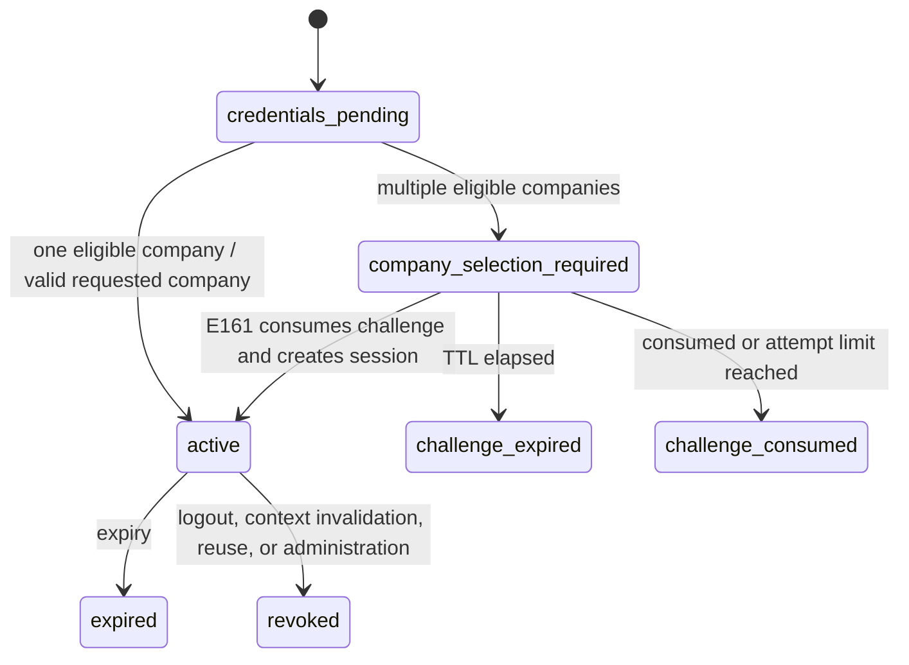

# Browser Authentication and Context Contract

## Status and scope

This document is the canonical design for browser authentication at
`app.asone.mx`. It reconciles the existing E001-E009 contracts and reserves
E161-E163. It does not implement routes, schema, cookies, or frontend code.

The server remains the sole authority for user, membership, company, branch,
device, permitted branches, and permissions. Client identifiers can only
request a narrower context.

## Current implementation and contradictions

E001 currently verifies credentials, selects one active membership, resolves
branch and optional device scope, and creates a company-bound session. With
multiple memberships and no `company_id`, it returns
`company_scope_mismatch`. E008 requires that company-bound session, so it
cannot bootstrap company selection. E009 can list authorized branches after
login, but no operation issues replacement credentials for another branch.

The current refresh-token family, generation, rotation, reuse detection, and
revocation model is reusable. Browser transport is not: the refresh token is
currently returned in JSON and CORS has credentials disabled.

## Durable session transport

Every normal session has one server-owned, durable `transport_mode`:
`browser` or `bearer`. It is selected and validated only while the server
creates the authenticated session, persisted on `sessions`, returned in the
safe session representation, and authoritative for refresh, context switching,
and logout. It is never inferred from `User-Agent`, headers, or cookie presence
after creation and cannot be changed within a session family.

`client_type` and `transport_mode` remain distinct. Login challenges retain
`client_type=browser|mobile|pos`; the closed mapping is `browser -> browser`,
`mobile -> bearer`, and `pos -> bearer`. Any requested combination outside this
mapping is `validation_error`. Challenge completion revalidates this mapping
and persists the same canonical transport on the new session.

`session_refresh_tokens` does not duplicate the mode. Refresh-token lookup must
resolve the parent session before accepting the credential, and the parent
`sessions.transport_mode` controls the allowed source. This avoids two
transport authorities that could diverge.

## Canonical login flow

### Single eligible company

1. E001 receives credentials and optional requested context.
2. The server performs the normal anti-enumeration credential check.
3. Exactly one active membership in an active company is eligible.
4. The server resolves branch and optional device scope, creates the normal
   session, and returns credentials using the negotiated client transport.

### Multiple eligible companies

1. E001 verifies credentials before revealing any membership information.
2. If a supplied `company_id` is eligible, E001 creates the normal session.
3. Without a selection, E001 creates no normal session and returns `200` with
   `outcome=company_selection_required`, eligible safe company summaries, and
   a short-lived challenge.
4. E161 consumes the challenge and selected company, revalidates current user,
   membership, company, optional branch, and optional device, then creates the
   normal session.

No eligible membership, an invalid supplied company, an inactive membership,
or an inactive company returns `invalid_credentials`. This deliberately avoids
revealing whether the identity, membership, or company exists. After valid
credentials, a selected company that became unavailable during challenge
completion returns `invalid_login_challenge`, without cross-user detail.

## Company-selection challenge

The token is 32 random bytes encoded as unpadded base64url. PostgreSQL stores
only SHA-256 of the token. The record contains the global user ID, eligible
membership IDs captured at issuance, optional client/device binding hash,
expiry, attempt count, maximum attempts, consumed and invalidated timestamps,
safe invalidation reason, and creation/update timestamps.

- TTL: five minutes; configuration may shorten but not exceed ten minutes.
- Maximum failed completion attempts: five.
- Single use: consumption and normal-session creation are atomic.
- The token is not a bearer access token, refresh token, or tenant authority.
- Exact replay after consumption returns `login_challenge_already_used`.
- Expiry returns `login_challenge_expired`.
- Unknown, malformed, cross-user, changed-binding, or invalidated challenges
  return `invalid_login_challenge`.
- Failed attempts increment atomically; reaching the limit invalidates it.
- Raw tokens, identifier values, passwords, and eligible lists are never
  logged or audited.

Issuance and completion use independent IP and identifier/user rate limits.
Expired and consumed records are retained only for the approved security-audit
window and then deleted by an operational cleanup process.

## Endpoint reconciliation

Paths are below `/api/v1`.

| ID | Method and path | Contract |
| --- | --- | --- |
| E001 | `POST /auth/login` | Existing strict body. Returns either normal login success or `company_selection_required`; no business permission. `X-ASONE-Client` declares `browser`, `mobile`, or `pos` only during login; absent means bearer compatibility. The server validates and persists the canonical mode. |
| E002 | `POST /auth/refresh` | Resolves the parent session and accepts exactly the source authorized by its stored mode: browser host-only cookie or bearer/native body credential. Ambiguous, missing, or mismatched transport is `validation_error`. |
| E003 | `POST /auth/logout` | Revokes current session idempotently; browser requests also clear the refresh cookie. |
| E004 | `POST /auth/logout-all` | Preserves current-company scope and `except_current`; browser cookie is cleared when current session is revoked. |
| E005 | `GET /auth/session` | Returns the canonical safe session context and security flags. |
| E006 | `GET /auth/me` | Returns only the actor's safe global identity and explicitly requested authorized includes. |
| E007 | `GET /auth/permissions` | Recalculates effective permissions for current or authorized requested branch. |
| E008 | `GET /context/companies` | After authentication, lists the actor's currently eligible company memberships; it is not the pre-session bootstrap mechanism. |
| E009 | `GET /context/branches` | Lists current-company branches the server authorizes and returns `company_wide_access`. |
| E161 | `POST /auth/company-selections` | Public challenge completion. Strict body `challenge_token`, `company_id`, optional `branch_id` and `device_id`; no transport override. Returns normal login success using the challenge's validated mapping. |
| E162 | `POST /auth/company-switches` | Current session. Strict body `company_id`, optional `branch_id`; no transport field. Creates a new session with the current mode and revokes the previous session atomically. |
| E163 | `POST /auth/branch-switches` | Current session. Strict body `branch_id` nullable; no transport field. Revalidates scope, preserves mode, updates context, advances generation, and returns replacement credentials atomically. |

E161-E163 accept request/correlation IDs, reject unknown fields, and never trust
payload ownership. E162-E163 are protected by authenticated-session policy,
CSRF for cookie clients, and dedicated rate limits. No aliases are approved.

## Canonical session context

The safe representation contains `session_id`, `user_id`, `membership_id`,
`company_id`, nullable `branch_id`, nullable `device_id`,
`permitted_branch_ids`, `company_wide_access`, `status`,
`transport_mode`, `refresh_generation`, `issued_at`, `expires_at`, nullable `revoked_at`, and
nullable `last_used_at`. Access-token generation is represented by the current
session refresh generation and must be checked against server session state;
stale access tokens cannot expand authority.

Company-wide authority is an explicit server-derived boolean based on active
company-scoped role assignments. It is never inferred from an empty branch
list. A null branch is valid only with this authority. Zero branches without
company-wide authority prevents session creation or switching.

E162 creates a new session and refresh family and revokes the prior company
session in one transaction. E163 retains the session ID and family, changes the
branch context, increments the generation, rotates refresh credentials, and
recalculates permissions and branches in one transaction. Previous refresh
generations become unusable. Concurrent sessions remain supported.

## Browser token and cookie policy

The browser keeps the access token in memory only. Its refresh token is never
returned to JavaScript and uses a host-only cookie:

```text
__Host-asone_refresh=<opaque token>; HttpOnly; Secure; SameSite=Strict;
Path=/api/v1/auth; Max-Age=<remaining session seconds>
```

No `Domain` attribute is allowed. Production, demo, and staging use HTTPS and
the `__Host-` prefix. Local HTTP development uses a differently named host-only
cookie without `Secure`; it must never be accepted outside development. Cookie
expiry equals server refresh expiry. Rotation replaces it. Logout, reuse,
expiry, revocation, and invalid challenge completion clear it with matching
attributes.

Mobile and POS continue sending bearer access tokens and opaque refresh tokens
in the E002 JSON body, stored in platform secure storage. They never depend on
cookies. `X-ASONE-Client` selects `browser`, `mobile`, or `pos`; transport
mismatch is rejected rather than silently falling back.

For `browser` sessions, E002 accepts the refresh token only from the canonical
cookie, rejects body credentials and conflicting sources, requires CSRF, sets
the replacement cookie, and omits the refresh token from JSON. For `bearer`
sessions, E002 accepts only the approved body credential, rejects cookie
authentication, does not require CSRF solely because of transport, and returns
the rotated refresh token in JSON. Missing required sources are
`validation_error`; a credential never authorizes its own transport.

## CSRF and CORS

Cookie-authenticated E002, E003, E004, E162, and E163 require all of:

- exact `Origin` allowlist validation, with safe `Referer` fallback only when
  browser policy legitimately omits Origin;
- a per-session random CSRF token returned in login/refresh response metadata,
  held in memory, and echoed as `X-CSRF-Token`;
- constant-time comparison with its server-side hash;
- `SameSite=Strict` in the canonical same-site topology.

The CSRF token rotates with the refresh generation. Bearer-only mobile/POS
requests do not require it. E161 has no authentication cookie but still
requires Origin validation for browser transport.

CORS uses an environment-specific exact allowlist, never `*` with credentials.
Browser environments allow credentials and `GET, HEAD, OPTIONS, POST, PUT,
PATCH, DELETE`; allow `Authorization`, `Content-Type`, `X-ASONE-Client`,
`X-CSRF-Token`, request/correlation, `If-Match`, and `Idempotency-Key`; expose
`ETag`, request/correlation IDs, rate-limit headers, `Retry-After`, and
`Idempotency-Replayed`; and use a bounded preflight cache. Rejected origins
receive no CORS approval headers.

## Browser security headers

The future static frontend host owns its restrictive CSP, including
`default-src 'self'`, allowlisted API connections, no object embedding, and
`frame-ancestors 'none'`. It also owns `Referrer-Policy`,
`Permissions-Policy`, `X-Content-Type-Options`, and clickjacking protection.
Cloudflare/ingress owns HSTS after HTTPS is proven. API responses retain Helmet
headers and must not weaken CSP for any hosted UI. Frontend bundles, logs,
telemetry, URLs, and error messages contain no credentials or tokens.

## Branch outcomes

- One eligible branch may be selected by default only when the server's policy
  marks it default or the client explicitly requests it.
- Multiple branches require explicit selection unless company-wide null context
  is permitted.
- Zero branches plus company-wide authority permits nullable branch context.
- Zero branches without company-wide authority returns `branch_access_denied`.
- Inactive, cross-company, stale, or unauthorized branches are concealed as
  `branch_access_denied` and never expand the session.

## Refresh and logout behavior

E002 locks the presented refresh row. Exactly one concurrent caller wins the
rotation, inserts the next hash, advances the generation, recalculates current
authority, and commits before returning credentials. Clients serialize refresh
locally. Presentation of an already rotated token is reuse: the entire session
family is revoked and the response is `refresh_token_reused`. A mere stale
access token does not trigger family revocation.

E003 is idempotent for an authenticated or safely identified current session;
its public response is `204` whether already revoked or newly revoked. E004
returns the current-state revoked count and never reveals other users. Raw or
foreign tokens receive the same safe session error. Browser responses clear
the cookie even when the server session is already unavailable. Bearer logout
has no cookie dependency. Logout-all clears the current browser cookie when it
revokes the current browser session; it does not manufacture cookie behavior
for bearer sessions.

## Public errors

| Code | HTTP | Retry | Safe meaning |
| --- | ---: | --- | --- |
| `invalid_credentials` | 401 | No | Credentials or eligible login context rejected without enumeration. |
| `company_selection_required` | 200 outcome | No | Valid credentials require selection; only safe eligible summaries accompany it. |
| `invalid_login_challenge` | 401 | No | Challenge cannot be accepted. |
| `login_challenge_expired` | 401 | Restart login | Challenge expired. |
| `login_challenge_already_used` | 409 | Restart login | Challenge was consumed. |
| `company_access_denied` | 404 | No | Requested company context is unavailable or concealed. |
| `branch_access_denied` | 404 | No | Requested branch context is unavailable or concealed. |
| `session_expired` | 401 | Login | Session is expired or otherwise unusable. |
| `session_revoked` | 401 | Login | Session was explicitly revoked. |
| `refresh_token_reused` | 401 | Login | Refresh family was revoked after reuse detection. |
| `validation_error` | 400/422 | Correct request | Transport or declared input invalid. |
| `rate_limit_exceeded` | 429 | After `Retry-After` | Bounded policy exceeded. |

Messages are safe but UI copy remains client-owned. Details never contain
membership IDs for another user, raw tokens, hashes, or existence evidence.

## Audit and rate limiting

Canonical audit actions retain the existing dot convention:
`auth.login.succeeded`, `auth.login.failed`,
`auth.company_selection.required`, `auth.company.selected`,
`auth.company.switched`, `auth.branch.selected`, `auth.branch.switched`,
`auth.refresh.rotated`, `auth.refresh.reuse_detected`, `auth.logout`, and
`auth.logout_all`. Audit includes safe actor/session/context transition,
request and correlation IDs, outcome, and bounded reason; never credentials,
raw tokens, cookie values, challenge tokens, or full identifiers.

Login limits combine IP and normalized-identifier hash. Challenge completion
uses IP, challenge hash, and user after lookup. Refresh uses IP and session.
Company/branch switches use user and session. Logout-all uses user, company,
and session. Limits are independently configurable, return `Retry-After`, and
do not revoke a valid session solely because a network source is noisy.

## Device policy

Browser `device_id` is optional in V1 and conveys no trust by itself. Safe
client metadata may be recorded under retention policy. Trusted POS enrollment
is a separate future flow and is not mixed with browser login.

## State machines and atomic transitions



Refresh-token states remain `active -> rotated`, `active -> revoked`, and
`rotated -> reused`; reuse atomically revokes the family. Challenge consumption
and session creation, company replacement, branch switch plus token rotation,
and refresh rotation are each single PostgreSQL transactions.

## Schema and migration impact

Classification: **B — minimal additive migration required**.

Migration `0009` already adds the durable single-use challenge and remains
unchanged. The future additive migration
`0010_auth_session_transport_mode` adds `sessions.transport_mode` as `NOT NULL`
with a `browser|bearer` check and `bearer` default for historical rows. It has
no destructive operation and does not alter `session_refresh_tokens`.

The default preserves every historical body-transport client. New session
creation must always write the validated value explicitly; the default exists
for safe backfill and compatibility, not client selection. The column is
immutable within a session family. E162 copies it to the replacement session;
E163 preserves it on the existing session. This reconciliation documents the
future migration but does not create it.

## Frontend contract

TASK 10.3/10.4 may rely on discriminated login outcomes (`authenticated` or
`company_selection_required`), safe company summaries, a single-use challenge,
safe branch summaries with explicit `company_wide_access`, canonical session,
safe identity, effective permissions, memory-only access/CSRF tokens, automatic
single-flight refresh, and idempotent logout.

Required UI states are initial loading, submitting, company selection, branch
selection, authenticated, empty authorized scope, permission denied, session
expired/revoked, rate limited with retry time, validation error, and API
unavailable. Lists shown by the UI are hints; every selection is revalidated by
the server.

## Compatibility and deprecation

Existing bearer clients continue using E001/E002 bodies and receiving refresh
tokens in JSON. Browser behavior is additive and explicitly negotiated. During
one v1 deprecation window, `company_scope_mismatch` from the old multi-company
login remains accepted by clients, while updated servers return the structured
selection outcome. E005-E009 additions are response-additive. No existing
route, permission, tenant rule, refresh rotation, or audit control is removed.
