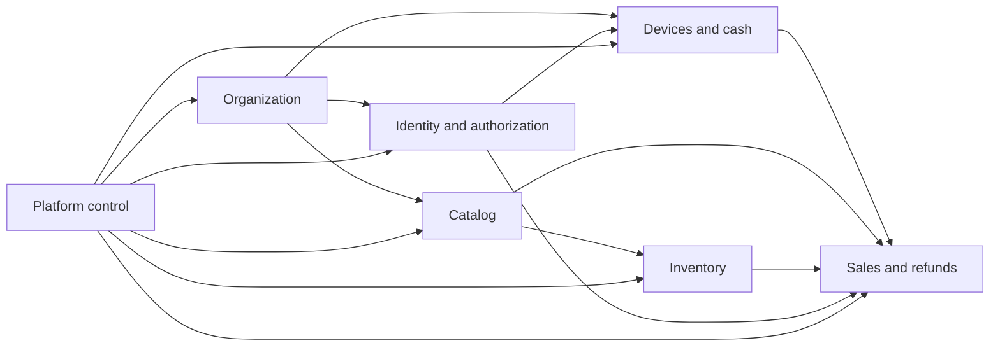
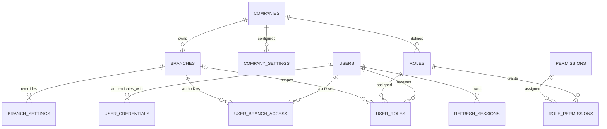
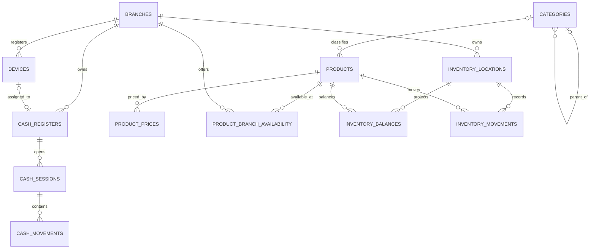
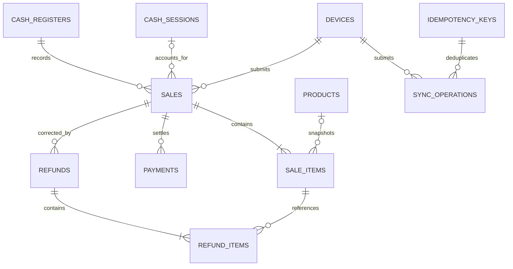

# AS ONE Core Transactional Data Model

## 1. Executive summary

This document is the authoritative logical data model for the first commercial AS ONE core. It converts the useful concepts found in the AS POS V1 prototype into a secure PostgreSQL design for multiple companies, branches, devices, registers, offline terminals, and horizontally scaled API instances.

The model contains **32 entities** in seven domains. PostgreSQL is the source of truth. Financial, inventory, cash, audit, synchronization, and event records are append-oriented. All tenant relationships carry `company_id`; all branch-owned records carry both `company_id` and `branch_id`. Composite foreign keys are required where they prevent cross-company or cross-branch references. Client-supplied ownership identifiers never establish authority.

This is a logical specification, not SQL. Names and constraints are migration inputs and remain subject to an accepted implementation review.

## 2. Scope and exclusions

### Included

- Companies, branches, and scoped settings.
- Users, credentials, roles, permissions, branch access, and refresh sessions.
- Devices, cash registers, cash sessions, and cash movements.
- Categories, products, prices, and branch availability.
- Inventory locations, balances, and movements.
- Sales, sale items, payments, refunds, and refund items.
- Audit logs, idempotency records, offline operations, and transactional outbox events.

### Excluded

Rewards, events, memberships, advanced promotions, suppliers, purchase orders, recipes, payroll, accounting, invoicing, AI, and advanced analytics are not designed here. They may reference stable core identifiers later but must own their own data and migrations. Customer identity is also deferred; `sales.customer_id` is intentionally absent until the customer model is approved.

## 3. Mandatory conventions

| Concern | Convention |
| --- | --- |
| Names | PostgreSQL objects and JSON fields use lowercase `snake_case` |
| Primary keys | UUID named `id` |
| Time | `timestamptz` in UTC; business timezone stored separately where required |
| Money | `numeric(19,4)` plus ISO 4217 `char(3)` currency; never floating point |
| Quantities | `numeric(19,6)` to support countable and measured products |
| Versioning | Positive `bigint version`, incremented atomically on mutable syncable records |
| Lifecycle | `status` plus cancellation/reversal records; `deleted_at` only for non-transactional configuration |
| Audit columns | `created_at`, `updated_at`, `created_by`, and `updated_by` where appropriate |
| Tenant scope | Every tenant-owned row has `company_id`; every branch-owned row also has `branch_id` |
| Client authority | Company and branch come from authenticated membership/device context, not untrusted payload ownership |
| Durability | Sales, payments, refunds, cash, and inventory changes commit transactionally with audit/outbox evidence |

Required fields are marked `*` in the specifications.

## 4. Domain map

## 5. Complete entity catalogue

| Domain | Entities |
| --- | --- |
| Organization | `companies`, `branches`, `company_settings`, `branch_settings` |
| Identity | `users`, `user_credentials`, `roles`, `permissions`, `user_roles`, `role_permissions`, `user_branch_access`, `refresh_sessions` |
| Devices and cash | `devices`, `cash_registers`, `cash_sessions`, `cash_movements` |
| Catalog | `categories`, `products`, `product_prices`, `product_branch_availability` |
| Inventory | `inventory_locations`, `inventory_balances`, `inventory_movements` |
| Sales | `sales`, `sale_items`, `payments`, `refunds`, `refund_items` |
| Platform control | `audit_logs`, `idempotency_keys`, `sync_operations`, `outbox_events` |

## 6. Detailed table specifications

### 6.1 Organization

#### `companies`

**Purpose:** tenant root and legal/operational ownership boundary.

| Item | Specification |
| --- | --- |
| Key fields | `id uuid*`; `slug text*`; `legal_name text*`; `display_name text*`; `status text*`; `default_currency char(3)*`; `timezone text*`; `created_at timestamptz*`; `updated_at timestamptz*`; `version bigint*` |
| Foreign keys | None in the core; `created_by` is omitted because a company can predate its first tenant user |
| Unique/checks | Unique normalized `slug`; `status IN ('active','suspended','closed')`; ISO currency; nonblank names; `version > 0` |
| Ownership | The row is the tenant root; effective `company_id` is its own `id` |
| Delete/audit | Never physically delete after operational data exists; status transition is audited |
| Offline | Read-only tenant identity may be cached; never created or modified offline |

#### `branches`

**Purpose:** operational location owned by one company.

| Item | Specification |
| --- | --- |
| Key fields | `id uuid*`; `company_id uuid*`; `code text*`; `name text*`; `status text*`; `timezone text*`; address fields; `created_at*`; `updated_at*`; `created_by uuid`; `updated_by uuid`; `version bigint*`; `deleted_at timestamptz` |
| Foreign keys | `company_id -> companies`; actor references to `users`; composite ownership target `(company_id,id)` |
| Unique/checks | Unique `(company_id, normalized code)`; active rows require nonblank name/timezone; valid status; `version > 0` |
| Ownership | Tenant and branch owned: `company_id`, `branch_id=id` |
| Delete/audit | Soft-delete only if never referenced; otherwise deactivate; all lifecycle changes audited |
| Offline | Versioned reference data; cached by authorized devices, server wins after explicit conflict response |

#### `company_settings`

**Purpose:** typed company-wide configuration with history and optimistic concurrency.

| Item | Specification |
| --- | --- |
| Key fields | `id uuid*`; `company_id uuid*`; `key text*`; `value jsonb*`; `value_type text*`; `is_secret boolean*`; `created_at*`; `updated_at*`; `created_by uuid*`; `updated_by uuid*`; `version bigint*`; `deleted_at` |
| Foreign keys | Company and actor; unique ownership target `(company_id,id)` |
| Unique/checks | Unique active `(company_id,key)`; approved key syntax; allowed `value_type`; `is_secret=false` for values returned to clients |
| Ownership | Company-scoped, never branch-scoped |
| Delete/audit | Soft-delete/replacement; old and new safe values audited, secret values redacted |
| Offline | Safe effective settings cached read-only; offline writes prohibited |

#### `branch_settings`

**Purpose:** branch overrides for approved company configuration keys.

| Item | Specification |
| --- | --- |
| Key fields | `id uuid*`; `company_id uuid*`; `branch_id uuid*`; `key text*`; `value jsonb*`; `value_type text*`; `created_at*`; `updated_at*`; actor fields; `version bigint*`; `deleted_at` |
| Foreign keys | Composite branch `(company_id,branch_id)` and actors |
| Unique/checks | Unique active `(company_id,branch_id,key)`; approved key and type; overrides allowed only for overridable definitions |
| Ownership | Company and branch scoped |
| Delete/audit | Soft-delete/replacement with change audit |
| Offline | Safe effective settings cached; changes online-only |

### 6.2 Identity and authorization

#### `users`

**Purpose:** global human identity that may belong to multiple companies without duplicating credentials.

| Item | Specification |
| --- | --- |
| Key fields | `id uuid*`; `email text`; `display_name text*`; `status text*`; `locale text`; `created_at*`; `updated_at*`; `version bigint*`; `deleted_at` |
| Foreign keys | None; tenant membership is represented by `user_roles` and `user_branch_access` |
| Unique/checks | Unique normalized email when present; allowed status; nonblank display name; `version > 0` |
| Ownership | Platform identity, not tenant-owned; it grants no access by itself |
| Delete/audit | Disable/anonymize subject to retention; identity and status changes audited |
| Offline | Minimal identity projection may be cached for assigned operators; no offline creation |

#### `user_credentials`

**Purpose:** protected authentication factors separate from profile data.

| Item | Specification |
| --- | --- |
| Key fields | `id uuid*`; `user_id uuid*`; `credential_type text*`; `identifier text`; `secret_hash text`; `algorithm text`; `parameters jsonb`; `failed_attempts integer*`; `locked_until timestamptz`; `last_used_at`; `created_at*`; `updated_at*`; `version bigint*`; `revoked_at` |
| Foreign keys | `user_id -> users` |
| Unique/checks | Unique active `(credential_type, normalized identifier)` when applicable; no plaintext secret; nonnegative failures; allowed type/status |
| Ownership | Platform security record; tenant access remains separate |
| Delete/audit | Revoke, never expose; credential events audited without hashes |
| Offline | Never synchronized to POS clients; offline auth requires a separate approved verifier design |

#### `roles`

**Purpose:** company-owned bundles of permissions.

| Item | Specification |
| --- | --- |
| Key fields | `id uuid*`; `company_id uuid*`; `code text*`; `name text*`; `description text`; `status text*`; `is_system boolean*`; `created_at*`; `updated_at*`; actor fields; `version bigint*`; `deleted_at` |
| Foreign keys | Company and actors |
| Unique/checks | Unique active `(company_id,code)`; system role restrictions; valid status |
| Ownership | Company-scoped |
| Delete/audit | Retire/soft-delete only when unassigned; permission changes audited |
| Offline | Effective permission snapshot may be cached; role administration online-only |

#### `permissions`

**Purpose:** platform-global, versioned capability vocabulary.

| Item | Specification |
| --- | --- |
| Key fields | `id uuid*`; `key text*`; `resource text*`; `action text*`; `scope text*`; `description text`; `status text*`; `created_at*`; `updated_at*`; `version bigint*` |
| Foreign keys | None |
| Unique/checks | Unique `key`; allowed scope (`company`,`branch`,`own`,`platform`); nonblank action/resource |
| Ownership | Global reference catalog; tenant assignments live in `role_permissions` |
| Delete/audit | Deprecate, never reuse keys; changes require architecture/security audit |
| Offline | Read-only effective subset can be cached with version |

#### `user_roles`

**Purpose:** assign a company role to a user, optionally limited to a branch.

| Item | Specification |
| --- | --- |
| Key fields | `id uuid*`; `company_id uuid*`; `user_id uuid*`; `role_id uuid*`; `branch_id uuid`; `valid_from timestamptz*`; `valid_until timestamptz`; `created_at*`; `created_by uuid*`; `revoked_at`; `revoked_by uuid` |
| Foreign keys | Company, user, composite company role, optional composite branch, actors |
| Unique/checks | One active equivalent assignment; `valid_until > valid_from`; role belongs to same company |
| Ownership | Company-scoped and branch-scoped when `branch_id` is present |
| Delete/audit | Revoke only; assignment and revocation are security audit events |
| Offline | Effective grants cached for a session; assignments never changed offline |

#### `role_permissions`

**Purpose:** immutable-at-runtime relationship between a company role and global permission.

| Item | Specification |
| --- | --- |
| Key fields | `id uuid*`; `company_id uuid*`; `role_id uuid*`; `permission_id uuid*`; `effect text*`; `created_at*`; `created_by uuid*`; `revoked_at`; `revoked_by uuid` |
| Foreign keys | Composite company role, permission, actors |
| Unique/checks | One active `(company_id,role_id,permission_id)`; `effect IN ('allow','deny')` |
| Ownership | Company-scoped |
| Delete/audit | Revoke rather than delete; every change security-audited |
| Offline | Effective compiled permissions cached; modifications online-only |

#### `user_branch_access`

**Purpose:** explicit branch membership independent of role composition.

| Item | Specification |
| --- | --- |
| Key fields | `id uuid*`; `company_id uuid*`; `branch_id uuid*`; `user_id uuid*`; `status text*`; `is_default boolean*`; `created_at*`; `created_by uuid*`; `revoked_at`; `revoked_by uuid` |
| Foreign keys | Composite branch, user, actors |
| Unique/checks | One active `(company_id,branch_id,user_id)`; at most one active default branch per company/user |
| Ownership | Company and branch scoped |
| Delete/audit | Revoke only; access changes are security events |
| Offline | Authorized branch list cached with session; cannot be expanded offline |

#### `refresh_sessions`

**Purpose:** rotating, revocable authentication sessions with tenant context.

| Item | Specification |
| --- | --- |
| Key fields | `id uuid*`; `company_id uuid*`; `user_id uuid*`; `device_id uuid`; `token_family_id uuid*`; `token_hash text*`; `issued_at*`; `expires_at*`; `rotated_at`; `revoked_at`; `reuse_detected_at`; `ip_hash text`; `user_agent_hash text`; `version bigint*` |
| Foreign keys | Company, user, optional composite company device |
| Unique/checks | Unique active token hash; expiry after issue; hashes only; one current token per family generation |
| Ownership | Company-scoped; branch authority is recomputed rather than trusted from the token |
| Delete/audit | Revoke/expire, retain security metadata by policy; rotation/reuse audited |
| Offline | Never stored as a reusable plaintext database record on clients; no offline refresh |

### 6.3 Devices and cash operation

#### `devices`

**Purpose:** registered POS or administrative device identity.

| Item | Specification |
| --- | --- |
| Key fields | `id uuid*`; `company_id uuid*`; `branch_id uuid*`; `device_code text*`; `name text*`; `device_type text*`; `status text*`; `public_key text`; `last_seen_at`; `app_version text`; `created_at*`; `updated_at*`; actor fields; `version bigint*`; `revoked_at` |
| Foreign keys | Composite branch and actors |
| Unique/checks | Unique `(company_id,device_code)`; allowed type/status; revoked device cannot authenticate |
| Ownership | Company and branch scoped |
| Delete/audit | Revoke/decommission; registration, key rotation, and reassignment audited |
| Offline | Device ID and non-secret registration metadata persist locally; queued commands bind to device ID |

#### `cash_registers`

**Purpose:** logical branch register that may be assigned to a device.

| Item | Specification |
| --- | --- |
| Key fields | `id uuid*`; `company_id uuid*`; `branch_id uuid*`; `code text*`; `name text*`; `status text*`; `device_id uuid`; `created_at*`; `updated_at*`; actor fields; `version bigint*`; `deleted_at` |
| Foreign keys | Composite branch; optional same-company/branch device |
| Unique/checks | Unique active `(company_id,branch_id,code)`; device branch must match; valid status |
| Ownership | Company and branch scoped |
| Delete/audit | Deactivate; never delete after cash activity; assignment changes audited |
| Offline | Register identity cached; reassignment online-only |

#### `cash_sessions`

**Purpose:** accountable open-to-close operating period for one register.

| Item | Specification |
| --- | --- |
| Key fields | `id uuid*`; `company_id uuid*`; `branch_id uuid*`; `cash_register_id uuid*`; `opened_by uuid*`; `opened_at*`; `opening_amount numeric(19,4)*`; `currency char(3)*`; `status text*`; `closed_by uuid`; `closed_at`; `declared_closing_amount`; `expected_closing_amount`; `discrepancy_amount`; `version bigint*`; `created_at*`; `updated_at*` |
| Foreign keys | Composite register, branch, opening/closing users |
| Unique/checks | At most one open session per register; nonnegative declared/opening values; closure fields consistent with status |
| Ownership | Company and branch scoped |
| Delete/audit | Never delete or edit after close; corrections are compensating cash movements/reconciliation records |
| Offline | Opening normally online; approved offline operation uses a unique session ID and later server validation |

#### `cash_movements`

**Purpose:** append-only accountable movement inside a cash session.

| Item | Specification |
| --- | --- |
| Key fields | `id uuid*`; `company_id uuid*`; `branch_id uuid*`; `cash_session_id uuid*`; `movement_type text*`; `amount numeric(19,4)*`; `currency char(3)*`; `reason_code text*`; `note text`; `occurred_at*`; `created_at*`; `created_by uuid*`; `device_id uuid`; `sync_operation_id uuid`; `reversal_of_id uuid` |
| Foreign keys | Composite session, actor, device, sync operation, optional same-scope reversed movement |
| Unique/checks | `amount > 0`; allowed type; reversal cannot reverse itself/twice; currency matches session |
| Ownership | Company and branch scoped |
| Delete/audit | Immutable; correction uses a reversal movement; creation/reversal audited |
| Offline | Client-generated UUID and idempotency key; enqueue locally and reconcile server outcome |

### 6.4 Catalog

#### `categories`

**Purpose:** tenant catalog organization with optional hierarchy.

| Item | Specification |
| --- | --- |
| Key fields | `id uuid*`; `company_id uuid*`; `parent_id uuid`; `code text*`; `name text*`; `description text`; `sort_order integer*`; `status text*`; presentation metadata `jsonb`; audit fields; `version bigint*`; `deleted_at` |
| Foreign keys | Company; optional same-company parent; actors |
| Unique/checks | Unique active `(company_id,code)`; no self-parent/cycle; nonnegative order |
| Ownership | Company-scoped |
| Delete/audit | Soft-delete only when no active dependency; otherwise retire; changes audited |
| Offline | Versioned read model synchronized to authorized devices; server resolves write conflicts |

#### `products`

**Purpose:** tenant-owned sellable item or service definition.

| Item | Specification |
| --- | --- |
| Key fields | `id uuid*`; `company_id uuid*`; `category_id uuid`; `sku text*`; `barcode text`; `name text*`; `description text`; `product_type text*`; `unit text*`; `tracks_inventory boolean*`; `is_weighted boolean*`; `tax_code text`; `status text*`; audit fields; `version bigint*`; `deleted_at` |
| Foreign keys | Company, same-company category, actors |
| Unique/checks | Unique active `(company_id,sku)` and normalized barcode when present; inventory tracking compatible with type/unit |
| Ownership | Company-scoped; branch behavior is separate |
| Delete/audit | Retire/soft-delete; sale history keeps snapshots; changes audited |
| Offline | Versioned catalog projection cached; offline edits postponed, sales reference product/version plus snapshots |

#### `product_prices`

**Purpose:** exact, effective-dated product pricing by company and optional branch.

| Item | Specification |
| --- | --- |
| Key fields | `id uuid*`; `company_id uuid*`; `branch_id uuid`; `product_id uuid*`; `price_type text*`; `amount numeric(19,4)*`; `currency char(3)*`; `valid_from timestamptz*`; `valid_until timestamptz`; `status text*`; audit fields; `version bigint*` |
| Foreign keys | Same-company product; optional composite branch; actors |
| Unique/checks | `amount >= 0`; valid interval; no overlapping active interval for same scope/product/type/currency |
| Ownership | Company-scoped, branch-scoped when override applies |
| Delete/audit | Expire/cancel, never erase prices referenced by sales; changes audited |
| Offline | Devices receive versioned effective price set and evaluation timestamp; server validates submitted snapshot |

#### `product_branch_availability`

**Purpose:** explicit branch availability and local product controls.

| Item | Specification |
| --- | --- |
| Key fields | `id uuid*`; `company_id uuid*`; `branch_id uuid*`; `product_id uuid*`; `is_available boolean*`; `sales_channel text*`; `display_order integer`; `created_at*`; `updated_at*`; actor fields; `version bigint*`; `deleted_at` |
| Foreign keys | Composite branch and same-company product |
| Unique/checks | Unique active `(company_id,branch_id,product_id,sales_channel)`; nonnegative order |
| Ownership | Company and branch scoped |
| Delete/audit | Soft-delete/disable; changes audited |
| Offline | Versioned branch catalog projection cached locally |

### 6.5 Inventory

#### `inventory_locations`

**Purpose:** branch-owned stock-holding location.

| Item | Specification |
| --- | --- |
| Key fields | `id uuid*`; `company_id uuid*`; `branch_id uuid*`; `code text*`; `name text*`; `location_type text*`; `status text*`; audit fields; `version bigint*`; `deleted_at` |
| Foreign keys | Composite branch and actors |
| Unique/checks | Unique active `(company_id,branch_id,code)`; valid type/status |
| Ownership | Company and branch scoped |
| Delete/audit | Deactivate; cannot delete with balance/movements; lifecycle audited |
| Offline | Location reference cached; administration online-only |

#### `inventory_balances`

**Purpose:** rebuildable current quantity projection per product and location.

| Item | Specification |
| --- | --- |
| Key fields | `id uuid*`; `company_id uuid*`; `branch_id uuid*`; `inventory_location_id uuid*`; `product_id uuid*`; `quantity_on_hand numeric(19,6)*`; `quantity_reserved numeric(19,6)*`; `updated_at*`; `version bigint*` |
| Foreign keys | Composite location and same-company product |
| Unique/checks | Unique `(company_id,inventory_location_id,product_id)`; reserved nonnegative; negative on-hand policy deferred/configured |
| Ownership | Company and branch scoped |
| Delete/audit | Never manually edited/deleted; derived only from movements and rebuildable |
| Offline | Cached projection with checkpoint; not an offline authority; optimistic version detects stale commands |

#### `inventory_movements`

**Purpose:** immutable source for every stock change.

| Item | Specification |
| --- | --- |
| Key fields | `id uuid*`; `company_id uuid*`; `branch_id uuid*`; `inventory_location_id uuid*`; `product_id uuid*`; `movement_type text*`; `quantity numeric(19,6)*`; `occurred_at*`; `reference_type text*`; `reference_id uuid`; `created_at*`; `created_by uuid*`; `device_id uuid`; `sync_operation_id uuid`; `reversal_of_id uuid`; `balance_version_after bigint*` |
| Foreign keys | Composite location, product, actor, device, sync operation, optional reversed movement |
| Unique/checks | `quantity <> 0`; allowed type; reversal uniqueness; referenced company/branch must match |
| Ownership | Company and branch scoped |
| Delete/audit | Immutable; correction is compensating movement; itself provides inventory audit evidence |
| Offline | Client UUID + idempotency; server applies transactionally with balance version check and returns conflict/reconciliation outcome |

### 6.6 Sales

#### `sales`

**Purpose:** authoritative sale aggregate and lifecycle.

| Item | Specification |
| --- | --- |
| Key fields | `id uuid*`; `company_id uuid*`; `branch_id uuid*`; `cash_session_id uuid`; `cash_register_id uuid*`; `device_id uuid*`; `sale_number text*`; `status text*`; `currency char(3)*`; `subtotal`; `discount_total`; `tax_total`; `total`; `paid_total`; `change_total` as `numeric(19,4)*`; `occurred_at*`; `completed_at`; `cancelled_at`; `cancelled_by`; `created_at*`; `created_by*`; `version bigint*`; `sync_operation_id uuid` |
| Foreign keys | Composite register/session/device; actor; sync operation |
| Unique/checks | Unique `(company_id,branch_id,sale_number)`; nonnegative totals; arithmetic equality; status timestamps consistent; session scope matches |
| Ownership | Company and branch scoped |
| Delete/audit | Never delete; completed rows immutable; cancellation/refund/compensation only |
| Offline | Client-generated ID, idempotency key, product/price snapshots, ordered command; server returns accepted/duplicate/rejected/reconcile |

#### `sale_items`

**Purpose:** immutable commercial snapshot of each sold line.

| Item | Specification |
| --- | --- |
| Key fields | `id uuid*`; `company_id uuid*`; `branch_id uuid*`; `sale_id uuid*`; `line_number integer*`; `product_id uuid`; `product_version bigint`; `sku_snapshot text`; `name_snapshot text*`; `quantity numeric(19,6)*`; `unit_price`; `subtotal`; `discount_total`; `tax_total`; `line_total` as `numeric(19,4)*`; `tax_snapshot jsonb`; `created_at*` |
| Foreign keys | Composite sale; optional same-company product |
| Unique/checks | Unique `(company_id,sale_id,line_number)`; quantity positive; exact line arithmetic; currency inherited from sale |
| Ownership | Company and branch scoped through copied keys and sale constraint |
| Delete/audit | Immutable; refunds reference lines; product edits never rewrite snapshots |
| Offline | Included atomically in sale command; never synchronized as an independent mutable record |

#### `payments`

**Purpose:** append-only payment attempts and successful settlement records.

| Item | Specification |
| --- | --- |
| Key fields | `id uuid*`; `company_id uuid*`; `branch_id uuid*`; `sale_id uuid*`; `cash_session_id uuid`; `payment_method text*`; `status text*`; `amount numeric(19,4)*`; `currency char(3)*`; `provider_reference text`; `authorization_reference text`; `occurred_at*`; `created_at*`; `created_by*`; `device_id*`; `sync_operation_id`; `reversal_of_id uuid` |
| Foreign keys | Composite sale/session/device; actor; sync operation; optional reversed payment |
| Unique/checks | `amount > 0`; currency matches sale; provider reference unique within company/provider when present; reversal uniqueness |
| Ownership | Company and branch scoped |
| Delete/audit | Never delete/edit successful payment; reversal/refund records only; sensitive provider data minimized |
| Offline | Cash may queue under approved policy; external electronic authorization is online; all attempts idempotent |

#### `refunds`

**Purpose:** authorized correction aggregate referencing an original sale.

| Item | Specification |
| --- | --- |
| Key fields | `id uuid*`; `company_id uuid*`; `branch_id uuid*`; `sale_id uuid*`; `cash_session_id uuid`; `refund_number text*`; `status text*`; `reason_code text*`; `reason_note text`; `currency char(3)*`; `subtotal`; `tax_total`; `total` as `numeric(19,4)*`; `occurred_at*`; `completed_at`; `created_at*`; `created_by*`; `approved_by uuid`; `device_id*`; `sync_operation_id`; `version bigint*` |
| Foreign keys | Original composite sale, optional session, actor/approver/device, sync operation |
| Unique/checks | Unique `(company_id,branch_id,refund_number)`; positive total; currency matches sale; completed amount cannot exceed refundable balance |
| Ownership | Company and branch scoped; normally original sale branch |
| Delete/audit | Never delete; failed/cancelled statuses retained; completed refund immutable |
| Offline | Normally online authorization; future offline policy must cap risk and remain idempotent |

#### `refund_items`

**Purpose:** immutable quantity/value link from refund to original sale item.

| Item | Specification |
| --- | --- |
| Key fields | `id uuid*`; `company_id uuid*`; `branch_id uuid*`; `refund_id uuid*`; `sale_item_id uuid*`; `quantity numeric(19,6)*`; `subtotal`; `tax_total`; `line_total` as `numeric(19,4)*`; `restock_disposition text*`; `created_at*` |
| Foreign keys | Composite refund and original sale item; both must resolve to same original sale and scope |
| Unique/checks | Unique `(company_id,refund_id,sale_item_id)` unless split disposition is later approved; positive quantity; cumulative quantity not above sold less prior refunds |
| Ownership | Company and branch scoped |
| Delete/audit | Immutable; inventory effects produce separate movements |
| Offline | Part of atomic refund command, never independently mutable |

### 6.7 Platform control

#### `audit_logs`

**Purpose:** append-only evidence of critical business and security actions.

| Item | Specification |
| --- | --- |
| Key fields | `id uuid*`; `company_id uuid*`; `branch_id uuid`; `actor_user_id uuid`; `actor_device_id uuid`; `action text*`; `resource_type text*`; `resource_id uuid`; `occurred_at*`; `request_id uuid*`; `correlation_id uuid*`; `source text*`; `result text*`; `reason text`; `before_data jsonb`; `after_data jsonb`; `metadata jsonb`; `created_at*` |
| Foreign keys | Company; optional branch/user/device with matching scope where applicable |
| Unique/checks | Unique `(company_id,id)` and optionally `(company_id,request_id,action,resource_id)` for dedupe; safe/redacted payload policy |
| Ownership | Company scoped, optionally branch scoped |
| Delete/audit | Append-only and inaccessible to ordinary mutation; retention/archival by policy |
| Offline | Client may submit context, but server creates authoritative audit; offline command outcome links to its evidence |

#### `idempotency_keys`

**Purpose:** prevent duplicate effects across retries, terminals, and offline replay.

| Item | Specification |
| --- | --- |
| Key fields | `id uuid*`; `company_id uuid*`; `branch_id uuid`; `device_id uuid`; `actor_user_id uuid`; `operation_scope text*`; `idempotency_key text*`; `request_hash text*`; `status text*`; `resource_type text`; `resource_id uuid`; `response_code integer`; `response_body jsonb`; `locked_at`; `completed_at`; `expires_at*`; `created_at*`; `updated_at*` |
| Foreign keys | Company and optional branch/device/actor |
| Unique/checks | Unique `(company_id,operation_scope,idempotency_key)`; same key requires same request hash; valid lifecycle/expiry |
| Ownership | Company-scoped, branch copied when applicable |
| Delete/audit | Retain through maximum replay window; purge only after dependent retention guarantees |
| Offline | Required on sale, payment, refund, cash, and inventory commands; duplicates return stored outcome |

#### `sync_operations`

**Purpose:** durable record of every offline command and reconciliation outcome.

| Item | Specification |
| --- | --- |
| Key fields | `id uuid*`; `company_id uuid*`; `branch_id uuid*`; `device_id uuid*`; `actor_user_id uuid*`; `client_operation_id uuid*`; `operation_type text*`; `aggregate_type text*`; `aggregate_id uuid`; `base_version bigint`; `sequence_number bigint*`; `payload_hash text*`; `status text*`; `received_at*`; `processed_at`; `result_code text`; `result_data jsonb`; `conflict_data jsonb`; `idempotency_key_id uuid*`; `created_at*` |
| Foreign keys | Composite branch/device, actor, idempotency record |
| Unique/checks | Unique `(company_id,device_id,client_operation_id)` and `(company_id,device_id,sequence_number)`; positive sequence; payload hash immutable |
| Ownership | Company and branch scoped |
| Delete/audit | Retain for reconciliation window and financial retention when linked; never rewrite accepted payload identity |
| Offline | Central server-side receipt; outcomes are accepted, duplicate, rejected, or reconciliation-required with checkpoint progression |

#### `outbox_events`

**Purpose:** reliably publish committed business events after the owning transaction commits.

| Item | Specification |
| --- | --- |
| Key fields | `id uuid*`; `company_id uuid*`; `branch_id uuid`; `aggregate_type text*`; `aggregate_id uuid*`; `aggregate_version bigint`; `event_type text*`; `schema_version integer*`; `payload jsonb*`; `occurred_at*`; `correlation_id uuid*`; `causation_id uuid`; `created_at*`; `available_at*`; `published_at`; `attempt_count integer*`; `last_error text`; `locked_at`; `locked_by text` |
| Foreign keys | Company and optional branch; aggregate relationship is logical to preserve generic outbox ownership |
| Unique/checks | Unique event `id`; nonnegative attempts; positive schema/version; published state consistent |
| Ownership | Company scoped and branch scoped whenever the aggregate is branch-owned |
| Delete/audit | Immutable payload; archive/purge only after publication and retention policy |
| Offline | Created only by server transaction; clients receive authorized scoped events and recover gaps through API checkpoints |

## 7. Relationship descriptions

The model defines **50 core relationships**:

1. Company has many branches.
2. Company has many company settings.
3. Branch has many branch settings.
4. User has many credentials.
5. Company has many roles.
6. Role belongs to one company.
7. Role has many role-permission assignments.
8. Permission has many role-permission assignments.
9. User has many user-role assignments.
10. Role has many user-role assignments.
11. Branch may scope many user-role assignments.
12. User has many branch-access grants.
13. Branch has many user-access grants.
14. User has many refresh sessions.
15. Company has many refresh sessions.
16. Device may bind many refresh sessions.
17. Branch has many devices.
18. Branch has many cash registers.
19. Device may be assigned to a cash register.
20. Cash register has many cash sessions over time.
21. User opens cash sessions.
22. User closes cash sessions.
23. Cash session has many cash movements.
24. Cash movement may reverse one earlier cash movement.
25. Category may have one parent category.
26. Category has many child categories.
27. Category has many products.
28. Product has many prices.
29. Branch may scope product prices.
30. Product has many branch-availability records.
31. Branch has many product-availability records.
32. Branch has many inventory locations.
33. Inventory location has many balances.
34. Product has many inventory balances.
35. Inventory location has many inventory movements.
36. Product has many inventory movements.
37. Inventory movement may reverse one earlier movement.
38. Cash register has many sales.
39. Cash session has many sales.
40. Device submits many sales.
41. Sale has many sale items.
42. Product may be referenced by many sale items.
43. Sale has many payments.
44. Payment may reverse one prior payment.
45. Sale has many refunds.
46. Refund has many refund items.
47. Sale item has many refund items over time.
48. Idempotency key has one or more linked sync operations/outcomes.
49. Device submits many sync operations in sequence.
50. A committed aggregate transaction creates one or more outbox events and audit logs through logical resource references.

### Organization and identity ER

### Operations ER

### Sales and control ER

## 8. Required indexes

The initial design proposes **70 indexes**, including unique indexes described above. Exact names, included columns, partial predicates, and access-method choices must be confirmed with migrations and query plans.

| IDs | Proposed index targets |
| --- | --- |
| I01–I08 Organization | company slug; company status; branch company/code; branch company/status; company setting key; company setting updated version; branch setting key; branch setting updated version |
| I09–I22 Identity | user normalized email; user status; credential identifier; credential user/type; role company/code; role company/status; permission key; permission resource/action; active user-role equivalence; user-role user/company; user-role role; active role-permission; branch-access equivalence; branch-access user/company |
| I23–I27 Sessions | active default branch grant; refresh token hash; session user/company; session family; active session expiry |
| I28–I37 Devices/cash | device company/code; device branch/status; device last seen; register branch/code; register device; open session per register unique partial; session branch/opened time; session operator; movement session/time; movement reversal unique partial |
| I38–I47 Catalog | category company/code; category parent/order; category company/status; product company/SKU; product barcode; product category/status; price effective lookup; price overlap support; availability branch/product/channel; availability version checkpoint |
| I48–I55 Inventory | location branch/code; location status; balance location/product unique; balance product/branch; stale balance version; movement location/time; movement product/time; movement reference |
| I56–I65 Sales | sale branch/number; sale branch/time; sale status/time; sale session/time; sale sync operation; sale-item sale/line; sale-item product/time via sale projection strategy; payment sale/time; payment provider reference; refund branch/number |
| I66–I70 Control | refund original sale/time; audit company/occurred; idempotency scope/key; sync device/sequence; unpublished outbox available time |

Additional production indexes require observed queries; audit resource lookup, outbox aggregate ordering, and refund-item cumulative checks are leading candidates but are not counted until query contracts are finalized.

## 9. Tenant-isolation strategy

1. Authentication resolves the user and session; authorization resolves active company membership and allowed branches.
2. Request context contains immutable `company_id`, allowed `branch_id` values, actor, device, permissions, request ID, and correlation ID.
3. Repositories require this trusted context and never accept an optional tenant filter.
4. Client ownership fields may be rejected or compared but never used to grant scope.
5. Composite foreign keys such as `(company_id,branch_id)` and `(company_id,id)` prevent cross-tenant references.
6. Tenant-relative unique constraints begin with `company_id`; branch-relative constraints include `branch_id`.
7. PostgreSQL row-level security may add defense in depth after an ADR, but application checks and negative tests remain mandatory.
8. WebSocket subscriptions and outbox consumers filter by authorized company and branch before delivery.

Global `users`, `user_credentials`, and `permissions` are explicit exceptions: they contain no tenant business authority. Tenant access exists only through scoped assignment tables.

## 10. Critical business invariants

The core documents **24 mandatory invariants**:

1. A branch belongs to exactly one company.
2. A device belongs to one company and branch at a time.
3. A cash register belongs to one company and branch.
4. A cash session belongs to the same company and branch as its register.
5. At most one cash session is open per register.
6. Only an authorized user may open, operate, or close a branch register.
7. A sale must reference an open cash session unless a future approved company policy explicitly permits another mode.
8. Sale, session, register, device, and actor scopes must agree.
9. Sale totals equal the exact sum of immutable line subtotal, discount, tax, and total snapshots.
10. Valid captured payments equal the sale total before completion, excluding explicitly modeled change.
11. Payment currency equals sale currency.
12. A completed sale cannot be edited directly.
13. Corrections require cancellation, refund, payment reversal, or compensating records.
14. A refund references one original sale and cannot exceed the remaining refundable quantity/value.
15. Refund items reference sale items from that same original sale.
16. Inventory cannot change without an inventory movement.
17. Inventory balances equal the fold of committed movements and can be rebuilt.
18. A movement reversal references one prior movement and cannot be applied twice.
19. Product price intervals cannot overlap for the same product, scope, type, and currency.
20. A user operates only in companies and branches granted by active server-side assignments.
21. Replayed offline operations never create duplicate sales, payments, refunds, cash movements, or inventory movements.
22. A reused idempotency key with a different request hash is rejected as a conflict.
23. Every committed critical transaction creates audit evidence and required outbox events atomically.
24. WebSocket and outbox delivery never expands beyond event company and branch scope.

## 11. Financial integrity rules

- Sale creation, lines, payments, stock movements, cash effects, idempotency outcome, audit, and outbox records commit in one database transaction when part of one command.
- Use exact decimal arithmetic in backend and PostgreSQL; define rounding at tax and allocation boundaries before implementation.
- Store sale item descriptions, SKUs, unit prices, tax basis, and computed totals as immutable commercial snapshots.
- External payment side effects occur outside long database transactions through resumable state machines; callbacks are authenticated and idempotent.
- Cash totals derive from immutable movements and completed sale/payment facts, not editable summary fields.
- Cancellation and refund permissions are separate from sale creation and require reason codes and actor evidence.
- Closing a cash session locks its financial period against ordinary mutation.

## 12. Inventory integrity rules

- `inventory_movements` is the ledger; `inventory_balances` is a transactional projection updated under row lock or optimistic version check.
- Sale completion and its stock movement commit together for tracked products.
- Returns create explicit restock, damage, quarantine, or no-restock movements according to disposition.
- Transfers require paired source and destination movements under one future transfer aggregate; the transfer entity is deferred.
- Negative-stock policy is an explicit company/branch decision and must not be inferred from client behavior.
- Counts and adjustments require reason, actor, and expected/base balance version.
- Inventory units and product units must be compatible; recipe/component consumption is deferred.

## 13. Offline synchronization strategy

1. A registered device maintains a durable IndexedDB or SQLite outbox.
2. Every command receives a client-generated UUID, monotonic per-device sequence, idempotency key, payload hash, aggregate ID, and known base version.
3. Commands include no trusted ownership grant; the server derives scope from device/session and verifies any referenced branch.
4. The sync endpoint records `sync_operations`, claims `idempotency_keys`, validates authorization and versions, and commits accepted effects atomically.
5. Outcomes are `accepted`, `duplicate`, `rejected`, or `reconciliation_required` and include a durable checkpoint.
6. Devices keep commands until a terminal outcome is stored locally.
7. Catalog/configuration changes synchronize as versioned read models; financial records synchronize as commands, never last-write-wins objects.
8. Conflicts are domain-specific. Money and inventory are never silently overwritten.
9. A lost response is safe to retry because the same key and request hash return the original outcome.
10. Device revocation blocks new commands while preserving investigation and reconciliation records.

## 14. Idempotency strategy

- Scope keys by `(company_id, operation_scope, idempotency_key)`.
- Claim the key inside the same transaction that begins the effect.
- Persist request hash, lifecycle, resource identity, and safe response snapshot.
- Concurrent equal requests wait for or return the established result; unequal hashes conflict.
- Payments also use provider idempotency and provider-reference uniqueness.
- Retention exceeds the longest offline replay, chargeback, and operational retry window.
- Client-generated resource UUIDs add a second duplicate barrier but do not replace idempotency records.

## 15. Outbox event strategy

- The transaction that changes an aggregate inserts one or more `outbox_events` before commit.
- A separate publisher claims ready rows with bounded locks/retries, publishes, and records `published_at`.
- Event envelopes contain ID, schema version, company, optional branch, aggregate ID/version, occurrence time, correlation, causation, and safe payload.
- Consumers are idempotent and tolerate duplicates or delayed delivery.
- Redis may coordinate real-time fan-out after durable publication; it is not the event source of truth.
- Clients recover missed events through version/checkpoint API reads rather than assuming WebSocket completeness.
- Sensitive fields are excluded; authorization is evaluated at delivery time.

## 16. Audit strategy

- Authentication/session, permission, branch access, device, cash, sale, payment, refund, inventory, configuration, export, and security-control actions are auditable.
- Server code writes authoritative audit entries in the same transaction as critical changes.
- Record actor, device, company, branch, action, target, outcome, time, request/correlation IDs, source, reason, and safe before/after context.
- Never log secrets, credential hashes, refresh tokens, full payment data, or unnecessary personal data.
- Audit readers require dedicated permissions; ordinary application roles cannot update/delete entries.
- Offline client context is evidence input, not trusted proof; server outcome and device identity are recorded.

## 17. Data retention and deletion strategy

| Data class | Strategy |
| --- | --- |
| Companies/branches | Deactivate; retain while referenced; legal closure policy required |
| Users | Disable, revoke sessions, then anonymize where legally allowed without breaking audit references |
| Credentials/sessions | Revoke; retain minimal security metadata for defined period; hashes never exported |
| Catalog/configuration | Soft-delete or expire; keep versions referenced by transactions |
| Sales/payments/refunds/cash | Never physically delete; retain per fiscal, dispute, and contractual policy |
| Inventory movements | Never physically delete; archive only with verifiable ledger continuity |
| Audit logs | Append-only, access-controlled retention and archival by policy |
| Idempotency/sync metadata | Retain beyond maximum offline replay and financial retry windows |
| Outbox | Archive/purge only after confirmed publication and consumer recovery window |

Backups inherit the strictest data classification, encryption, isolation, and deletion obligations. Retention periods remain an open legal/business decision.

## 18. Initial migration sequence

1. PostgreSQL extensions and shared conventions required for UUIDs and normalized comparisons, only after ADR/tooling approval.
2. `companies`, then `branches`.
3. `users`, `user_credentials`, `permissions`, and `roles`.
4. `role_permissions`, `user_roles`, `user_branch_access`, and `refresh_sessions`.
5. `company_settings` and `branch_settings`.
6. `devices` and `cash_registers`.
7. `cash_sessions` and `cash_movements`.
8. `categories`, `products`, `product_prices`, and `product_branch_availability`.
9. `inventory_locations`, `inventory_balances`, and `inventory_movements`.
10. `idempotency_keys` and `sync_operations` before accepting offline commands.
11. `sales`, `sale_items`, `payments`, `refunds`, and `refund_items`.
12. `audit_logs` and `outbox_events`; in implementation these must exist before any critical feature is considered complete.
13. Seed only platform permission definitions and safe development fixtures; never production credentials or customer data.

Migrations must be forward-safe, transactional where PostgreSQL permits, and validated with tenant-isolation and rollback/forward-fix exercises.

## 19. Open questions and deferred decisions

Twelve decisions require product, operational, legal, or measured evidence:

1. Exact monetary scale, tax rounding, discount allocation, and cash-rounding rules by country.
2. Whether UUIDv7 is approved for index locality or ordinary UUID generation remains sufficient.
3. Whether one human identity may use the same email across multiple authentication realms and companies.
4. Approved offline authentication and device key-protection model.
5. Which operations may occur without an open cash session, if any.
6. Negative inventory policy and branch-specific exceptions.
7. Price precedence among company, branch, channel, customer class, and future promotion rules.
8. Maximum offline duration, replay window, command batch size, and device sequence reset recovery.
9. Refund offline policy, approval thresholds, and original-branch requirements.
10. Legal retention, privacy deletion, fiscal retention, and audit archival periods by market.
11. Whether PostgreSQL row-level security is adopted as defense in depth and how connection pooling preserves context.
12. Partitioning thresholds for audit, outbox, sync, inventory movement, and sales tables based on measured volume.

### Decision status after TASK 07.2.1

The original questions above remain intact as the historical decision backlog. Their current status is:

| # | Status | Resolution or remaining question |
| ---: | --- | --- |
| 1 | Partially resolved | [ADR-0001](adr/ADR-0001-money-and-rounding.md) fixes exact decimals and the MXN commercial baseline; country-specific fiscal rules remain open. |
| 2 | Resolved | [ADR-0002](adr/ADR-0002-uuid-strategy.md) adopts UUIDv7 when supported with standard UUID fallback. |
| 3 | Open | Cross-company email identity and authentication realm policy remain undecided. |
| 4 | Open | Offline authentication and device private-key protection remain undecided. |
| 5 | Open | Operations permitted without an open cash session remain undecided. |
| 6 | Resolved | [ADR-0004](adr/ADR-0004-inventory-ledger.md) prohibits negative inventory initially; future exceptions require explicit configuration and a new decision. |
| 7 | Open | Price precedence remains undecided. |
| 8 | Partially resolved | [ADR-0003](adr/ADR-0003-offline-command-sync.md) fixes the command protocol; duration, batch limits, replay window, and sequence-reset recovery remain open. |
| 9 | Open | Refund offline policy and approval thresholds remain undecided. |
| 10 | Open | Legal, privacy, fiscal, and audit retention periods remain undecided by market. |
| 11 | Resolved | [ADR-0006](adr/ADR-0006-tenant-isolation.md) defers RLS as optional defense in depth while requiring application authorization. |
| 12 | Open | Partition thresholds remain measurement-driven and undecided. |

[ADR-0005](adr/ADR-0005-idempotency-and-outbox.md) additionally formalizes transactionally consistent idempotency, audit, outbox, and checkpoint recovery.

## 20. Future extension points

- Rewards and memberships may reference `companies`, `branches`, `users` or future customers, `sales`, and immutable ledger identifiers.
- Events may reference branches, products, sales, payments, refunds, files, and access credentials while owning capacity/reservation data.
- Promotions may contribute immutable evaluation snapshots to sale items without rewriting completed sales.
- Suppliers, purchases, recipes, payroll, accounting, invoicing, AI, and analytics must use module-owned tables and public contracts; they must not add columns opportunistically to core ledgers without an ADR.
