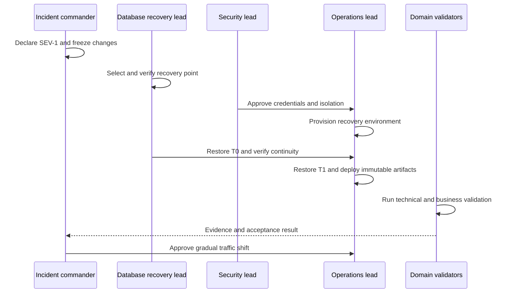

# AS ONE — Disaster Recovery

## Purpose

This document defines recovery objectives and decision gates for a production
loss of infrastructure, region or authoritative data. Targets are service
objectives, not claims of current provider capability; staging exercises must
prove them before production launch.

## Recovery tiers and objectives

| Tier | Data/service | Authority and recoverability | RPO | RTO |
| --- | --- | --- | --- | --- |
| T0 | PostgreSQL transactional core, identity, audit and outbox | authoritative; restore through verified backup and WAL/PITR | ≤ 5 minutes | ≤ 60 minutes |
| T1 | Object storage containing required business objects | authoritative object bytes with PostgreSQL ownership metadata | ≤ 15 minutes | ≤ 4 hours |
| T2 | API and static application artifacts/configuration | immutable and reproducible from reviewed release | 0 committed data | ≤ 60 minutes |
| T3 | Redis cache, rate-limit and realtime coordination | disposable/reconstructible; never business authority | 0 authoritative data | ≤ 30 minutes |
| T4 | Derived projections and analytics | rebuild from T0 checkpoints | checkpoint-defined | ≤ 24 hours |
| T5 | POS offline queues on managed devices | device-held until acknowledged; server cannot guarantee unreceived commands | last server acknowledgement | operational reconciliation, not regional restore |

RPO is measured from the recovered authoritative state to the last confirmed
production commit. RTO ends only after validation and controlled traffic return,
not when infrastructure merely starts.

## Disaster scenarios

| Scenario | Initial posture | Recovery path |
| --- | --- | --- |
| Primary database unavailable, replica healthy | stop unsafe writes; verify replica lag and integrity | controlled promotion and checkpoint validation |
| Logical corruption | prevent propagation and preserve evidence | point-in-time restore to isolated environment, determine safe boundary, approved cutover |
| Region unavailable | declare R3/SEV-1 | activate recovery region, restore T0/T1, deploy immutable artifacts, validate, shift edge traffic |
| Credential compromise | revoke/rotate before broad restoration | isolate, rotate scoped secrets, redeploy, review audit evidence |
| Object-store loss or corruption | block affected object operations | restore version/replica and reconcile PostgreSQL metadata |
| Redis loss | remain degraded if safe | recreate empty service and recover consumers from PostgreSQL/checkpoints |
| Cross-tenant exposure suspicion | isolate affected surfaces immediately | security-led evidence review; no traffic return until isolation tests pass |

## Invocation and decision gates

DR may be invoked by the incident commander when a T0/T1 objective is at risk,
the primary region cannot recover inside the remaining RTO, or integrity cannot
be established safely. Invocation records the incident, recovery point,
affected scope, chosen backup/replica, expected data-loss window and approvers.

Promotion requires all of the following:

1. Recovery target and WAL/PITR boundary are immutable and documented.
2. Backup integrity and encryption access are verified.
3. Migration history matches the reviewed application release.
4. Tenant-safe constraints and representative isolation probes pass.
5. Audit/outbox continuity and recent critical records reconcile.
6. DNS/Cloudflare, TLS, secret and storage bindings point to the recovery environment.
7. Recovery lead executes and an independent approver authorizes promotion.

## Regional recovery sequence

## Return to primary region

Failback is a separate planned change, never an automatic consequence of
primary recovery. It requires a new replication/backup baseline, proof that the
target is not stale, a controlled write boundary, rollback plan, independent
approval and the same validation used for failover.

## Offline POS reconciliation after DR

- Devices retain unacknowledged commands and their idempotency identities.
- The recovered server publishes its authoritative checkpoint.
- Clients never assume that an interrupted response means rejection.
- Commands are replayed through normal authorization, version and idempotency
  controls; money, inventory and cash never use last-write-wins.
- Conflicts become explicit reconciliation outcomes. Operators do not edit
  financial or inventory records to make queues disappear.

## Exercises and evidence

| Exercise | Frequency | Minimum evidence |
| --- | --- | --- |
| Backup restore into isolation | monthly | backup ID, timing, checksums, migrations and validation results |
| PITR to chosen timestamp | quarterly | requested/actual boundary, measured RPO/RTO and transaction samples |
| Regional tabletop | quarterly | role attendance, decision timeline and uncovered dependencies |
| Full recovery rehearsal | twice yearly | end-to-end T0–T3 recovery, traffic validation and corrective actions |
| Credential-loss exercise | yearly | rotation duration and proof revoked credentials fail |

Production readiness requires demonstrated T0/T1 objectives. Missed objectives
must be reported as reliability risk; targets are not weakened merely to record
a successful exercise.

## Restore validation automation boundary

The internal harness validates preconditions only. It rejects protected or
non-allowlisted database names, production mode, source/target equality and
missing `--dry-run --confirm`. It performs no restore or deletion. Actual
isolated restore, PITR, promotion and failback remain controlled manual
procedures requiring the roles and evidence defined above.
