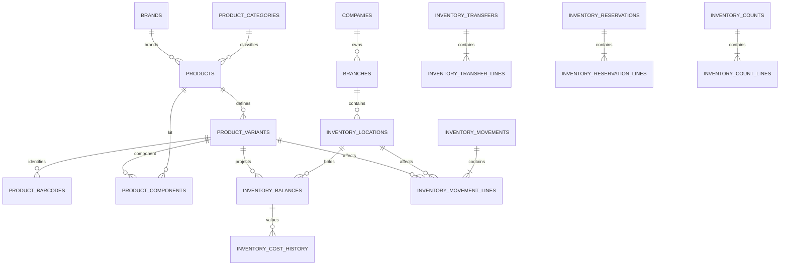
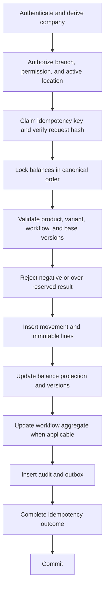
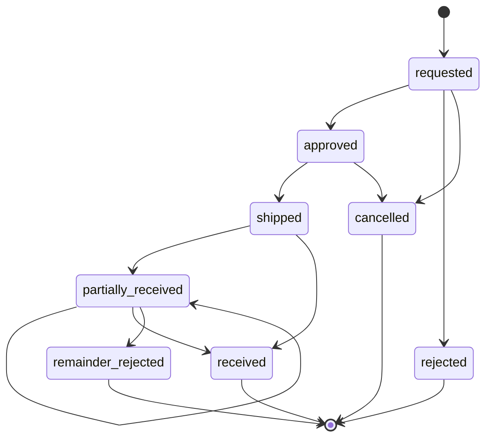

# AS ONE Inventory Engine

## Status

This document is the approved architecture and contract foundation for TASK 09.4. Block 2.2 physically implements only the nine catalog tables, five technical units, domain primitives, and `inventory.cost.read`. Inventory ledger/workflow tables, HTTP endpoints, producers, consumers, workers, and hardware integrations do not yet exist.

## Executive summary

The Inventory Engine provides exact, auditable stock control for AS POS, ticket offices, snacks, events, kiosks, AS Admin, and AS CEO across independent companies, branches, and multiple stock-holding locations per branch.

`inventory_movements` and `inventory_movement_lines` form the immutable authoritative ledger. `inventory_balances` is a transactionally maintained, rebuildable projection. Every accepted inventory command commits its ledger effects, balance projection, idempotency outcome, audit evidence, and outbox events in one PostgreSQL transaction.

Inventory is tracked at this hierarchy:

```text
company -> branch -> inventory_location -> product_variant
```

`inventory_locations` is the canonical domain and database term. “Warehouse” and “almacén” are interface labels only.

## V1 scope

- Product categories, brands, approved units of measure, products, variants, and barcodes.
- Simple, variable, service, virtual-kit, and ordinary preassembled products.
- One explicit default variant for every simple inventory product.
- Multiple active inventory locations per authorized branch.
- Exact on-hand, reserved, available, and in-transit quantities.
- Immutable movement headers and lines.
- Manual receipts, sales consumption, operational consumption, waste, returns, adjustments, reversals, and count adjustments.
- Idempotent reservations with configurable expiration.
- Approved transfers with partial receipt and documented discrepancies.
- Immediate counts through E070 and a persistent count workflow through E115–E123.
- Weighted-average, last-purchase, and standard cost concepts in company currency.
- Audit, transactional outbox, realtime contracts, checkpoints, and offline-command reconciliation.

## Outside V1

- Suppliers, purchase orders, supplier invoicing, manufacturing, and production orders.
- Yield-based recipes, substitutions, co-products, and theoretical waste.
- Lots, expiration dates, serial numbers, and individually serialized inventory units.
- FIFO/LIFO costing, consignment, foreign-currency inventory ledgers, forecasting, and automatic replenishment.
- Hardware readers, vendor SDKs, RFID portals, antennas, EPC decoding, and proximity inventory.
- Explicit membership-to-location grants; V1 derives location access from branch access and inventory permission.
- PostgreSQL RLS and partitioning without measured evidence.

Lots, expiration, and serialization are not represented by incomplete nullable columns. Their later introduction changes stock identity and therefore reservations, balances, transfers, counts, and ledger lines.

## Approved decisions

### Ledger and projection

- `inventory_movements` and `inventory_movement_lines` are immutable.
- `inventory_balances` is read-only to external callers and rebuildable from committed ledger lines.
- Corrections create compensating movements.
- No artificial financial debit/credit model is used.
- No HTTP endpoint edits a balance directly.

### Negative stock

V1 prohibits negative inventory:

```text
quantity_on_hand >= 0
quantity_reserved >= 0
quantity_reserved <= quantity_on_hand
quantity_available = quantity_on_hand - quantity_reserved
quantity_in_transit >= 0
```

Any future exception requires a new accepted decision covering precedence, authorization, reporting, offline conflicts, and audit.

### Tenant and branch scope

- `company_id` comes only from authenticated server context.
- A payload may request a narrower branch or location but cannot expand scope.
- An empty permitted-branch list grants zero access.
- Every branch-owned relationship carries `company_id` and `branch_id`.
- Composite foreign keys prevent cross-company and cross-branch references.
- A valid branch actor with the required inventory permission may access active locations in that branch.
- Explicit per-location membership restrictions are a future extension, not V1 schema.

### Products and variants

- Ledger, balances, reservations, transfers, counts, and future sales inventory effects reference `product_variant_id`.
- A simple inventory product owns one explicit default variant.
- E054 creates `simple`, `service`, and V1 `kit` products with a nested default variant in the same transaction; a `variable` product may omit it only while draft.
- SKU, barcode, unit of measure, quantity scale, cost, and currency belong to the variant, never directly to the product.
- Future commercial and sale-line references use `product_variant_id`, not `product_id`.
- A service creates no balance or inventory movement.
- A product or variant with history is retired logically.
- Unit and `quantity_scale` may change only before the first committed movement.
- Active SKU and barcode values are unique per company after normalization.

### Kits

- A virtual kit has no balance.
- Reservation or sale explodes its versioned component definition atomically.
- Every component must be available or the complete command fails.
- Preassembled merchandise is an ordinary inventory variant.
- Kit implementation follows the base ledger; manufacturing remains outside V1.

### Manual receipts and adjustments

Manual receipts without a purchase order are allowed. They require a client operation identity, idempotency key, reason code, actor, audit, and outbox. They do not imply supplier or procurement implementation.

Every adjustment produces a movement. V1 starts with strict permissions and mandatory reason codes. Threshold-based approval remains a later policy extension.

### Transfers

- V1 transfers require approval.
- Source and destination belong to the same company.
- Destination cannot change after shipment.
- Partial receipt is allowed.
- Remaining quantity may close only as a documented rejection or discrepancy.
- `received + rejected <= shipped`.
- Each stock-affecting transition creates ledger effects, audit evidence, and outbox events.

### Reservations

- Active reservations increase reserved quantity.
- Confirmation decreases reserved and on-hand quantities atomically.
- Confirmation, release, expiration, and cancellation are idempotent.
- Expiration is configurable; the initial POS fallback is 15 minutes.
- A future idempotent worker expires reservations; the first ledger slice does not implement that worker.

### Default location

A cash register, channel, kiosk, event operation, or snacks operation may later reference a default `inventory_location_id`. This selection never belongs on `products`.

### Costing

- Company currency is the single V1 inventory costing currency.
- Weighted-average and last-purchase costs are scoped by location and variant.
- Standard cost is variant or company-policy metadata.
- Authoritative calculations use exact decimals and never JavaScript or database floating point.
- Cost fields require `inventory.cost.read`.
- `inventory.cost.read` supports the existing company permission assignment and optional branch-limited role-assignment model; it introduces no new scope mechanism.
- `product.manage` authorizes catalog mutation but does not imply cost visibility. Without effective `inventory.cost.read`, cost fields are omitted rather than replaced by zero.

### Counts

- E070 remains the compatible immediate count/adjustment contract.
- E115–E123 define the future persistent workflow.
- A count never holds a PostgreSQL transaction open while humans count.
- An expiring domain lock protects only the selected location/product scope.
- Applying a count creates adjustment movements and is idempotent.

## Terminology

| Term | Meaning |
| --- | --- |
| Product | Commercial definition shared by variants |
| Variant | Concrete SKU and inventory unit |
| Location | Branch-owned stock-holding location; UI may say warehouse |
| On hand | Physically controlled quantity |
| Reserved | On-hand quantity committed to an active reservation |
| Available | On hand minus reserved |
| In transit | Shipped transfer quantity not finally received or rejected |
| Movement | Immutable command result header |
| Movement line | Immutable balance delta for one location and variant |
| Balance | Current rebuildable projection |
| Kardex | Authorized chronological view over movement lines |
| Compensating movement | New movement that corrects an earlier committed movement |

## Conceptual model



## Proposed entities

The detailed logical specifications live in [CORE_DATA_MODEL.md](CORE_DATA_MODEL.md). The V1 inventory extension comprises:

- `product_categories`, `brands`, `units_of_measure`
- `products`, `product_option_definitions`, `product_option_values`
- `product_variants`, `product_variant_option_values`, `product_barcodes`
- `product_components`
- `inventory_locations`, `inventory_balances`, `inventory_stock_policies`
- `inventory_movements`, `inventory_movement_lines`
- `inventory_transfers`, `inventory_transfer_lines`
- `inventory_reservations`, `inventory_reservation_lines`
- `inventory_counts`, `inventory_count_lines`
- `inventory_cost_history`

No parallel `warehouses` entity is permitted.

## Movement model and kardex

A committed movement contains one or more lines. Each line records explicit:

- `on_hand_delta`
- `reserved_delta`
- `in_transit_delta`
- before/after quantities
- before/after balance versions
- exact authorized unit and total cost
- location, variant, reason, reference, actor, device, and time

At least one delta is nonzero. A transfer is balanced operationally through related source, transit, and destination effects; it is not represented as financial debit and credit.

Kardex is a stable authorized view ordered by `(occurred_at, movement_id, line_number)`. It is not a separately editable ledger. Cost columns are redacted without `inventory.cost.read`.

## Transaction and lock strategy



Balances are locked in this order:

```text
company_id, branch_id, inventory_location_id, product_variant_id
```

Transactions are short and contain no network calls. Missing balance rows are created through the known tenant-scoped unique constraint. Only that expected unique violation may map to a concurrency conflict.

## Idempotency and offline behavior

Every stock mutation requires:

- client-generated UUID
- tenant-scoped idempotency key
- operation scope
- canonical request hash
- expected/base balance or aggregate version
- device sequence and client operation ID when offline

Identical retries return the stored outcome. Reusing a key with different content returns `idempotency_payload_mismatch`. Money and inventory never use last-write-wins. Offline outcomes remain `accepted`, `duplicate`, `rejected`, or `reconciliation_required`.

Clients cache catalog and balance projections with checkpoints. They do not upload complete tables and do not treat local balances as authority.

## State machines

### Product and variant

```text
draft -> active <-> inactive -> retired
```

`retired` is terminal.

### Inventory location

```text
active <-> inactive -> retired
```

Retirement requires zero quantities and no open reservations, transfers, or counts.

### Movement

```text
pending -> committed
pending -> cancelled
committed -> corrected by new compensating movement
```

### Transfer



### Reservation

```text
active -> confirmed
active -> released
active -> expired
active -> cancelled
```

### Count

```text
draft -> counting -> submitted -> approved -> applied
draft|counting|submitted -> cancelled
submitted -> rejected -> counting
```

## Strict invariants

1. Available equals on hand minus reserved.
2. V1 on-hand, reserved, and in-transit quantities never become negative.
3. Reserved never exceeds on hand.
4. Only committed movements affect balances.
5. Committed movements and lines are immutable and never physically deleted.
6. Balances are changed only by the inventory application service.
7. Ledger folding reconstructs every balance.
8. A service product never owns inventory.
9. A virtual kit never owns inventory.
10. SKU and barcode uniqueness are tenant-scoped.
11. Unit and quantity scale lock after first movement.
12. A transfer never receives or rejects more than shipped.
13. A reservation reaches one terminal outcome once.
14. An applied count cannot apply again.
15. One idempotent operation produces at most one business effect.
16. Setting, ledger, balance, workflow, audit, idempotency, and outbox effects roll back together.
17. Cross-company and cross-branch references fail at application and database boundaries.

## Kits

`product_components` is a versioned fixed bill of materials for virtual kits. Reservation and sale capture the component-definition version and atomically reserve or consume all components. Cycles, self-reference, zero quantities, and cross-company components are rejected.

Recipes with yield, substitutions, production, or process waste remain outside V1.

## Transfers

Shipment decreases source on-hand and increases destination in-transit. Receipt decreases in-transit and increases destination on-hand. Rejected remainder creates a documented compensating disposition. Destination identity freezes at shipment.

Every transition validates `base_version`, permission, tenant, branch, location status, line totals, and idempotency.

## Reservations

Reservations own lines for concrete variants and locations. Kit reservations are exploded before balance locks. Expiration is a domain command, not a direct status update. A future worker claims expired reservations safely and executes the same idempotent release service used by HTTP or recovery flows.

## Counts

A persistent count stores its scope, checkpoint, baseline quantities, recorded quantities, and expiring domain locks. Applying an approved count calculates deltas against the protected baseline and creates immutable adjustment movements.

E070 remains available for authorized immediate single-scope counts.

## Costing

Quantities use `numeric(19,6)`. Money and costs use `numeric(19,4)` following ADR-0001. Weighted-average calculations retain exact decimal intermediates and round only at the documented storage or commercial boundary.

Transfers retain source cost. Negative-value tricks cannot correct quantity; corrections create explicit cost-history and movement evidence.

## Permissions

| Permission | Capability |
| --- | --- |
| `inventory.read` | Read authorized locations, balances, movements, and cost-redacted kardex |
| `inventory.update` | Update approved non-quantity inventory metadata; never balances |
| `inventory.adjust` | Create manual receipts and adjustments |
| `inventory.transfer` | Request and administer transfers |
| `inventory.receive` | Receive shipped transfers |
| `inventory.count` | Conduct counts |
| `inventory.approve` | Approve controlled transfers/counts/adjustments |
| `inventory.cost.read` | Read costs and valuation |
| `inventory_location.manage` | Create and manage locations |
| `inventory.reverse` | Create compensating reversals |
| `inventory.reservation.manage` | Manage non-automatic reservations |

Explicit deny precedes allow. Sales invoke an internal inventory capability inside the authorized sale transaction; cashiers do not need `inventory.adjust`.

## Contract errors

Reserved domain codes:

- `insufficient_stock`
- `inventory_version_conflict`
- `inventory_count_in_progress`
- `inventory_location_inactive`
- `product_variant_inactive`
- `duplicate_sku`
- `duplicate_barcode`
- `duplicate_option_code`
- `duplicate_option_value_code`
- `option_combination_conflict`
- `invalid_product_state`
- `reservation_expired`
- `reservation_already_completed`
- `transfer_invalid_transition`
- `transfer_quantity_exceeded`
- `idempotency_payload_mismatch`
- `reconciliation_required`
- `inventory_unit_locked`

Unexpected PostgreSQL errors remain sanitized. These codes are documented contracts only; `@asone/errors` is unchanged in this block.

The option contracts reuse `validation_error`, `resource_not_found`, `permission_denied`, and `version_conflict`. `option_in_use` is not reserved because option definitions and values have no physical-delete route and are retired logically without erasing relational variant mappings.

## Audit

Audit evidence includes company, branch, location, actor, request, correlation, action, resource, reason, result, timestamp, and bounded safe metadata. It excludes tokens, headers, unrestricted payloads, payment data, hardware credentials, and costs unless policy and permission explicitly allow them.

The inventory ledger explains the physical effect; audit proves who authorized and executed it. Neither replaces the other.

## Outbox and realtime

Inventory events use the existing envelope and carry exact decimal quantities as strings. Producers commit events with the owning transaction. Consumers deduplicate by `event_id`, process aggregate versions defensively, and recover gaps through REST checkpoints because global delivery order is not guaranteed.

The proposed event inventory is defined in [REALTIME_EVENTS.md](REALTIME_EVENTS.md). No producer or consumer is implemented by this task.

## Recovery

- Catalog changes use the existing E062/E063 checkpoint pattern.
- Inventory balances and movements use E072 and future recovery contracts.
- Rebuild tooling folds committed movement lines into a new projection and compares it with live balances before controlled replacement.
- Realtime clients stop applying a gapped aggregate stream and recover authorized state through REST.
- Audit and outbox retention must cover the supported offline replay window.

## Future NFC/RFID extension

### Catalog identifiers

V1 supports product-class identification through `product_barcodes`. A future provider-neutral `product_variant_identifiers` entity may support:

- barcode
- product QR
- internal code
- reusable NFC identifier
- variant-level RFID value
- external identifier

Conceptual fields include `identifier_type`, `normalized_value`, `provider`, `status`, `first_seen_at`, `last_seen_at`, safe metadata, logical retirement, and unique `(company_id, identifier_type, normalized_value)`.

### Physical-unit identifiers

An EPC, NFC UID, serial, or asset tag that identifies one physical item requires a future inventory-unit aggregate, tentatively `inventory_item_identifiers`. It must not be attached directly to an undifferentiated balance.

This later aggregate changes the identity used by receipts, reservations, transfers, counts, and sales. It belongs with serialization/lots/assets, outside V1.

### Integration model

- Hardware adapters translate vendor-specific reads into canonical commands.
- The domain never depends on a reader brand, SDK, antenna, or EPC decoder.
- Reception may associate identifiers after validating company, variant, and expected command.
- Counts deduplicate repeated reads before submitting an idempotent count command.
- Transfers record identifiers at shipment and verify them at receipt.
- POS resolves identifiers to authorized variants without trusting device-provided tenant scope.

Read batches require a device ID, reader session, client read ID, sequence, normalized identifier, timestamp, and payload hash. Duplicate reads are harmless; idempotency prevents repeated stock effects.

Hardware credentials, raw access keys, unrestricted RF observations, and unnecessary location/person tracking are prohibited. Identifier access is tenant-scoped, audited, minimized, and retained according to privacy policy. Potential uses include merchandise, reusable wristbands, controlled assets, and serialized equipment, but wristband identity and customer identity require separate approved modules.

No NFC/RFID table belongs in the first inventory migration.

## Test strategy

### Unit

- State transitions, quantity scale, kit explosion, transfer arithmetic, reservations, count deltas, exact cost calculations, payload redaction, and error mapping.

### PostgreSQL

- Numeric checks, state/deletion checks, tenant-composite FKs, SKU/barcode uniqueness, movement immutability, rebuild equivalence, and cost precision.

### Concurrency and rollback

- Competing sales for final stock, concurrent reservations, first balance creation, transfer/adjustment races, duplicate receipts, count locks, deadlock-resistant lock ordering, and forced audit/outbox failures.

### Offline and security

- Lost responses, duplicate/reordered commands, stale versions, revoked devices, expired reservations, cross-company/branch/location attempts, empty branch access, deny precedence, and cost redaction.

No PostgreSQL atomicity claim may rely only on mocks.

## Risks and remaining decisions

1. `CORE_DATA_MODEL.md` originally referenced products directly; implementation must migrate the design to variants before catalog/inventory code exists.
2. E049–E072 are already authoritative and require compatible extension rather than replacement.
3. Location-level membership restrictions remain deferred.
4. Approval thresholds and separation-of-duties policy remain open.
5. Default location selection by register/channel remains an integration contract.
6. Reservation duration may later vary by company, channel, or product.
7. Count lock duration and abandoned-count recovery need operational limits.
8. Purchase valuation without a procurement module needs a controlled manual-receipt policy.
9. Outbox volume may require coalesced client projections while retaining every ledger fact.
10. Partitioning and archival thresholds remain measurement-driven.

## Implementation blocks

| Block | Entry criteria | Scope | Exit criteria |
| --- | --- | --- | --- |
| 2 — Inventory catalog | This architecture and initial contracts accepted | Categories, brands, UOM, products, variants, barcodes, retirement, permissions | PostgreSQL and API tests prove tenant isolation, uniqueness, lifecycle, and no inventory effects |
| 3 — Locations and balance reads | Block 2 published | Locations, stock policies, empty balance projection, read endpoints, branch authorization | E064–E067 compatible; no direct balance mutation; scope tests pass |
| 4 — Base ledger | Blocks 2–3 published; idempotency contract ready | Movements/lines, receipts, adjustment, reversal, balance projection, audit/outbox, kardex | Real PostgreSQL proves rebuild, negative rejection, concurrency, rollback, and safe events |
| 5 — Reservations | Ledger published; expiration policy accepted | Create, confirm, release, expire services; no worker initially | Concurrent overselling tests and idempotent terminal outcomes pass |
| 6 — Transfers | Reservations/ledger stable; approval policy accepted | Request, approval, shipment, transit, partial receipt, discrepancy | State, quantity, concurrency, and cross-branch tests pass |
| 7 — Counts | Lock duration and approval policy accepted | Immediate compatibility plus persistent counts and domain locks | Apply-once, conflict, expiration, rollback, and audit tests pass |
| 8 — Kits and costing | Catalog/ledger stable; cost policy accepted | Fixed BOM explosion, weighted average, last and standard cost history | Golden decimal, component concurrency, and cost authorization tests pass |
| 9 — Recovery and realtime | Event schemas accepted; retention decided | Checkpoints, changes, publisher/consumer integration | Gap, replay, dedupe, authorization, and backlog tests pass |
| 10 — Productive validation | Complete vertical slices | Load, contention, rebuild, restore, monitoring, runbooks | Measured SLO evidence and production-readiness review accepted |
