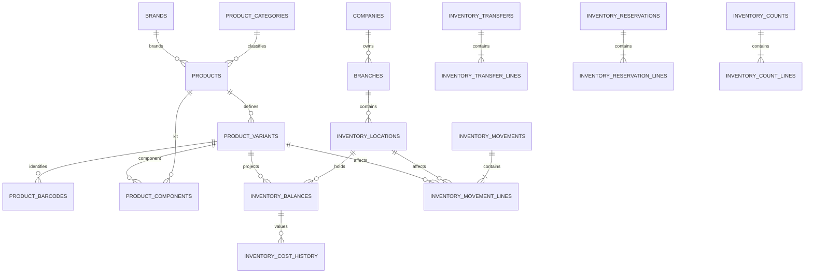
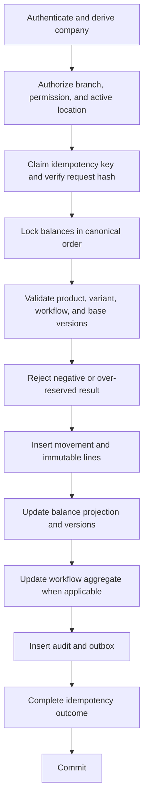
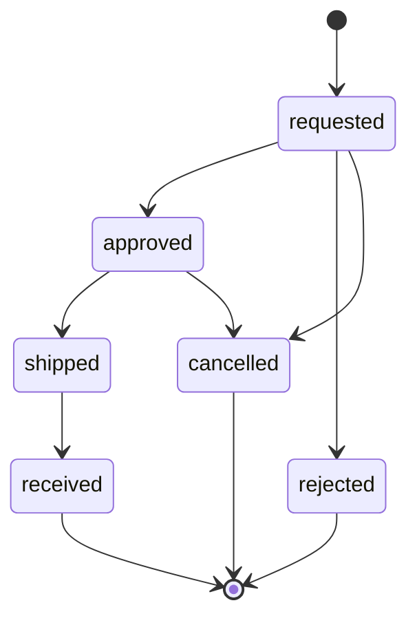

# AS ONE Inventory Engine

## Status

This document is the approved architecture and contract foundation for TASK
09.4. Block 2.2 implements the catalog foundation. Blocks 3.2A–3.2B add the
physical inventory, transfer, and reservation tables through migrations
`0005_inventory_operations_foundation` and
`0006_inventory_transfers_and_reservations`. E064–E068 and the E145–E152 draft
application layer exist. Posting, balance mutation, transfer/reservation
orchestration, producers, consumers, workers, and hardware integrations do not
yet exist.

The detailed TASK 09.4 Block 3.1 physical and operational design is documented
in [INVENTORY_OPERATIONS_DESIGN.md](INVENTORY_OPERATIONS_DESIGN.md).

## Executive summary

The Inventory Engine provides exact, auditable stock control for AS POS, ticket offices, snacks, events, kiosks, AS Admin, and AS CEO across independent companies, branches, and multiple stock-holding locations per branch.

`inventory_movements` and `inventory_movement_lines` form the immutable authoritative ledger. `inventory_balances` is a transactionally maintained, rebuildable projection. Every accepted inventory command commits its ledger effects, balance projection, idempotency outcome, audit evidence, and outbox events in one PostgreSQL transaction.

Inventory is tracked at this hierarchy:

```text
company -> branch -> inventory_location -> product_variant
```

`inventory_locations` is the canonical domain and database term. “Warehouse” and “almacén” are interface labels only.

## V1 scope

- Product categories, brands, approved units of measure, products, variants, and barcodes.
- Simple, variable, service, virtual-kit, and ordinary preassembled products.
- One explicit default variant for every simple inventory product.
- Multiple active inventory locations per authorized branch.
- Exact on-hand, reserved, available, and in-transit quantities.
- Immutable movement headers and lines.
- Manual receipts, sales consumption, operational consumption, waste, returns, adjustments, reversals, and count adjustments.
- Idempotent reservations with configurable expiration.
- Approved quantity-only transfers with one complete shipment and receipt.
- Immediate counts through E070 and a persistent count workflow through E115–E123.
- Weighted-average, last-purchase, and standard cost concepts in company currency.
- Audit, transactional outbox, realtime contracts, checkpoints, and offline-command reconciliation.

## Outside V1

- Suppliers, purchase orders, supplier invoicing, manufacturing, and production orders.
- Yield-based recipes, substitutions, co-products, and theoretical waste.
- Lots, expiration dates, serial numbers, and individually serialized inventory units.
- FIFO/LIFO costing, consignment, foreign-currency inventory ledgers, forecasting, and automatic replenishment.
- Hardware readers, vendor SDKs, RFID portals, antennas, EPC decoding, and proximity inventory.
- Explicit membership-to-location grants; V1 derives location access from branch access and inventory permission.
- PostgreSQL RLS and partitioning without measured evidence.

Lots, expiration, and serialization are not represented by incomplete nullable columns. Their later introduction changes stock identity and therefore reservations, balances, transfers, counts, and ledger lines.

## Approved decisions

### Ledger and projection

- `inventory_movements` and `inventory_movement_lines` are immutable.
- `inventory_balances` is read-only to external callers and rebuildable from posted ledger lines.
- Corrections create compensating movements.
- No artificial financial debit/credit model is used.
- No HTTP endpoint edits a balance directly.

### Negative stock

V1 prohibits negative inventory:

```text
quantity_on_hand >= 0
quantity_reserved >= 0
quantity_reserved <= quantity_on_hand
quantity_available = quantity_on_hand - quantity_reserved
quantity_in_transit >= 0
```

Any future exception requires a new accepted decision covering precedence, authorization, reporting, offline conflicts, and audit.

### Tenant and branch scope

- `company_id` comes only from authenticated server context.
- A payload may request a narrower branch or location but cannot expand scope.
- An empty permitted-branch list grants zero access.
- Every branch-owned relationship carries `company_id` and `branch_id`.
- Composite foreign keys prevent cross-company and cross-branch references.
- A valid branch actor with the required inventory permission may access active locations in that branch.
- Explicit per-location membership restrictions are a future extension, not V1 schema.

### Products and variants

- Ledger, balances, reservations, transfers, counts, and future sales inventory effects reference `product_variant_id`.
- A simple inventory product owns one explicit default variant.
- E054 creates `simple`, `service`, and V1 `kit` products with a nested default variant in the same transaction; a `variable` product may omit it only while draft.
- SKU, barcode, unit of measure, quantity scale, cost, and currency belong to the variant, never directly to the product.
- Future commercial and sale-line references use `product_variant_id`, not `product_id`.
- A service creates no balance or inventory movement.
- A product or variant with history is retired logically.
- Unit and `quantity_scale` may change only before the first posted movement.
- Active SKU and barcode values are unique per company after normalization.

Block 2.3C resolves E101 `option_value_ids` against relational product options. It locks definitions and
values deterministically, permits at most one value per definition, derives the canonical signature on
the server, and persists the mappings atomically with the variant. Simple, service, and kit products keep
the canonical empty signature. E103 does not change option composition; a future explicit aggregate
contract is required for that mutation.

Option definitions, values, and barcodes retire logically. Definitions and values used by active variants
cannot retire, and creating a second active primary barcode is rejected rather than silently demoting the
existing primary barcode.

UOM and `quantity_scale` remain mutable during this block because inventory movement tables do not yet
exist. E103 validates every currently provable invariant and preserves `inventory_unit_locked` as the
future contractual error; it does not issue a synthetic movement query.

Catalog mutations use a consistent lock order. Existing-product updates lock product, category, brand,
and variant in that order. Product creation locks category, then brand, before inserting product and
variant. This order is shared with brand retirement to reduce deadlock risk.

### Kits

- A virtual kit has no balance.
- Reservation or sale explodes its versioned component definition atomically.
- Every component must be available or the complete command fails.
- Preassembled merchandise is an ordinary inventory variant.
- Kit implementation follows the base ledger; manufacturing remains outside V1.

### Manual receipts and adjustments

Manual receipts without a purchase order are allowed. They require a client operation identity, idempotency key, reason code, actor, audit, and outbox. They do not imply supplier or procurement implementation.

Every adjustment produces a movement. V1 starts with strict permissions and mandatory reason codes. Threshold-based approval remains a later policy extension.

### Transfers

- V1 transfers require approval.
- Source and destination belong to the same company.
- Destination cannot change after shipment.
- V1 shipment and receipt are complete and happen once.
- Partial receipt, remaining-quantity disposition, and discrepancies are
  physically forward-compatible but contractually deferred.
- V1 completion produces `received = shipped = requested` and `rejected = 0`.
- Each stock-affecting transition creates ledger effects, audit evidence, and outbox events.

### Reservations

- Block 3.3E freezes E124-E128; future Block 3.3F implements them. The old plan
  assigning reservations to 3.3D is superseded because published Blocks 3.3D.1
  and 3.3D.2 are the transfer contract and engine.
- A reservation is company/branch-owned and contains one or more lines across
  active issuing locations in that branch. No singular header location exists.
- `owner_type` is `pos_cart`, `event`, `booking`, or `order`; `owner_id` is the
  opaque owning aggregate, never a user/device grant.
- Active reservations increase reserved quantity without changing on-hand or
  in-transit quantity.
- Full confirmation decreases reserved and on-hand quantities atomically and
  creates one posted `issue` movement referenced to the reservation.
- Release, expiration, and cancellation decrease reserved only. Every terminal
  transition is mutually exclusive, idempotent, versioned and audited.
- `expires_at` is optional. An expired reservation cannot confirm; command-time
  expiry uses the same atomic service. No expiration worker is implemented yet.

### Default location

A cash register, channel, kiosk, event operation, or snacks operation may later reference a default `inventory_location_id`. This selection never belongs on `products`.

### Costing

- Company currency is the single V1 inventory costing currency.
- Weighted-average and last-purchase costs are scoped by location and variant.
- Standard cost is variant or company-policy metadata.
- Authoritative calculations use exact decimals and never JavaScript or database floating point.
- Cost fields require `inventory.cost.read`.
- `inventory.cost.read` supports the existing company permission assignment and optional branch-limited role-assignment model; it introduces no new scope mechanism.
- `product.manage` authorizes catalog mutation but does not imply cost visibility. Without effective `inventory.cost.read`, cost fields are omitted rather than replaced by zero.

### Counts

- E070 remains the compatible immediate count/adjustment contract.
- E115–E123 define the future persistent workflow.
- A count never holds a PostgreSQL transaction open while humans count.
- Durable V1 counts own one location and freeze either all existing
  inventory-tracked balances or an explicit nonempty variant set at start.
- Expected quantities, balance versions, and last movement IDs form the
  snapshot; normal operations continue, but drift blocks approval/application.
- An expiring domain lock stored on the count header and protected by a partial
  unique location index prevents overlapping active counts.
- Applying a count creates at most one posted adjustment movement and is
  idempotent; zero total discrepancy applies without an empty movement.
- E070 uses `inventory.count_applied`; durable E122 uses
  `inventory.count.completed`, never both.

## Terminology

| Term | Meaning |
| --- | --- |
| Product | Commercial definition shared by variants |
| Variant | Concrete SKU and inventory unit |
| Location | Branch-owned stock-holding location; UI may say warehouse |
| On hand | Physically controlled quantity |
| Reserved | On-hand quantity allocated to an active reservation |
| Available | On hand minus reserved |
| In transit | Shipped transfer quantity not finally received or rejected |
| Movement | Immutable command result header |
| Movement line | Immutable balance delta for one location and variant |
| Balance | Current rebuildable projection |
| Kardex | Authorized chronological view over movement lines |
| Compensating movement | New posted movement that corrects an earlier posted movement |

## Conceptual model



## Proposed entities

The detailed logical specifications live in [CORE_DATA_MODEL.md](CORE_DATA_MODEL.md). The V1 inventory extension comprises:

- `product_categories`, `brands`, `units_of_measure`
- `products`, `product_option_definitions`, `product_option_values`
- `product_variants`, `product_variant_option_values`, `product_barcodes`
- `product_components`
- `inventory_locations`, `inventory_balances`, `inventory_stock_policies`
- `inventory_movements`, `inventory_movement_lines`
- `inventory_transfers`, `inventory_transfer_lines`
- `inventory_reservations`, `inventory_reservation_lines`
- `inventory_counts`, `inventory_count_lines`
- `inventory_cost_history`

No parallel `warehouses` entity is permitted.

### Physical foundation implemented by migration 0005

- Four tables only: locations, balances, movement headers, and movement lines.
- Locations and movements require tenant-safe branch ownership; company-level
  warehouses are not represented.
- Approved types are `main`, `sales_floor`, `cafeteria`, `event_storage`,
  `damaged`, `returns`, `transit`, and `virtual`.
- A partial unique index permits at most one active default per branch, but 0005
  creates no default data.
- Balances use variant identity, store on-hand/reserved/in-transit and average
  cost, and do not store available quantity.
- Posted/reversed line quantities are positive with source/destination direction.
- UOM references the implemented global `unit_of_measure_code`.
- All cross-company inventory references are rejected by physical foreign keys.
- Immutability remains an application-service responsibility; no trigger or
  posting behavior is included in 0005.

### Physical transfer and reservation foundation implemented by migration 0006

- `inventory_transfers` uses the canonical requested, approved, shipped,
  partially received, received, rejected, cancelled, and remainder-rejected
  lifecycle. Row-local timestamp and actor consistency is enforced physically.
- `inventory_transfer_lines` stores requested, shipped, received, and rejected
  quantities as `numeric(19,6)` and enforces
  `received + rejected <= shipped <= requested`.
- `inventory_reservations` uses only active, confirmed, released, expired, and
  cancelled states with owner types `pos_cart`, `event`, `booking`, and `order`.
- `inventory_reservation_lines` owns the concrete inventory location and variant.
  Its defensive `branch_id` enables composite foreign keys proving that each
  line belongs to the reservation branch.
- Remaining reserved quantity is derived as
  `reserved_quantity - consumed_quantity - released_quantity`; it is not stored.
- Migration 0006 creates no triggers, stock mutation, posting, orchestration,
  expiration worker, audit producer, or outbox producer.

## Movement model and kardex

A posted movement contains one or more lines. Each line records explicit:

- `on_hand_delta`
- `reserved_delta`
- `in_transit_delta`
- before/after quantities
- before/after balance versions
- exact authorized unit and total cost
- location, variant, reason, reference, actor, device, and time

At least one delta is nonzero. A transfer is balanced operationally through related source, transit, and destination effects; it is not represented as financial debit and credit.

Kardex is a stable authorized view ordered by `(occurred_at, movement_id, line_number)`. It is not a separately editable ledger. Cost columns are redacted without `inventory.cost.read`.

## Transaction and lock strategy



Balances are locked in this order:

```text
company_id, branch_id, inventory_location_id, product_variant_id
```

Transactions are short and contain no network calls. Missing balance rows are created through the known tenant-scoped unique constraint. Only that expected unique violation may map to a concurrency conflict.

## Idempotency and offline behavior

Every stock mutation requires:

- client-generated UUID
- tenant-scoped idempotency key
- operation scope
- canonical request hash
- expected/base balance or aggregate version
- device sequence and client operation ID when offline

Identical retries return the stored outcome. Reusing a key with different content returns `idempotency_payload_mismatch`. Money and inventory never use last-write-wins. Offline outcomes remain `accepted`, `duplicate`, `rejected`, or `reconciliation_required`.

Clients cache catalog and balance projections with checkpoints. They do not upload complete tables and do not treat local balances as authority.

## State machines

### Product and variant

```text
draft -> active <-> inactive -> retired
```

`retired` is terminal.

### Inventory location

```text
active <-> inactive -> retired
```

Retirement requires zero quantities and no open reservations, transfers, or counts.

### Movement

```text
draft -> pending -> posted
pending -> cancelled
draft -> cancelled
posted -> reversed
```

Editable draft contracts are reserved as E145–E152. Only `draft` is editable;
`draft` and `pending` are cancellable; `pending` is postable by a future
contract; `posted` and `reversed` are immutable, and `cancelled` and `reversed`
are terminal for direct edits. E145 creates a header only. Line mutations use
the parent movement strong ETag and increment `movement.version`; lines have no
independent version.

The generic draft allowlist is deliberately limited to `opening_balance` and
`adjustment`. Opening balances require a destination. Adjustment lines require
exactly one endpoint: destination for adjustment-in or source for
adjustment-out. Receipts and consumptions remain E134/E135; transfer, sale,
return, and reversal movements remain workflow-owned.

Draft line quantities are positive exact `numeric(19,6)` strings. Until a UOM
conversion graph is approved, submitted UOM must equal the variant base UOM and
the server derives an equal `base_quantity`. Client cost input is forbidden;
valuation remains posting-owned, and visible cost evidence still requires
`inventory.cost.read`.

Movement numbers are opaque server identifiers derived from the generated
UUIDv7 movement ID: lowercase canonical UUID, hyphens removed, prefixed with
`IMV-`. The exact regex is `^IMV-[0-9a-f]{32}$`. ID and number are inserted
atomically. The number is immutable, non-sequential, non-reusable, and carries
no company, branch, date, type, accounting, fiscal, or legal-folio semantics.
Generation needs no sequence, folio table, `MAX()+1`, or allocation lock, and
exact idempotent replay returns the original pair.

Submission and quantity-only posting are reserved as E153–E154. E153 freezes a
nonempty `draft` as `pending` under `inventory.adjust`; E154 posts only
`pending` manual `opening_balance` and `adjustment` movements under the stronger
existing `inventory.approve` permission. Both require `Idempotency-Key` and the
parent strong `If-Match`, increment the aggregate version once, and replay the
original response and ETag without another effect. No direct draft-to-post
transition or preview route is approved.

E154 aggregates exact `base_quantity` deltas by balance key, locks keys in
company/branch/location/variant order, creates missing inbound balances safely,
and prohibits missing or insufficient outbound balances. It changes only
`quantity_on_hand`; reserved and in-transit remain unchanged and available is
derived. V1 provides no negative-stock override.

Posting is explicitly quantity-only until a separate valuation reconciliation
is accepted. Existing average cost is retained; new inbound balances use the
physical zero-cost/null-currency default; draft line cost fields remain null.
This permits safe quantity authority without silently inventing opening-balance
or adjustment valuation.

E154 reuses the documented `inventory.approve` permission already reserved for
controlled inventory approvals. It is not yet seeded, so its technical seed and
role assignment are an explicit implementation prerequisite. No new
`inventory.post` permission is approved by this documentation block.

### Transfer



The physical `partially_received` and `remainder_rejected` states remain
forward-compatible but dormant. V1 accepts one complete receipt and never
transitions into them.

### Reservation

```text
active -> confirmed
active -> released
active -> expired
active -> cancelled
```

### Count

```text
draft -> counting -> submitted -> approved -> applied
draft|counting|submitted -> cancelled
```

V1 does not persist `rejected`. Reopening a submitted count is deferred until a
separate contract defines who may reopen it and how its evidence is retained.
`applied` and `cancelled` are terminal.

## Strict invariants

1. Available equals on hand minus reserved.
2. V1 on-hand, reserved, and in-transit quantities never become negative.
3. Reserved never exceeds on hand.
4. Only posted and reversal movements affect balances.
5. Posted/reversed movement lines are immutable and never physically deleted; the header may only transition from `posted` to `reversed` after its compensating movement posts.
6. Balances are changed only by the inventory application service.
7. Ledger folding reconstructs every balance.
8. A service product never owns inventory.
9. A virtual kit never owns inventory.
10. SKU and barcode uniqueness are tenant-scoped.
11. Unit and quantity scale lock after first movement.
12. A transfer never receives or rejects more than shipped.
13. A reservation reaches one terminal outcome once.
14. An applied count cannot apply again.
15. One idempotent operation produces at most one business effect.
16. Setting, ledger, balance, workflow, audit, idempotency, and outbox effects roll back together.
17. Cross-company and cross-branch references fail at application and database boundaries.

## Kits

`product_components` is a versioned fixed bill of materials for virtual kits. Reservation and sale capture the component-definition version and atomically reserve or consume all components. Cycles, self-reference, zero quantities, and cross-company components are rejected.

Recipes with yield, substitutions, production, or process waste remain outside V1.

## Transfers

E108–E114 are the only reserved V1 transfer routes. E109 creates the complete
aggregate directly in `requested`; there is no equivalent `draft`, `submitted`,
update, or submit route. E111 approves or rejects. E112 ships only `approved`,
E113 receives only `shipped`, and E114 cancels only `requested` or `approved`.
Received, rejected, and cancelled transfers are terminal.

E109 validates and freezes an explicitly selected active `transit` location in
the destination branch. Shipment posts a
`transfer_shipment` movement from source to transit, decreases source on-hand,
and increases destination-scoped in-transit. Receipt posts a distinct
`transfer_receipt` movement from transit to destination, decreases in-transit,
and increases destination on-hand.
Quantities remain positive and direction remains explicit. No stock remains
available at source after shipment and none becomes destination on-hand before
receipt.

V1 ships and receives all approved quantities once. Partial receipt, multiple
deliveries, discrepancy/remainder disposition, over-receipt, substitution,
post-shipment cancellation, and transfer reversal are deferred. The physical
columns and states that can support a later contract do not authorize those
behaviors.

Every transition validates strong `If-Match` where applicable, the operation
permission, tenant, required endpoint-branch grants, active locations, line
totals, and idempotency. Creation, approval, shipment, and cancellation require
both endpoint branches; receipt requires destination access; reads require at
least one endpoint branch without exposing hidden endpoint data. Aggregate and
balance locks are deterministic, so double shipment/receipt and concurrent
cancel/ship produce one winner and a safe `version_conflict` or
`transfer_invalid_transition` loser.

## Reservations

Reservations own lines for concrete variants and locations. Kit reservations
are exploded before balance locks. E125 creates an `active` aggregate and
increases reserved quantity. E127 fully confirms it, posts an `issue` movement,
and decreases reserved and on-hand. E128 uses the explicit action
`release|expire|cancel`; all three actions decrease reserved only. E127 and E128
require the strong current ETag. Every mutation stores its idempotency outcome,
audit, outbox, and balance effects in one transaction.

Expiration is a domain command, not a direct status update. With no worker in
V1, a command that observes an elapsed optional `expires_at` may atomically
expire under the authenticated actor. A future worker must call the same
service using an approved technical actor. The current schema supports V1:
terminal reasons are audit evidence and confirmation movement identity is
projected from its typed movement reference, so no reservation migration is
approved.

Owner metadata is immutable identification, not authorization. Public commands
require `inventory.reservation.manage`; a future owning module may call the
internal service only with a trusted capability bound to the exact owner pair.
Clients cannot assert that capability in request data.

## Counts

A persistent count stores its scope, checkpoint, baseline quantities, recorded quantities, and expiring domain locks. Applying an approved count calculates deltas against the protected baseline and creates immutable adjustment movements.

E070 remains available for authorized immediate single-scope counts.

## Costing

Quantities use `numeric(19,6)`. Money and costs use `numeric(19,4)` following ADR-0001. Weighted-average calculations retain exact decimal intermediates and round only at the documented storage or commercial boundary.

Transfer V1 is quantity-only: it does not copy or recalculate line cost,
average cost, currency, landed cost, or accounting evidence. Source-cost
preservation and transfer valuation remain deferred to a separate approved
contract. Negative-value tricks cannot correct quantity.

## Permissions

| Permission | Capability |
| --- | --- |
| `inventory.read` | Read authorized locations, balances, movements, and cost-redacted kardex |
| `inventory.update` | Update approved non-quantity inventory metadata; never balances |
| `inventory.adjust` | Create manual receipts and adjustments |
| `inventory.transfer` | Request, ship, and cancel transfers with required endpoint-branch access |
| `inventory.receive` | Receive shipped transfers |
| `inventory.count` | Conduct counts |
| `inventory.approve` | Approve or reject controlled transfers/counts/adjustments |
| `inventory.cost.read` | Read costs and valuation |
| `inventory_location.manage` | Create and manage locations |
| `inventory.reverse` | Create compensating reversals |
| `inventory.reservation.manage` | Manage non-automatic reservations |

`inventory.reservation.manage` is contractually approved but not yet seeded;
Block 3.3F must add it. It is the public mutation permission for E125, E127 and
E128. `inventory.read` governs E124 and E126. Count, approval and reconciliation
permissions grant no reservation capability.

Explicit deny precedes allow. Sales invoke an internal inventory capability inside the authorized sale transaction; cashiers do not need `inventory.adjust`.

## Contract errors

Reserved domain codes:

- `insufficient_inventory`
- `negative_inventory_not_allowed`
- `inventory_location_not_found`
- `inventory_balance_conflict`
- `inventory_reconciliation_required`
- `inventory_count_in_progress`
- `inventory_location_inactive`
- `invalid_movement_state`
- `movement_already_posted`
- `movement_already_reversed`
- `product_variant_inactive`
- `duplicate_sku`
- `duplicate_barcode`
- `duplicate_option_code`
- `duplicate_option_value_code`
- `option_combination_conflict`
- `invalid_product_state`
- `reservation_expired`
- `reservation_already_completed`
- `transfer_invalid_transition`
- `transfer_quantity_exceeded`
- `idempotency_conflict`
- `inventory_unit_locked`
- `movement_has_no_lines`
- `inventory_balance_not_found`
- `invalid_movement_line`
- `numeric_overflow`

Unexpected PostgreSQL errors remain sanitized. These codes are documented contracts only; `@asone/errors` is unchanged in this block.

The previous inventory aliases `insufficient_stock`, `inventory_version_conflict`,
`reconciliation_required`, and `idempotency_payload_mismatch` are replaced and
are not active canonical errors.

The option contracts reuse `validation_error`, `resource_not_found`, `permission_denied`, and `version_conflict`. `option_in_use` is not reserved because option definitions and values have no physical-delete route and are retired logically without erasing relational variant mappings.

## Audit

Audit evidence includes company, branch, location, actor, request, correlation, action, resource, reason, result, timestamp, and bounded safe metadata. It excludes tokens, headers, unrestricted payloads, payment data, hardware credentials, and costs unless policy and permission explicitly allow them.

The inventory ledger explains the physical effect; audit proves who authorized and executed it. Neither replaces the other.

## Outbox and realtime

Inventory events use the existing envelope and carry exact decimal quantities as strings. Producers commit events with the owning transaction. Consumers deduplicate by `event_id`, process aggregate versions defensively, and recover gaps through REST checkpoints because global delivery order is not guaranteed.

The proposed event inventory is defined in [REALTIME_EVENTS.md](REALTIME_EVENTS.md). No producer or consumer is implemented by this task.

## Recovery

- Catalog changes use the existing E062/E063 checkpoint pattern.
- Inventory balances and movements use E072 and future recovery contracts.
- Rebuild tooling folds posted and reversal movement lines into a new projection and compares it with live balances before controlled replacement.
- Realtime clients stop applying a gapped aggregate stream and recover authorized state through REST.
- Audit and outbox retention must cover the supported offline replay window.

## Future NFC/RFID extension

### Catalog identifiers

V1 supports product-class identification through `product_barcodes`. A future provider-neutral `product_variant_identifiers` entity may support:

- barcode
- product QR
- internal code
- reusable NFC identifier
- variant-level RFID value
- external identifier

Conceptual fields include `identifier_type`, `normalized_value`, `provider`, `status`, `first_seen_at`, `last_seen_at`, safe metadata, logical retirement, and unique `(company_id, identifier_type, normalized_value)`.

### Physical-unit identifiers

An EPC, NFC UID, serial, or asset tag that identifies one physical item requires a future inventory-unit aggregate, tentatively `inventory_item_identifiers`. It must not be attached directly to an undifferentiated balance.

This later aggregate changes the identity used by receipts, reservations, transfers, counts, and sales. It belongs with serialization/lots/assets, outside V1.

### Integration model

- Hardware adapters translate vendor-specific reads into canonical commands.
- The domain never depends on a reader brand, SDK, antenna, or EPC decoder.
- Reception may associate identifiers after validating company, variant, and expected command.
- Counts deduplicate repeated reads before submitting an idempotent count command.
- Transfers record identifiers at shipment and verify them at receipt.
- POS resolves identifiers to authorized variants without trusting device-provided tenant scope.

Read batches require a device ID, reader session, client read ID, sequence, normalized identifier, timestamp, and payload hash. Duplicate reads are harmless; idempotency prevents repeated stock effects.

Hardware credentials, raw access keys, unrestricted RF observations, and unnecessary location/person tracking are prohibited. Identifier access is tenant-scoped, audited, minimized, and retained according to privacy policy. Potential uses include merchandise, reusable wristbands, controlled assets, and serialized equipment, but wristband identity and customer identity require separate approved modules.

No NFC/RFID table belongs in the first inventory migration.

## Test strategy

### Unit

- State transitions, quantity scale, kit explosion, transfer arithmetic, reservations, count deltas, exact cost calculations, payload redaction, and error mapping.

### PostgreSQL

- Numeric checks, state/deletion checks, tenant-composite FKs, SKU/barcode uniqueness, movement immutability, rebuild equivalence, and cost precision.

### Concurrency and rollback

- Competing sales for final stock, concurrent reservations, first balance creation, transfer/adjustment races, duplicate receipts, count locks, deadlock-resistant lock ordering, and forced audit/outbox failures.

### Offline and security

- Lost responses, duplicate/reordered commands, stale versions, revoked devices, expired reservations, cross-company/branch/location attempts, empty branch access, deny precedence, and cost redaction.

No PostgreSQL atomicity claim may rely only on mocks.

## Canonical quantity-only reversal

E071 remains `POST /inventory/movements/{movement_id}/reversals`; no new
endpoint ID or alias is introduced. It requires `inventory.reverse`, the
original movement's strong ETag, an idempotency key, and a bounded non-empty
`reason_code`. The command accepts no client-authored lines, quantities,
locations, costs, linkage, state, or timestamps.

Only manually posted `opening_balance` and `adjustment` movements are eligible.
Typed receipt, issue, return, sale, transfer, reservation, count, and prior
reversal effects remain owned by their workflows. E071 immediately creates a
distinct posted reversal, mirrors every original positive quantity while
exchanging source and destination, applies all inverse balance deltas, and
then marks the original `reversed` in one transaction. There is no editable
reversal draft and no partial reversal.

The reversal points to its original through `reversal_of_movement_id`; the
original points back through `reversed_by_movement_id` and records
`reversed_at` and `reversed_by`. The existing partial unique index limits an
original to one successful full reversal. Original lines remain immutable.
Because no line-level relationship column exists, stable generated line order
is the canonical correspondence; metadata must not emulate a foreign key.

Inverse deltas use exact `base_quantity`, aggregate by the physical balance
key, and reuse the E154 lock order. Reversal of an original inbound effect is
outbound and requires enough unreserved stock. Reversal of an original
outbound effect is inbound and may safely create a missing balance. Any
conflict rolls back the inverse movement, original transition, balances,
audits, events, and successful idempotency outcome.

This is a quantity correction only. It never creates line cost, changes
average cost or currency, or claims to reverse accounting value. Successful
reversal writes audits for both linked aggregates and emits
`inventory.movement.created`, the approved `inventory.movement_reversed`, and
one `inventory.stock.changed` per affected balance. Exact replay duplicates
none of those effects.

## Risks and remaining decisions

1. `CORE_DATA_MODEL.md` originally referenced products directly; implementation must migrate the design to variants before catalog/inventory code exists.
2. E049–E072 are already authoritative and require compatible extension rather than replacement.
3. Location-level membership restrictions remain deferred.
4. Approval thresholds and separation-of-duties policy remain open.
5. Default location selection by register/channel remains an integration contract.
6. Reservation duration may later vary by company, channel, or product.
7. Count lock duration and abandoned-count recovery need operational limits.
8. Purchase valuation without a procurement module needs a controlled manual-receipt policy.
9. Outbox volume may require coalesced client projections while retaining every ledger fact.
10. Partitioning and archival thresholds remain measurement-driven.

## Implementation blocks

| Block | Entry criteria | Scope | Exit criteria |
| --- | --- | --- | --- |
| 2 — Inventory catalog | This architecture and initial contracts accepted | Categories, brands, UOM, products, variants, barcodes, retirement, permissions | PostgreSQL and API tests prove tenant isolation, uniqueness, lifecycle, and no inventory effects |
| 3 — Locations and balance reads | Block 2 published | Locations, stock policies, empty balance projection, read endpoints, branch authorization | E064–E067 compatible; no direct balance mutation; scope tests pass |
| 4 — Base ledger | Blocks 2–3 published; idempotency contract ready | Movements/lines, receipts, adjustment, reversal, balance projection, audit/outbox, kardex | Real PostgreSQL proves rebuild, negative rejection, concurrency, rollback, and safe events |
| 5 — Reservations | Ledger published; expiration policy accepted | Create, confirm, release, expire services; no worker initially | Concurrent overselling tests and idempotent terminal outcomes pass |
| 6 — Transfers | Reservations/ledger stable; approval policy accepted | Request, approval/rejection, full shipment, transit, full receipt, pre-shipment cancellation | State, quantity, concurrency, and cross-branch tests pass |
| 7 — Counts | Lock duration and approval policy accepted | Immediate compatibility plus persistent counts and domain locks | Apply-once, conflict, expiration, rollback, and audit tests pass |
| 8 — Kits and costing | Catalog/ledger stable; cost policy accepted | Fixed BOM explosion, weighted average, last and standard cost history | Golden decimal, component concurrency, and cost authorization tests pass |
| 9 — Recovery and realtime | Event schemas accepted; retention decided | Checkpoints, changes, publisher/consumer integration | Gap, replay, dedupe, authorization, and backlog tests pass |
| 10 — Productive validation | Complete vertical slices | Load, contention, rebuild, restore, monitoring, runbooks | Measured SLO evidence and production-readiness review accepted |
