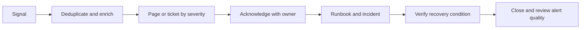

# AS ONE — Production Monitoring and Alerting

## Objectives

Monitoring must detect customer impact, integrity risk and exhaustion early
enough to meet the recovery objectives. Metrics and logs support diagnosis; they
do not become transactional authority. Every signal is scoped safely and avoids
credentials, sensitive payloads and unbounded tenant data.

## Signal model

| Signal | Required context |
| --- | --- |
| Metrics | environment, service, release, region and bounded company/branch classification only when safe |
| Logs | UTC timestamp, level, service/release, request and correlation IDs, safe error code |
| Traces | sampled request/dependency spans with tenant data redacted |
| Health | process liveness separated from dependency readiness |
| Audit | privileged/security/business evidence in PostgreSQL, not ordinary logs |

High-cardinality user, aggregate, device and request identifiers are not metric
labels. They may appear only in access-controlled structured evidence where
necessary and permitted.

## Health contracts

| Check | Meaning | Failure behavior |
| --- | --- | --- |
| Liveness | process event loop and runtime can make progress | restart only after repeated failure; no dependency checks |
| Readiness | instance can safely serve its advertised traffic class | remove from routing; expose only safe component status |
| PostgreSQL readiness | required connection and bounded validation query succeed | writes unavailable; invoke database runbook |
| Redis readiness | cache/coordination available where required | degrade realtime/rate-limit-dependent surfaces; do not claim business loss |
| Object-storage readiness | required object operation path available | isolate affected upload/download capability |
| Migration compatibility | deployed release recognizes current migration history | block readiness and deployment promotion |

Health responses never disclose hostnames, credentials, SQL, topology or hidden
tenant resources.

## Service indicators

### API and runtime

- request rate, successful rate and duration by route template/status class;
- p50, p95 and p99 latency;
- 5xx, safe domain conflicts and authentication/authorization denial rates;
- event-loop delay, memory, CPU, restart and open connection saturation;
- readiness/liveness failures and deployment version distribution.

### PostgreSQL

- availability, connection-pool use/wait, transaction duration and rollback rate;
- query latency and timeout/deadlock/serialization failures;
- storage, WAL generation, replication lag and backup freshness;
- autovacuum health, table/index growth and migration state;
- audit/outbox transaction failures and oldest pending outbox age.

### Redis and realtime

- availability, memory, evictions and connection errors;
- active connections/subscriptions, outgoing buffer pressure and disconnects;
- publication backlog, duplicate delivery, checkpoint lag and recovery-required rate.

### Domain integrity

- inventory reconciliation findings by safe type/severity/status;
- oldest open critical finding and recurrence rate;
- idempotency conflicts and explicit reconciliation-required outcomes;
- failed/rolled-back critical commands;
- backup/PITR freshness and last successful restore exercise;
- POS unacknowledged-command age and checkpoint lag where observable.

Financial totals, credentials, personal data and raw evidence are prohibited in
general-purpose metrics.

## Initial service objectives

| Objective | Initial target | Measurement window |
| --- | --- | --- |
| API availability excluding planned maintenance | 99.9% | rolling 30 days |
| Critical authenticated API p95 latency | ≤ 500 ms under approved load profile | rolling 5 minutes and 30 days |
| API server error rate | < 1% | rolling 5 minutes |
| T0 backup/WAL freshness | within 5 minutes | continuous |
| Critical outbox oldest age | < 60 seconds under normal operation | rolling 5 minutes |
| Critical reconciliation finding acknowledgement | ≤ 30 minutes | per finding |

Targets require load and production evidence and may be tightened through an
approved reliability decision. Scheduled maintenance counts separately only
when announced and executed within policy.

## Alert policy

An alert must name owner, severity, customer/integrity risk, detection query,
threshold/window, runbook, deduplication key and resolution condition.

| Alert | Initial trigger | Severity |
| --- | --- | --- |
| Cross-tenant/security signal | any confirmed event or strong detector signal | SEV-1 |
| PostgreSQL unavailable | readiness failure across serving instances for 2 minutes | SEV-1 |
| T0 recovery point at risk | WAL/backup freshness exceeds 5 minutes | SEV-1 |
| Critical transaction errors | sustained > 5% for 5 minutes | SEV-2; SEV-1 if broad or integrity-related |
| Outbox stalled | oldest required event > 5 minutes and increasing | SEV-2 |
| Critical reconciliation finding | new critical finding or unresolved > 30 minutes | SEV-2 |
| Capacity exhaustion | projected database/storage/pool exhaustion inside 24 hours | SEV-2 |
| Redis/realtime unavailable | sustained 5 minutes with customer-visible degradation | SEV-2/3 |
| Restore exercise overdue/failed | missed schedule or validation failure | SEV-2 reliability risk |

Thresholds are starting contracts and must be tuned from measured baselines,
without silencing real customer or integrity risk.

## Alert lifecycle

Alerts do not auto-resolve incidents merely because a metric returns below its
threshold. Integrity/security incidents require explicit validation.

## Dashboards

Minimum production views:

1. Global service health and release comparison.
2. API RED indicators: rate, errors and duration.
3. Infrastructure USE indicators: utilization, saturation and errors.
4. PostgreSQL durability, backup, WAL and replication.
5. Outbox/realtime/checkpoint recovery.
6. Inventory integrity and reconciliation.
7. Per-company/branch operational view with authorization and safe aggregation.
8. Incident and maintenance annotations.

## Monitoring operations

- Test paging routes quarterly and after ownership changes.
- Review noisy, unactionable and missing alerts after every incident.
- Retain monitoring data by privacy/security policy; audit evidence has separate
  authoritative retention.
- Synthetic checks use dedicated nonproduction-like identities and never real
  customer credentials.
- Maintenance suppressions are scoped, time-bounded, approved and visible; they
  never suppress security or backup-integrity alerts globally.
- Observability failure is itself monitored from an independent path.

## Production validation gate

Before production or a major recovery change, prove that health checks fail
safely, dashboards receive release-correlated data, each SEV-1/2 alert reaches
the current on-call owner, runbook links resolve, secrets remain redacted, and
backup/restore metrics match independently recorded exercise evidence.
