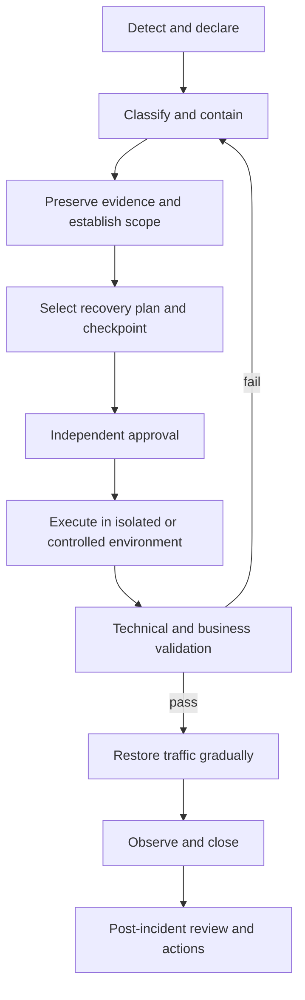

# AS ONE — Operational Runbooks

## Purpose and authority

This document defines the production operating model for AS ONE. It is a
human-executable contract, not automation. PostgreSQL remains the transactional
source of truth. Redis, caches, WebSocket delivery, local POS projections and
analytical projections are recoverable consumers and never override committed
business state.

The detailed data-protection policy is in [BACKUP_STRATEGY.md](BACKUP_STRATEGY.md),
regional disaster recovery is in [DISASTER_RECOVERY.md](DISASTER_RECOVERY.md),
and signals and alerts are in [MONITORING.md](MONITORING.md).

## Operational principles

1. Protect people and credentials before service availability.
2. Contain first; preserve evidence before destructive remediation.
3. Establish the authoritative company, branch, aggregate and checkpoint scope.
4. Prefer rollback for immutable application artifacts and forward repair for
   committed transactional data.
5. Never restore, rebuild or replay blindly over unknown newer state.
6. Every privileged action records operator, approver, reason, incident ID,
   timestamps, scope and evidence location outside application payload logs.
7. Recovery is complete only after technical and business validation.

## Recovery levels

| Level | Scope | Typical trigger | Authority | Target response |
| --- | --- | --- | --- | --- |
| R0 | Single request/client | transient API, device or cache fault | on-call engineer | diagnose and safely retry within 15 minutes |
| R1 | One aggregate, location or branch | stuck workflow, projection drift | on-call + domain owner | contain within 30 minutes; recover within 2 hours |
| R2 | One company or service component | tenant-wide degradation, bad release | incident commander | contain within 30 minutes; recover within 4 hours |
| R3 | Production region or primary database | regional loss, database unavailability | incident commander + recovery lead | invoke DR objectives in `DISASTER_RECOVERY.md` |
| R4 | Integrity or security crisis | cross-tenant exposure, unrecoverable corruption | executive incident authority + security lead | isolate immediately; recovery follows verified evidence, not a fixed shortcut |

These are operational classification targets. Data-specific RPO and RTO values
are defined in the disaster-recovery document and must be measured by exercises.

## Incident classification

| Severity | Definition | Notification and command |
| --- | --- | --- |
| SEV-1 | confirmed cross-tenant/security exposure, authoritative corruption, region loss, or critical transactions unavailable broadly | page immediately; incident commander, security and recovery leads required |
| SEV-2 | material company/branch outage, sustained transaction failures, or recovery objective at risk | page on-call; incident commander assigned within 15 minutes |
| SEV-3 | limited degradation with a safe workaround and no integrity threat | owning team responds during the support window |
| SEV-4 | informational defect or maintenance item without current customer impact | normal backlog and change process |

Severity may only decrease after evidence shows containment. Suspected tenant
isolation failure is SEV-1 until disproved.

## Operational roles

| Role | Responsibilities | Prohibited combination during SEV-1 |
| --- | --- | --- |
| Incident commander | severity, priorities, decisions, timeline and communications | must not be sole restore executor and approver |
| Operations lead | infrastructure diagnosis, failover and service restoration | cannot self-approve destructive recovery |
| Database recovery lead | backup selection, restore, WAL/PITR and integrity checks | cannot waive validation evidence |
| Domain owner | business invariants, tenant/branch scope and acceptance checks | cannot broaden recovery scope silently |
| Security lead | credential containment, evidence preservation and privacy assessment | cannot be omitted for suspected exposure |
| Communications lead | internal/customer status and timestamps | must not publish unverified root cause |
| Scribe | immutable incident timeline, actions and evidence references | must not store secrets in the timeline |
| Recovery approver | approves restore, promotion and return to service | must be independent of the executor for R3/R4 |

## Standard incident workflow

Required records are incident ID, severity changes, impact window, affected
companies/branches, last known good release and checkpoint, decisions, operator
commands or provider actions, validation results and follow-up owners.

## Runbook: application release failure

1. Stop rollout and record release identifiers and affected instances.
2. Confirm database migrations and background side effects before rollback.
3. If schema compatibility permits, redeploy the last verified immutable
   artifact. Otherwise use an approved forward fix.
4. Verify liveness, readiness, authentication, one tenant-scoped read and a
   safe synthetic transaction in the designated validation tenant.
5. Restore traffic progressively and observe error, latency and saturation
   indicators for at least one normal traffic interval.

## Runbook: PostgreSQL degradation or loss

1. Freeze schema changes, repair operations and nonessential writes.
2. Determine whether the problem is availability, capacity, replication lag or
   integrity. Never fail over a known-corrupt primary into a replica blindly.
3. Record the last durable transaction/WAL position and backup inventory.
4. Follow the restore or regional procedure in the linked documents.
5. Before promotion, validate migrations, tenant-safe constraints, row counts,
   recent critical transactions, audit/outbox consistency and time continuity.
6. Reconnect consumers gradually; do not discard checkpoints until recovery is
   proven.

## Runbook: Redis or realtime loss

1. Keep PostgreSQL authoritative writes available when safe.
2. Mark realtime/readiness degradation; disconnect clients if authorization or
   bounded buffering cannot be guaranteed.
3. Recreate Redis from configuration, not from assumed business authority.
4. Clients recover gaps through authoritative REST/checkpoints and deduplicate
   by event identity.
5. Verify outbox backlog, oldest unpublished age and checkpoint convergence.

## Runbook: inventory projection drift

1. Stop affected automated repair and identify company, branch, location,
   variant, finding revision and authoritative checkpoint.
2. Preserve ledger, finding, audit and outbox evidence.
3. Use only a contractually approved bounded repair when its preview remains
   current. Never edit the inventory ledger or balance directly.
4. For wider uncertainty, perform a shadow rebuild. Compare results before any
   promotion; no global rebuild is implied by this document.
5. Validate nonnegative quantities, reserved safety, last movement, exact
   decimals, audit/outbox atomicity and absence of cross-tenant effects.

## Shadow rebuild procedure

A shadow rebuild derives a candidate projection from an immutable source
checkpoint without modifying the active projection.

1. Declare exact company/branch/domain scope and source checkpoint.
2. Create an isolated target with no production write path.
3. Rebuild deterministically from authoritative records in stable order.
4. Compare counts, identities, exact quantities, versions/checkpoints and
   invariant violations. Classify every difference.
5. Repeat from the same checkpoint; hashes and comparisons must reproduce.
6. Domain owner and recovery approver review evidence.
7. Promotion requires a separately approved cutover plan with a final delta or
   write pause, rollback point and post-cutover monitoring.

Shadow output must never become authority merely because it completed.

## Maintenance windows

- Routine work uses an announced low-risk window and a reviewed change record.
- Backups continue during maintenance unless the recovery lead approves an
  equivalent protection measure.
- Schema and restore work is mutually exclusive.
- Freeze periods prohibit elective production changes.
- Emergency maintenance follows incident authority and retains the same audit,
  approval and validation requirements.
- Every window defines start/end, owner, affected services, customer impact,
  rollback/abort criteria and post-maintenance observation period.

## Operational validation and closure

A recovery or maintenance action is accepted only when:

- health and dependency checks pass from more than one instance where applicable;
- migration history and schema checks match the reviewed release;
- tenant and branch isolation probes pass;
- critical counts and exact-value invariants reconcile;
- audit and outbox gaps are absent or explicitly reconciled;
- backup/recovery objectives remain measurable;
- alerts have returned to normal without being disabled;
- incident evidence contains no secrets;
- the incident commander and domain owner approve return to service.

Runbooks are exercised quarterly by tabletop review and at least twice yearly by
technical recovery rehearsal. Any failed objective creates a tracked corrective
action with owner and due date.

## Internal diagnostic commands

Run `pnpm --filter @asone/api ops -- <command>`. Available commands are
`check`, `readiness`, `outbox`, `inventory`, `shadow-rebuild`,
`backup-verify`, and `restore-validate`. They support `--json`; database checks
also honor the validated timeout and scoped shadow comparison requires
`--company-id`.

Exit codes are: `0` success, `1` degraded/findings, `2` invalid input, `3`
dependency unavailable, `4` safety rejection, and `5` sanitized internal
failure. Unknown flags are rejected. No command consumes outbox records,
repairs inventory, changes findings, restores data, or schedules work.
