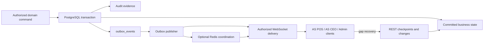
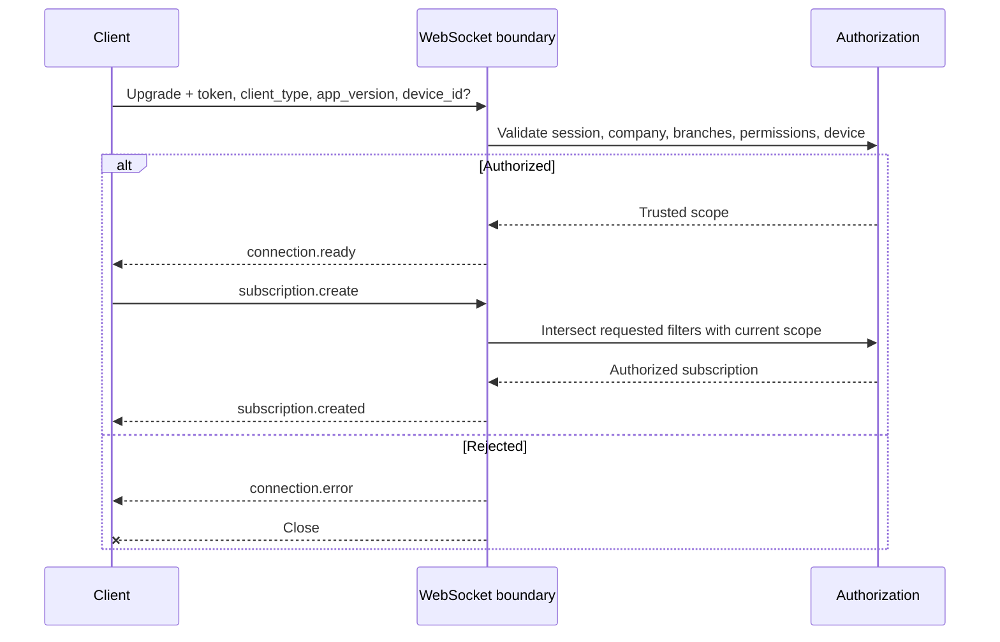
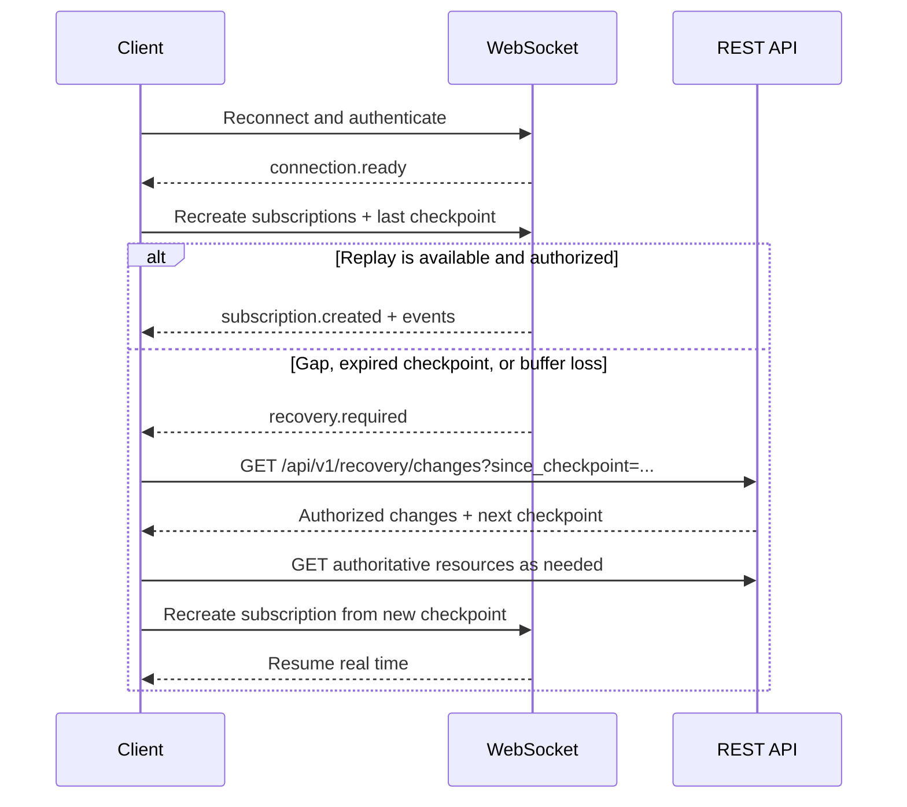
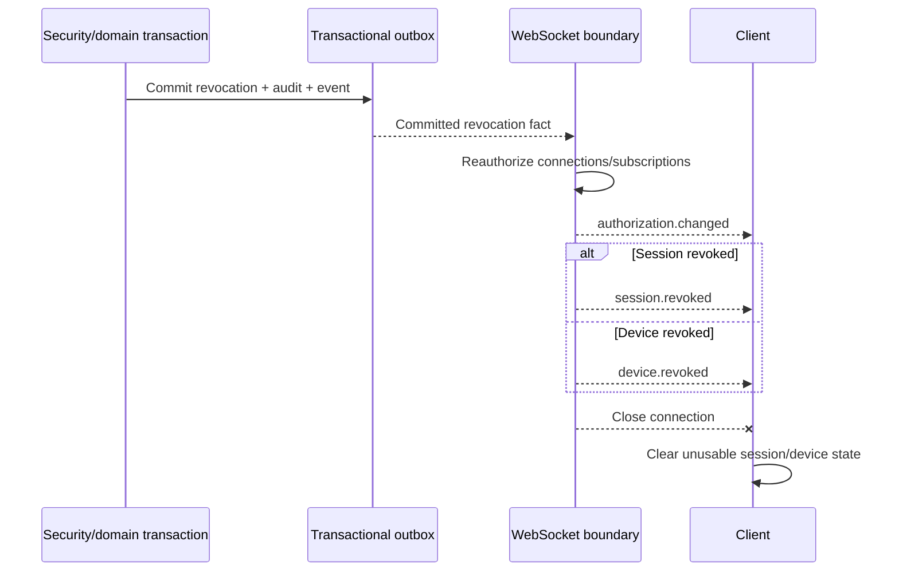

# AS ONE Real-Time Event Contracts

## 1. Status and purpose

This document is the authoritative real-time contract for the first AS ONE transactional core. It defines the WebSocket protocol, authorized subscriptions, committed domain-event envelopes, delivery semantics, and checkpoint recovery consumed by AS POS, AS CEO, and administrative clients.

It is consistent with [CORE_DATA_MODEL.md](CORE_DATA_MODEL.md), [API_CONTRACTS.md](API_CONTRACTS.md), and accepted ADRs [ADR-0003](adr/ADR-0003-offline-command-sync.md), [ADR-0005](adr/ADR-0005-idempotency-and-outbox.md), and [ADR-0006](adr/ADR-0006-tenant-isolation.md). It contains no executable WebSocket, Redis, worker, Fastify, Flutter, SQL, migration, or infrastructure configuration.

## 2. Guarantees and non-goals

PostgreSQL and its transactional outbox are authoritative. WebSocket connections and Redis coordination are transient delivery mechanisms and never establish business completion.

| Concern | Contract |
| --- | --- |
| Delivery | At-least-once while connected and during any configured replay window |
| Duplication | Expected; consumers deduplicate by `event_id` |
| Exactly-once | Not promised |
| Global order | Not promised |
| Aggregate order | Compare `aggregate_version` for the same `aggregate_type` and `aggregate_id` when versioned |
| Durability | A domain event exists only after its business effect and outbox record commit atomically |
| Gaps | Recovered from opaque checkpoints through REST, never by last-write-wins |
| Payload | Minimal notification data; retrieve authoritative state through REST |
| Scope | Derived and continuously enforced by the server |

Excluded: push notifications, webhooks, Kafka, detailed provider/library selection, Redis configuration, consumers/workers, Rewards, parties/events, memberships, customers, advanced analytics, and offline authentication.

## 3. Architecture and publication



The transaction inserts the outbox record before commit. Publishers claim only committed, available records and may retry. Publishing before commit is prohibited. Financial, cash, and inventory events therefore describe confirmed facts, not intent or pending UI state.

## 4. Connection and handshake

### 4.1 Endpoint

- Versioned URL: `wss://api.asone.mx/api/v1/realtime` in production.
- TLS is mandatory outside local development.
- The preferred token transport is an `Authorization: Bearer <access_token>` header or an approved secure handshake mechanism. Secrets are not placed in query strings when a secure transport is available.
- If the deployment surface cannot authenticate during the HTTP upgrade, the first client message must be `connection.authenticate`; no subscription or event delivery is allowed before success.
- Expired, revoked, malformed, wrong-issuer, or wrong-audience tokens are rejected safely without account or tenant enumeration.
- POS/device clients bind `device_id`; browser and administrative clients bind it only when their authenticated session policy requires a registered device.
- The client declares `client_type` and `app_version`; unsupported clients receive a safe protocol error.
- Connection limits apply by IP, company, user, session, and device. Exact limits remain configurable.

### 4.2 Connection sequence



`connection.ready` returns `connection_id`, server time, accepted protocol version, authenticated company, authorized branch IDs or a safe scope marker, heartbeat policy, maximum message size, and the current recovery checkpoint. It never returns credentials or private authorization internals.

## 5. Protocol messages

Every protocol message uses `message_type`, `message_id` (UUID), and an ISO 8601 UTC `sent_at`. Replies include `in_reply_to` when applicable. Domain events are carried only inside the server `event` message.

### 5.1 Client to server — 6 messages

| Message | Purpose | Required data | Result |
| --- | --- | --- | --- |
| `connection.authenticate` | Authenticate when upgrade authentication is unavailable | access token through approved protected body; client type/version; optional required device ID | `connection.ready` or `connection.error` |
| `subscription.create` | Request a narrowed authorized stream | client subscription ID; filters; optional last checkpoint | `subscription.created` or `subscription.rejected` |
| `subscription.remove` | Remove an owned subscription | subscription ID | `subscription.created` with removed status or safe error |
| `heartbeat.pong` | Prove liveness | ping ID and client receive time | no domain event |
| `checkpoint.ack` | Optional delivery progress hint | subscription ID and opaque checkpoint | acknowledgement is not business authority and may be ignored |
| `connection.close` | Optional graceful close | safe reason code | server closes after pending control acknowledgement |

### 5.2 Server to client — 11 messages

| Message | Purpose | Required data | Terminal effect |
| --- | --- | --- | --- |
| `connection.ready` | Confirm authenticated protocol readiness | connection/scope/protocol/heartbeat/checkpoint metadata | connection active |
| `connection.error` | Return a safe connection-level error | protocol error envelope | may close |
| `subscription.created` | Confirm effective filters | subscription ID, effective filter summary, checkpoint | subscription active/removed |
| `subscription.rejected` | Reject invalid or unauthorized request safely | subscription ID and non-enumerating error | connection may remain active |
| `event` | Deliver one committed event envelope | subscription ID and normative event | none |
| `heartbeat.ping` | Test liveness | ping ID and deadline | missing pong may close |
| `authorization.changed` | Require effective-scope refresh | reason code and replacement scope/checkpoint where safe | subscriptions are re-evaluated |
| `session.revoked` | Notify immediate session invalidation | safe reason and effective time | connection closes |
| `device.revoked` | Notify immediate device invalidation | device ID, safe reason, effective time | connection closes |
| `recovery.required` | Require REST gap recovery | affected domain/subscription, checkpoint and safe reason | recover before resuming |
| `server.draining` | Announce planned shutdown | retry hint and latest safe checkpoint | reconnect after drain |

The protocol therefore defines **17 client/server message types** in total: 6 client and 11 server types as explicitly listed in the task vocabulary.

Control messages are transient transport instructions. A same-named committed domain event, when applicable, is separately carried inside `event` and follows the outbox envelope.

## 6. Normative event envelope

```json
{
  "event_id": "018f0000-0000-7000-8000-000000000001",
  "event_type": "sale.completed",
  "schema_version": 1,
  "occurred_at": "2026-07-22T17:00:00.000Z",
  "published_at": "2026-07-22T17:00:00.120Z",
  "company_id": "018f0000-0000-7000-8000-000000000002",
  "branch_id": "018f0000-0000-7000-8000-000000000003",
  "aggregate_type": "sale",
  "aggregate_id": "018f0000-0000-7000-8000-000000000004",
  "aggregate_version": 3,
  "correlation_id": "018f0000-0000-7000-8000-000000000005",
  "causation_id": null,
  "checkpoint": "opaque-company-branch-domain-position",
  "data": {}
}
```

| Field | Rule |
| --- | --- |
| `event_id` | Globally unique UUID and stable across retries of the same outbox event |
| `event_type` | Stable lowercase domain fact in past tense or an approved projection/control fact |
| `schema_version` | Positive integer version for this event type |
| `occurred_at` | UTC time the authoritative transaction recorded the fact |
| `published_at` | UTC time of this publication attempt; may be later than occurrence |
| `company_id` | Required authenticated tenant scope; never client authority |
| `branch_id` | Required for branch-owned facts; `null` only for truly company-wide facts |
| `aggregate_type/id` | Identity whose lifecycle or projection changed |
| `aggregate_version` | New committed version when applicable; `null` only for unversioned facts |
| `correlation_id` | End-to-end request/workflow correlation UUID |
| `causation_id` | Causing command/event UUID when known; otherwise `null` |
| `checkpoint` | Opaque recovery position scoped to authorized stream/filter semantics |
| `data` | Minimal, non-secret, event-specific notification fields |

Clients treat every field except `data` additions as contract-critical. Ownership fields identify scope but never grant access.

## 7. Subscriptions and authorization

A subscription may filter only by `domains`, `branch_ids`, `event_types`, and `aggregate_types`. Empty filters mean the authorized default, not unrestricted platform access.

1. The server validates names and configured limits.
2. It derives company, branch grants, roles, permissions, session, and device from trusted state.
3. It intersects requested filters with that scope and the event permission catalogue.
4. It rejects a request when intersection would be misleading, invalid, or entirely unauthorized; error details do not reveal hidden branches, resources, or event existence.
5. It reauthorizes at connection, subscription, and every delivery boundary.
6. Permission, role, membership, session, or device changes immediately re-evaluate or revoke affected subscriptions.

Subscription IDs are connection-owned and non-authoritative. A client cannot widen `company_id` or `branch_id` through filters, checkpoints, aggregate IDs, event names, or reconnect state.

## 8. Delivery, ordering, and backpressure

- Delivery is at-least-once. The same event may arrive on retries, reconnects, overlapping authorized subscriptions, or publisher failover.
- Deduplicate by `event_id`; duplicate delivery never repeats a client-side business command.
- For one versioned aggregate, apply only the next expected `aggregate_version`. Equal/lower versions are duplicates or late events; a higher-than-next version is a gap.
- No order is guaranteed across aggregates, branches, domains, connections, or publisher instances.
- Unversioned and derived events are ordered only by checkpoint for recovery traversal, not business causality.
- Late events remain valid facts. Clients compare aggregate versions and fetch current REST state rather than overwriting newer state.
- Publisher retries are bounded and observable; poison records do not silently disappear.
- Per-connection buffers and message sizes are bounded. A slow consumer may receive `recovery.required` and be disconnected instead of exhausting server memory.
- Maximum payload, buffer, replay, and retry limits are configurable and advertised where safe.
- Compression remains an open decision.

## 9. Reconnection and recovery

Clients durably retain the last confirmed checkpoint per authorized stream, a bounded recent `event_id` deduplication set, and recent versions per aggregate.



POS command synchronization may instead use `GET /api/v1/sync/changes` and `GET /api/v1/sync/checkpoints` under `sync.execute`. General clients use `GET /api/v1/recovery/checkpoints`, `/recovery/changes`, and, for privileged diagnostics only, `/recovery/events`. A checkpoint is opaque, scoped, expirable, and cannot widen authorization.

## 10. Heartbeats, shutdown, and revocation

- The server sends `heartbeat.ping`; the client returns the matching `heartbeat.pong` before the advertised deadline.
- Exact cadence and timeout remain configurable. Inactive or stalled connections close safely.
- Reconnect uses exponential backoff with jitter, respects server retry hints, and has a configured ceiling.
- `server.draining` announces planned deployment shutdown with a reconnect-after hint and latest safe checkpoint.
- Session/device revocation closes every affected connection after the final safe control message where delivery is possible.



Revocation enforcement does not depend on successful delivery of the control message.

## 11. Event catalogue conventions

The catalogue defines **54 unique event types**. Every row inherits the normative envelope and security rules.

### 11.1 Field and recovery profiles

| Code | Prohibited `data` fields |
| --- | --- |
| `P-ORG` | secrets, billing data, private settings, full addresses, unrestricted configuration |
| `P-ID` | password/credential hashes, tokens, private contact data, role internals beyond authorized keys |
| `P-DEV` | device secrets/private keys, enrollment tokens, network identifiers not required by the client |
| `P-CASH` | credentials, notes with sensitive content, full tender/payment detail |
| `P-CAT` | internal costs or unpublished/private configuration outside receiver permission |
| `P-INV` | supplier/private cost data and unrelated location balances |
| `P-FIN` | full payment instruments, provider secrets, authorization tokens, unnecessary customer/PII data |
| `P-SEC` | access/refresh tokens, credentials, detection internals, IP/device fingerprint detail |
| `P-CEO` | raw transactions, customer/PII data, accounting claims, unrestricted cross-branch detail |

Recovery codes: `ORG` = organization/settings REST routes; `IAM` = users/roles/permissions/branch-access routes; `DEV` = devices/registers; `CASH` = cash sessions/movements; `CAT` = categories/products/prices/availability; `INV` = inventory locations/balances/movements; `SALE` = sales/payments; `REF` = refunds; `SYNC` = sync operations/checkpoints/changes; `REC` = `/recovery/changes` plus authoritative resource route; `AUTH` = `/auth/session`, `/auth/me`, `/auth/permissions` after reauthentication. Collection route details remain authoritative in [API_CONTRACTS.md](API_CONTRACTS.md).

For all rows, duplicates are ignored by `event_id`. `V` order means contiguous `aggregate_version` is expected; `C` means checkpoint traversal only. Retention is `CP` (recoverable only within configured checkpoint/event retention) unless stated `SEC` (security retention policy). Retention durations remain open.

### 11.2 Organization — 5 events

| Event type | Producer / aggregate | Scope / minimum permission | Allowed `data`; prohibited | Cause / recovery | Order / retention |
| --- | --- | --- | --- | --- | --- |
| `company.updated` | companies / `company` | company / `company.read` | changed field names, status, version; `P-ORG` | company update / `ORG` | V / CP |
| `company_setting.changed` | configuration / `company_setting` | company / `company_settings.read` | key, safe effective-value marker, version; `P-ORG` | setting create/update / `ORG` | V / CP |
| `branch.created` | branches / `branch` | authorized branch or company-wide / `branch.read` | branch ID, code, name, status, version; `P-ORG` | branch creation / `ORG` | V / CP |
| `branch.updated` | branches / `branch` | branch / `branch.read` | changed field names, status, version; `P-ORG` | branch update / `ORG` | V / CP |
| `branch_setting.changed` | configuration / `branch_setting` | branch / `branch_settings.read` | key, safe effective-value marker, version; `P-ORG` | setting create/update / `ORG` | V / CP |

### 11.3 Identity and authorization — 11 events

| Event type | Producer / aggregate | Scope / minimum permission | Allowed `data`; prohibited | Cause / recovery | Order / retention |
| --- | --- | --- | --- | --- | --- |
| `user.created` | users / `user` | company / `user.read` | user ID, status, display-name marker, version; `P-ID` | user creation / `IAM` | V / CP |
| `user.updated` | users / `user` | company / `user.read` | user ID, changed fields, status, version; `P-ID` | user update / `IAM` | V / CP |
| `user.role_assigned` | roles / `user_role` | company/authorized branches / `role.read` | user ID, role ID, effective scope, version; `P-ID` | role assignment / `IAM` | V / CP |
| `user.role_revoked` | roles / `user_role` | company/authorized branches / `role.read` | user ID, role ID, effective time, version; `P-ID` | role revocation / `IAM` | V / CP |
| `user.branch_access_changed` | branch access / `branch_access` | branch / `branch.read` | user ID, branch ID, access status/version; `P-ID` | access grant/change / `IAM` | V / CP |
| `user.branch_access_revoked` | branch access / `branch_access` | branch / `branch.read` | user ID, branch ID, effective time/version; `P-ID` | access revocation / `IAM` | V / CP |
| `role.created` | roles / `role` | company / `role.read` | role ID, code, name, status, version; `P-ID` | role creation / `IAM` | V / CP |
| `role.updated` | roles / `role` | company / `role.read` | role ID, changed fields, status, version; `P-ID` | role update / `IAM` | V / CP |
| `role.permissions_changed` | permissions / `role` | company / `permission.read` | role ID, added/removed permission keys receiver may see, version; `P-ID` | permission assignment/revocation / `IAM` | V / CP |
| `authorization.changed` | authorization / `authorization_scope` | affected actor or `permission.read` | reason code, scope version, refresh-required flag; `P-SEC` | any effective permission/scope change / `AUTH` | C / SEC |
| `auth.session.revoked` | authentication / `auth_session` | affected actor or `audit.read` | session ID, safe reason, revoked_at; `P-SEC` | logout, reuse detection, admin/security action / `AUTH` | C / SEC |

### 11.4 Devices and cash — 7 events

| Event type | Producer / aggregate | Scope / minimum permission | Allowed `data`; prohibited | Cause / recovery | Order / retention |
| --- | --- | --- | --- | --- | --- |
| `device.registered` | devices / `device` | branch/company / `device.read` | device ID, code, type, status, branch, version; `P-DEV` | device registration / `DEV` | V / CP |
| `device.revoked` | devices / `device` | affected device or `device.read` | device ID, safe reason, revoked_at, version; `P-SEC` | device revocation / `DEV` | V / SEC |
| `cash_register.created` | cash registers / `cash_register` | branch / `cash_register.read` | register ID, code, name, status, version; `P-CASH` | register creation / `DEV` | V / CP |
| `cash_register.device_assigned` | cash registers / `cash_register` | branch / `cash_register.read` | register ID, device ID, version; `P-DEV` | device assignment/change / `DEV` | V / CP |
| `cash_session.opened` | cash sessions / `cash_session` | branch / `cash_session.read` | session/register/operator IDs, currency, opening amount, opened_at, version; `P-CASH` | committed open command / `CASH` | V / CP |
| `cash_movement.created` | cash / `cash_movement` | branch / `cash_session.read` | movement/session IDs, type, exact amount/currency, reason code, occurred_at; `P-CASH` | committed cash movement / `CASH` | C / CP |
| `cash_session.closed` | cash sessions / `cash_session` | branch / `cash_session.read` | session ID, totals/discrepancy, currency, closed_at, version; `P-CASH` | committed closure / `CASH` | V / CP |

### 11.5 Catalog — 7 events

| Event type | Producer / aggregate | Scope / minimum permission | Allowed `data`; prohibited | Cause / recovery | Order / retention |
| --- | --- | --- | --- | --- | --- |
| `category.created` | catalog / `category` | company/branch visibility / `catalog.read` | category ID, parent, code/name, status, version; `P-CAT` | category creation / `CAT` | V / CP |
| `category.updated` | catalog / `category` | company/branch visibility / `catalog.read` | ID, changed fields, status, version; `P-CAT` | category update / `CAT` | V / CP |
| `product.created` | catalog / `product` | company/branch visibility / `catalog.read` | product ID, SKU/name/type/status, version; `P-CAT` | product creation / `CAT` | V / CP |
| `product.updated` | catalog / `product` | company/branch visibility / `catalog.read` | ID, changed fields, status, version; `P-CAT` | product update / `CAT` | V / CP |
| `product_price.created` | catalog / `product_price` | authorized visibility / `catalog.read` | price/product IDs, type, exact amount/currency, validity, version; `P-CAT` | price creation / `CAT` | V / CP |
| `product_price.updated` | catalog / `product_price` | authorized visibility / `catalog.read` | ID, changed fields, status/validity, version; `P-CAT` | price update / `CAT` | V / CP |
| `product.availability_changed` | catalog / `product_availability` | branch / `catalog.read` | product ID, branch ID, channel, availability, version; `P-CAT` | availability update / `CAT` | V / CP |

### 11.6 Inventory — 6 events

| Event type | Producer / aggregate | Scope / minimum permission | Allowed `data`; prohibited | Cause / recovery | Order / retention |
| --- | --- | --- | --- | --- | --- |
| `inventory_location.created` | inventory / `inventory_location` | branch / `inventory.read` | location ID, code/name/type/status, version; `P-INV` | location creation / `INV` | V / CP |
| `inventory_location.updated` | inventory / `inventory_location` | branch / `inventory.read` | ID, changed fields, status, version; `P-INV` | location update / `INV` | V / CP |
| `inventory.adjusted` | inventory / `inventory_movement` | branch / `inventory.read` | movement/location/product IDs, exact quantity, reason, balance version; `P-INV` | committed adjustment / `INV` | C / CP |
| `inventory.count_applied` | inventory / `inventory_movement` | branch / `inventory.read` | count reference, movement IDs, affected product/location, balance versions; `P-INV` | committed count result / `INV` | C / CP |
| `inventory.movement_reversed` | inventory / `inventory_movement` | branch / `inventory.read` | reversal/original IDs, exact quantity, reason, balance version; `P-INV` | committed compensating movement / `INV` | C / CP |
| `inventory.balance_changed` | inventory / `inventory_balance` | branch / `inventory.read` | location/product IDs, exact on-hand/reserved/available, version, source movement ID; `P-INV` | accepted inventory movement / `INV` | V / CP |

### 11.7 Sales and payments — 6 events

| Event type | Producer / aggregate | Scope / minimum permission | Allowed `data`; prohibited | Cause / recovery | Order / retention |
| --- | --- | --- | --- | --- | --- |
| `sale.created` | sales / `sale` | branch / `sale.read` | sale ID/number, register/session/device IDs, status, currency, exact total, version; `P-FIN` | committed sale creation / `SALE` | V / CP |
| `sale.completed` | sales / `sale` | branch / `sale.read` | sale ID/number, exact totals, status, completed_at, version; `P-FIN` | committed completion / `SALE` | V / CP |
| `sale.cancelled` | sales / `sale` | branch / `sale.read` | sale ID/number, safe reason code, cancelled_at, version; `P-FIN` | committed eligible cancellation / `SALE` | V / CP |
| `payment.recorded` | payments / `payment` | branch / `payment.read` | payment/sale IDs, method, status, exact amount/currency, safe reference, occurred_at; `P-FIN` | committed payment attempt/result / `SALE` | C / CP |
| `payment.status_changed` | payments / `payment` | branch / `payment.read` | payment/sale IDs, previous/new status, safe reason, occurred_at; `P-FIN` | committed provider/domain transition / `SALE` | C / CP |
| `payment.reversed` | payments / `payment` | branch / `payment.read` | reversal/original/sale IDs, exact amount/currency, occurred_at; `P-FIN` | committed reversal / `SALE` | C / CP |

### 11.8 Refunds — 4 events

| Event type | Producer / aggregate | Scope / minimum permission | Allowed `data`; prohibited | Cause / recovery | Order / retention |
| --- | --- | --- | --- | --- | --- |
| `refund.requested` | refunds / `refund` | branch / `refund.read` | refund/sale IDs, number, exact total/currency, status, reason code, version; `P-FIN` | committed refund request / `REF` | V / CP |
| `refund.approved` | refunds / `refund` | branch / `refund.read` | refund ID, safe approver marker, approved_at, status, version; `P-FIN` | committed approval / `REF` | V / CP |
| `refund.completed` | refunds / `refund` | branch / `refund.read` | refund/sale IDs, exact total/currency, completed_at, version; `P-FIN` | committed refund effects / `REF` | V / CP |
| `refund.cancelled` | refunds / `refund` | branch / `refund.read` | refund ID, safe reason, cancelled_at, version; `P-FIN` | committed cancellation / `REF` | V / CP |

### 11.9 Synchronization and security — 3 additional unique events

`device.revoked` is defined once in §11.4 and is also part of this domain grouping; it is not counted twice.

| Event type | Producer / aggregate | Scope / minimum permission | Allowed `data`; prohibited | Cause / recovery | Order / retention |
| --- | --- | --- | --- | --- | --- |
| `sync.operation_processed` | sync / `sync_operation` | originating device/branch or `sync.execute` | client operation ID, sequence, outcome, aggregate identity/version, result code, checkpoint; `P-SEC` | terminal sync outcome / `SYNC` | C / CP |
| `session.revoked` | security / `auth_session` | affected session/user or `audit.read` | session ID, safe reason, revoked_at; `P-SEC` | security/admin/session revocation / `AUTH` | C / SEC |
| `recovery.required` | recovery / `recovery_stream` | affected authorized stream or `recovery.read` | domain, safe reason, last usable/current checkpoint hints; `P-SEC` | detected gap, expired checkpoint, overflow, or stream reset / `REC` | C / CP |

`auth.session.revoked` is the durable authentication-domain fact. `session.revoked` is the client-facing security fact/control vocabulary required by this contract; implementations must document whether one outbox record maps to both names and must never double-count business effects.

### 11.10 AS CEO derived summaries — 5 events

These events report derived projection freshness. They are not accounting, cash-ledger, inventory-ledger, or sales authority; they may lag committed transactions. Every `data` payload includes `generated_at` and `source_checkpoint`. Clients display freshness and use authoritative REST/reporting contracts for decisions.

| Event type | Producer / aggregate | Scope / minimum permission | Allowed `data`; prohibited | Cause / recovery | Order / retention |
| --- | --- | --- | --- | --- | --- |
| `branch.sales_summary_updated` | reporting projection / `branch_sales_summary` | branch / `sale.read` | period key, exact safe totals/counts, generated_at, source_checkpoint; `P-CEO` | projection refresh / `REC` | C / CP |
| `branch.cash_summary_updated` | reporting projection / `branch_cash_summary` | branch / `cash_session.read` | period/session summary, exact safe totals, generated_at, source_checkpoint; `P-CEO` | projection refresh / `REC` | C / CP |
| `branch.inventory_alert_updated` | reporting projection / `branch_inventory_alert` | branch / `inventory.read` | severity/count/category summary, generated_at, source_checkpoint; `P-CEO` | projection refresh / `REC` | C / CP |
| `company.sales_summary_updated` | reporting projection / `company_sales_summary` | company-authorized branches / `sale.read` | period, authorized aggregate totals/counts, generated_at, source_checkpoint; `P-CEO` | projection refresh / `REC` | C / CP |
| `company.branch_ranking_updated` | reporting projection / `company_branch_ranking` | company-authorized branches / `sale.read` | period, authorized branch ranking entries, generated_at, source_checkpoint; `P-CEO` | projection refresh / `REC` | C / CP |

The aggregation model, schedule, ranking formula, and final granularity are explicitly outside this task.

## 12. Protocol errors

Errors use a safe envelope containing `code`, human-readable `message`, optional bounded `details`, `message_id`, `request_id` where available, and `correlation_id`. They never expose hidden resource or subscription existence.

| Code | Meaning / expected action |
| --- | --- |
| `authentication_required` | authenticate before any other operation |
| `token_expired` | acquire a valid session through the approved flow |
| `permission_denied` | requested operation is outside current effective permission |
| `invalid_subscription` | filter, combination, or limit is invalid |
| `branch_scope_mismatch` | requested branch is not in current authorized scope |
| `unsupported_schema_version` | client/server event-version overlap is unavailable |
| `rate_limit_exceeded` | retry only after the safe server hint |
| `payload_too_large` | message exceeds configured maximum |
| `checkpoint_expired` | perform full authorized REST recovery |
| `recovery_required` | pause application of affected stream and recover through REST |
| `device_revoked` | clear unusable device/session state; connection closes |
| `session_revoked` | clear session state and reauthenticate if allowed |
| `server_draining` | reconnect after advertised delay using checkpoint |
| `internal_error` | safe transient failure; follow retry/recovery policy |

Authentication/protocol failures close with implementation-defined WebSocket close codes mapped to these stable machine codes. Exact numeric close-code mapping remains an implementation contract, not invented here.

## 13. Schema versioning and compatibility

- `schema_version` is versioned independently per `event_type`.
- Compatible additive fields may be introduced within a version; consumers ignore unknown fields.
- Removal, type changes, semantic changes, or newly required consumer behavior require a new schema version.
- Publishers may support multiple schema versions during an announced compatibility window.
- A subscriber may declare supported versions; unsupported overlap is rejected safely.
- Version compatibility duration, telemetry, deprecation notice, and retirement policy remain open.
- Checkpoints and deduplication identity remain stable across compatible serialization changes; a translated publication retains the source event identity or an explicitly documented derivation identity.

## 14. Security and operational controls

- Reauthorize every connection, subscription, replay, and delivery.
- Apply company and branch isolation before filter evaluation and payload serialization.
- Redact PII, credentials, tokens, hashes, provider secrets, payment instruments, private device material, and unsafe audit context.
- Audit privileged connections and sensitive subscription changes with actor, device, company, effective branches, filters, result, correlation, and time.
- Rate-limit upgrades, authentication frames, subscription churn, replay, and malformed messages.
- Bound connections, subscriptions, filters, message size, replay pages, outgoing buffers, and heartbeat failures.
- Never log access tokens, event payload secrets, or unrestricted subscription data.
- Current authorization overrides historical authorization during replay; inaccessible events are not disclosed.
- Cross-company, cross-branch, revoked-session, revoked-device, stale-permission, duplicate, late, gap, overflow, and reconnect scenarios require contract tests when implementation begins.

## 15. Open decisions

The following **11 decision areas** remain open and must not be selected silently:

1. WebSocket server/provider/library and deployment integration.
2. Redis Pub/Sub versus Redis Streams, including whether either is necessary for the first topology.
3. Connection and subscription limits by IP, user, company, session, and device.
4. Per-connection and shared buffer limits plus slow-consumer thresholds.
5. Exact heartbeat cadence, timeout, and idle-close policy.
6. Outbox/event replay retention and security-event retention.
7. Checkpoint lifetime, invalidation, and full-resynchronization threshold.
8. Compression algorithm, negotiation, and minimum payload threshold.
9. Maximum inbound/outbound message and event payload sizes.
10. Schema-version compatibility window, deprecation telemetry, and retirement process.
11. AS CEO summary-event granularity, refresh cadence, projection ownership, and freshness objectives.

These require measured load, deployment evidence, privacy/retention policy, client capability, or a new ADR.

## 16. Contract inventory

- Unique event types: **54**.
- Client-to-server protocol messages: **6**.
- Server-to-client protocol messages: **11**.
- Total protocol message types: **17**.
- Mermaid diagrams: **4**.
- Unique permission keys used by event delivery: **18**.
- Open decision areas: **11**.

The 18 permission keys are: `company.read`, `company_settings.read`, `branch.read`, `branch_settings.read`, `user.read`, `role.read`, `permission.read`, `device.read`, `cash_register.read`, `cash_session.read`, `catalog.read`, `inventory.read`, `sale.read`, `payment.read`, `refund.read`, `sync.execute`, `recovery.read`, and `audit.read`.
